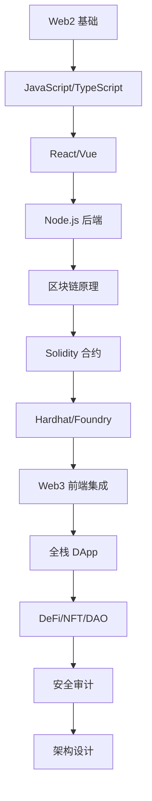

# Web3-onboarding-roadmap

> From Web2 to Web3: A Developer's Practical Guide & Knowledge Base

**从传统前端到区块链全栈的完整开源学习指南**
Go链开发全记录｜Go｜go-ethereum｜链上服务｜实战踩坑｜学习路线｜适合零基础转型区块链开发

还包含传统web2的基础知识及面试题汇总。

[🌐 在线阅读](https://Sunny20260315.github.io/Web3-onboarding-roadmap/) | [📝 贡献指南](./CONTRIBUTING.md) | [💬 加入讨论](https://github.com/Sunny20260315/Web3-onboarding-roadmap/discussions)

---

## 📊 学习进度总览

| 阶段 | 主题           |          进度          | 完成度 |   状态    |
| :--: | :------------- | :--------------------: | :----: | :-------: |
|  01  | Web2 基础巩固  | `░░░░░░░░░░░░░░░░░░░░` |   0%   | ⚪ 待开始 |
|  02  | 区块链核心原理 | `░░░░░░░░░░░░░░░░░░░░` |   0%   | ⚪ 待开始 |
|  03  | 智能合约开发   | `░░░░░░░░░░░░░░░░░░░░` |   0%   | ⚪ 待开始 |
|  04  | Web3 前端集成  | `░░░░░░░░░░░░░░░░░░░░` |   0%   | ⚪ 待开始 |
|  05  | 全栈 DApp 实战 | `░░░░░░░░░░░░░░░░░░░░` |   0%   | ⚪ 待开始 |
|  06  | DeFi 协议深度  | `░░░░░░░░░░░░░░░░░░░░` |   0%   | ⚪ 待开始 |
|  07  | NFT 与元宇宙   | `░░░░░░░░░░░░░░░░░░░░` |   0%   | ⚪ 待开始 |
|  08  | DAO 与治理     | `░░░░░░░░░░░░░░░░░░░░` |   0%   | ⚪ 待开始 |
|  09  | 前沿技术探索   | `░░░░░░░░░░░░░░░░░░░░` |   0%   | ⚪ 待开始 |
|  -   | **总体进度**   | `░░░░░░░░░░░░░░░░░░░░` | **0%** |  **0/9**  |

## 🎯 适合谁？

- ✅ 有 Web2 前端经验，想转型 Web3 的开发者
- ✅ 想了解区块链技术的全栈工程师
- ✅ 希望系统学习而非碎片化阅读的自学党
- ✅ 寻找开源项目贡献机会的社区成员

---

## 🗺️ 学习路线图

---

## 📂 目录结构速览

点击展开完整目录

- `00-StartHere` - 新手必读
- `01-Web2-Foundation` - Web2 基础
- `02-Blockchain-Core` - 区块链核心
- `03-Smart-Contract` - 智能合约
- `04-Web3-Frontend` - Web3 前端
- `05-Fullstack-DApp` - 全栈实战
- `06-DeFi-Protocol` - DeFi 协议
- `07-NFT-Metaverse` - NFT 元宇宙
- `08-DAO-Governance` - DAO 治理
- `09-Advanced-Topics` - 前沿技术
- `10-Resources` - 资源汇总

---

## 🛠️ 技术栈

### Web2

### Web3

---

## ⭐ Star

正在从传统开发转型Web3的小伙伴，欢迎 Star，一起交流。

## 🤝 贡献指南

1. **Fork** 这个仓库
2. **创建新分支**: `git checkout -b feature/AmazingFeature`
3. **提交更改**: `git commit -m 'Add some AmazingFeature'`
4. **推送分支**: `git push origin feature/AmazingFeature`
5. **创建 Pull Request**

---

## 💬 讨论

欢迎前往 [GitHub Discussions](https://github.com/Sunny20260315/Web3-onboarding-roadmap/discussions) 参与讨论！

扫码加入交流群，获取更多 Web3 资料和实时更新：

---

## 📜 License

本项目采用 [MIT License](https://opensource.org/licenses/MIT) 开源协议。

---

⭐ **Star 这个仓库，开启你的 Web3 全栈之旅！**
