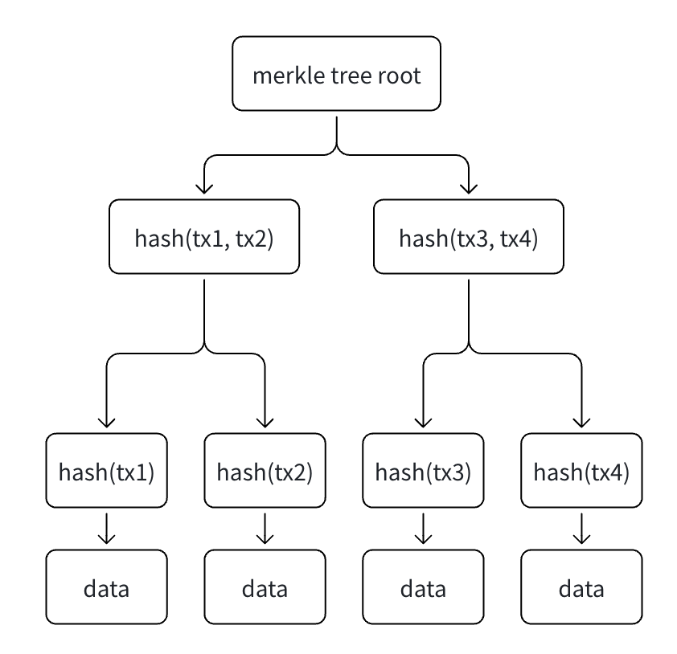

# 区块链的数据结构

一般认为，区块链的数据结构是：一个有序的区块头链和包含交易数据的默克尔树。

## 什么是默克尔树

默克尔树（Merkle Tree），也叫“哈希树（Hash Tree）”，是一种用于高效验证数据完整性的数据结构。它由计算机科学家 Ralph Merkle 在 1979 年提出，现在广泛应用于 Bitcoin、Ethereum 等区块链系统中。

它本质上是一棵“由哈希值组成的二叉树”。



**应用场景**

- 保证数据不可篡改：因为任意一点数据变化，root都会变化
- 快速验证交易是否存在

### 为什么区块链需要默克尔树

区块链的数据量极大。

例如：

一个 Bitcoin 区块可能包含数千笔交易
全链数据已经数百 GB

如果每次验证都下载全部数据：

非常慢
占存储
占带宽

默克尔树解决了这个问题。

### Bitcoin 与 Ethereum 中的应用

Bitcoin 中：

每个区块：

所有交易
构建一棵 Merkle Tree
Root 写入 Block Header

矿工挖矿时：

实际上是在对包含 Merkle Root 的区块头进行哈希。

---

Ethereum 更复杂。

Ethereum 不仅存交易：

还存：

账户状态
合约状态
Receipt

因此它用了：

Patricia Merkle Tree
Merkle Patricia Trie

来支持：

快速状态查询
智能合约存储
账户余额验证

Ethereum 实际上有多棵树：

| 树类型           | 作用       |
| ---------------- | ---------- |
| Transaction Tree | 存交易     |
| State Tree       | 存账户状态 |
| Receipt Tree     | 存执行结果 |

## 前缀树（Trie）

前缀树又叫字典树、单词查找树，它是一种专门用于"字符串查找"的树结构，按路径存储 Key。

### 前缀树的特点

- **快速查询**：时间复杂度 O(m)，m 为字符串长度，与字典大小无关
- **前缀共享**：相同前缀的字符串共用树的分支
- **空间高效**：重复前缀只存储一次
- **自动排序**：按字典序遍历

### 前缀树的结构

每个节点包含：

- 子节点指针（字母表大小的指针数组，通常 26 个英文字母）
- 是否为单词结尾的标志

```
示例：存储 "cat", "car", "dog"

        root
       /    \
      c      d
      |      |
      a      o
     / \     |
    t   r    g
   (✓) (✓)  (✓)
```

### 前缀树的应用

- 自动完成（Auto-complete）
- 拼写检查
- IP 路由（最长前缀匹配）
- 搜索引擎关键词建议
- 在区块链中用于状态树

### 前缀树 vs 哈希表 vs 二叉搜索树

| 特性       | 哈希表    | 二叉搜索树 | 前缀树 |
| ---------- | --------- | ---------- | ------ |
| 查找时间   | O(1) 平均 | O(log n)   | O(m)   |
| 前缀查询   | ❌        | ❌         | ✅     |
| 空间       | 较好      | 较好       | 一般   |
| 有序遍历   | ❌        | ✅         | ✅     |
| 实现复杂度 | 简单      | 中等       | 中等   |

### 缺点

- O(n),n 次的IO开销，相比较直接查找，对磁盘的压力较大
- 当 key 比较长时，可能会造成空间浪费

## MPT

全称：Merkle Patricia Trie，默克尔・帕特里夏前缀树，可以理解为一棵「自带防篡改校验」的「智能压缩字典树」，专门用来高效存以太坊的账户和合约数据。

因为Ethereum的本质是一个全球共享状态机，它维护的是整个链当前的状态，包括：

- 账户余额
- nonce:交易次数
- 合约代码
- 合约变量

MPT的本质是：Trie（字典树：快速查找） + Merkle（哈希验证） + Patricia（路径压缩）

- Trie（字典树 / 前缀树）：像查字典一样，按「前缀路径」找数据。比如查 “apple”，先找 a，再找 ap，再找 app，一步步定位。
- Patricia（帕特里夏 / 前缀压缩）：普通字典树会有很多重复路径，它会把共同的前缀合并起来，省空间、提速度。
- Merkle（默克尔）：树的每一段路径都带「哈希指纹」，只要改一个数据，整棵树的指纹都会变，一眼就能看出数据被篡改了。

**特点**

- 可验证性
- 防篡改
- 支持轻节点
- 树形数据结构

### MPT 的四种节点

**1. 空节点（Null）**

- 空占位符，表示某个路径不存在数据

**2. 分支节点（Branch Node）**

- 包含 16 个子节点指针（对应十六进制的 0~f）
- 通过 Nibble 编码降低存储需求，提高树的高度
- 比如查找 key 为 `0x123`，每个字符都是一个分支点

**3. 叶子节点（Leaf Node）**

- 存储完整的 Key 路径和最终的 Value（数据）
- 终止条件：到达叶子节点，查询结束
- 存储实际的账户数据或合约状态

**4. 扩展节点（Extension Node）**

- 相当于前缀压缩，合并连续单分支路径
- 比如路径 a → b → c 可以压缩为一个扩展节点，减少树深度
- Key 存储共同前缀，Val 指向下一个节点

### 路径压缩（Patricia）

普通前缀树会因为长 key 产生大量单分支节点，浪费空间。MPT 通过路径压缩解决：

- **问题**：插入 key "toast"，但树中不存在以 t 开头的路径，需要创建 5 个节点：t → o → a → s → t
- **解决**：用一个扩展节点存储 "toast" 作为前缀，直接跳过中间的单分支节点，减少树高和 I/O 开销
- **优势**：减少节点数量、提高查询效率、节省存储空间

### 以太坊 MPT 中 Key 的三种编码方式详解

你可以把 MPT 理解成一棵「按十六进制路径分叉」的树：
每个节点最多有 16 个分支（对应 0~f 这 16 个十六进制字符）
所以 Key 必须拆成「十六进制半字节（nibble）」的序列，才能顺着路径走
但问题来了：
原始地址 / Key 是字节流（比如 20 字节的地址），没法直接按 nibble 拆分；
扩展节点和叶子节点的路径需要区分；
路径长度的奇偶要处理，不然会浪费空间。
于是，就有了从 Raw 到 Hex 再到 HP 的三层编码

**1. Raw**

- 是什么：Key 的原始字节序列，比如以太坊地址就是 20 字节的二进制数据，合约存储的 Key 也是字节形式。
- 特点：
  是真实存储的原始数据
  没法直接给 MPT 用，因为 MPT 的路径是按 nibble 拆分的，而 Raw 是按字节（8 位）存的
- 举个例子：
  地址 0xabcdef0123456789abcdef0123456789abcdef
  原始 Raw 编码就是这 20 个字节的二进制数据，没法直接拆成 MPT 路径。

**2. Hex** -是什么：把 Raw 的每个字节拆成两个 4 位的 nibble（也就是十六进制字符），组成一个纯 nibble 序列。
目的：把 Key 变成 MPT 能识别的「路径单元」，每个 nibble 就是树的一步。

- 特点：
  长度翻倍（比如 20 字节地址 → 40 个 nibble）
  完全是十六进制字符序列，没有任何压缩或标记
- 举个例子：
  字节 0xab → 拆成两个 nibble：a 和 b
  所以地址 0xabcd 拆成 Hex 编码就是：a b c d 四个 nibble 的序列。

3. HP（Hex-Prefix）编码（最终存入 MPT 的编码）

- 是什么：在 Hex 编码的基础上，加上前缀标记，解决两个核心问题：
  区分路径长度是奇数还是偶数
  区分当前节点是扩展节点还是叶子节点
- 核心结构：
  HP 编码的开头，有一个 1 字节的前缀，由 4 个 bit 组成：
  第 1 位：标记节点类型（0 = 扩展节点，1 = 叶子节点）
  第 2 位：标记路径长度奇偶（0 = 偶数，1 = 奇数）
  后 2 位：补 0（如果路径长度是奇数，会把第一个 nibble 放在前缀的后 4 位里，避免浪费）
- 目的：
  压缩空间：奇数长度的路径，不用额外补 0
  明确区分节点类型，避免歧义
- 举个例子：
  场景 1：路径长度为偶数（4 个 nibble：a b c d），扩展节点
  前缀：0000（扩展节点 + 偶数长度）
  HP 编码：00 a b c d
  场景 2：路径长度为奇数（3 个 nibble：a b c），叶子节点
  前缀：1100（叶子节点 + 奇数长度），把第一个 nibble a 放到前缀的后 4 位，变成 1 a
  HP 编码：1a b c

```
Raw（字节）
  ↓  每个字节拆成两个nibble
Hex（纯nibble序列，长度翻倍）
  ↓  加上类型+奇偶前缀，奇数长度合并第一个nibble
HP（最终存入MPT的编码，带前缀标记）
```

总结：以太坊 MPT 的 Key，从原始字节（Raw）先拆成十六进制 nibble 序列（Hex），再通过 HP 编码加上节点类型和奇偶长度标记，最终变成 MPT 可识别的路径。HP 编码既适配了 MPT 的 16 叉树结构，又实现了空间压缩和无歧义区分。

### MPT 的应用场景

- 快速计算数据集哈希
- 快速状态回滚
  - 以太坊坑能发生区块回滚，MPT允许零延迟恢复历史状态
  - 原理：
    - 每个节点的哈希值唯一且不可变
    - 当状态变更时，只需替换变更节点的哈希索隐，旧状态仍然可访问
    - 无需删除旧数据，状态回滚时，只需切换到旧根哈希

## SPV（Simplified Payment Verification）

Bitcoin 白皮书提出的：轻节点验证机制。用户不用下载完整链，既可以验证交易。

所有轻钱包都依赖类似的思想：

- Bitcoin Wallet
- MetaMask
- Trust Wallet

## 布隆过滤器

布隆过滤器（Bloom Filter）是一种空间效率极高的概率性数据结构，用于判断某个元素是否存在与集合中，但允许一定的误判率。它广泛应用于区块链、数据库、搜索引擎、反垃圾邮件检测等场景，特别适用于大规模数据集合的快速查找。

**特点：**

优点：

- 节省存储空间：相比哈希表，布隆过滤器不存储具体的 Key,而是仅存哈希标记，极大地减少存储开销。
- 查询速度快：基于位数组和多个哈希函数，查询复杂度O(k),k为哈希函数数量。
- 不会产生 False Negative(假阴性)：如果布隆过滤器认为元素不存在，那一定不存在
- 适用于大规模数据过滤：可以有效减少数据库查询、网络请求、区块链存储

缺点：

- 可能产生 False Positive(假阳性)：误判率不等于0，可能把不存在的元素误判为存在
  - 不能100%准确，但可以通过调整参数（位数组大小和哈希函数数量）降低误判率
- 无法删除元素
  - 由于多个元素可能共享相同的位，所以无法确定是哪一个元素影响了该位

### 工作原理

用多个哈希函数把元素映射到位数组多个位置打 1 标记；
查询时只校验专属标记位，有 0 必无、全 1 疑似有，用微小误判换极致省内存 + 超快查询。

位数组(BitArray):长度为m白勺二进制数组，初始时全部设为0。
k个独立的哈希函数:每个哈希函数H1,H2,....Hk对输入元素计算哈希值，并将结果映射到位数组的索引上。

### 计数布隆过滤器（Counting Bloom Filter）

标准布隆过滤器**无法删除元素**，因为多个元素可能共享位，不知道是哪个元素影响了该位。

计数布隆过滤器通过把位数组改为计数数组来解决这个问题：

**结构改进：**

- 每个位置不再是 0/1，而是一个小整数计数器（通常 4-8 位）
- 添加元素时：k 个哈希位置的计数器都 +1
- 删除元素时：k 个哈希位置的计数器都 -1，当计数为 0 时，表示该位无元素

**特点：**

- ✅ 支持删除操作
- ❌ 存储开销增加（4-8 倍）
- ❌ 计数器溢出风险（需合理设置计数器大小）

**应用场景：**

- 缓存失效管理
- 网络流量去重

### 分层布隆过滤器（Layered Bloom Filter）

标准布隆过滤器容易产生大量假阳性。分层布隆过滤器通过多层过滤机制提高准确性：

**结构：**

- 多层布隆过滤器堆叠，每层独立
- 查询时逐层检验，只要任一层返回"不存在"，就判定元素不存在
- 添加时在第一层添加，当第一层接近饱和时，新建下一层

**工作流程：**

1. 查询：从第 1 层开始，逐层检验
   - 如果任一层返回 0，元素肯定不存在 → 返回 False
   - 所有层都返回 1，元素疑似存在 → 返回 True

2. 添加：
   - 优先添加到顶层
   - 顶层饱和后，创建新层并添加

**特点：**

- ✅ 误判率更低
- ✅ 动态扩展，无需重建
- ❌ 结构复杂，查询效率略低
- ❌ 存储开销增加

**应用场景：**

- 长期演进的数据集（如爬虫已访问 URL 集合）
- 分布式系统中的数据同步

### 布隆过滤器的使用场景

**1. 区块链应用**

- Bitcoin SPV 客户端：快速过滤无关交易
- Ethereum 轻钱包（MetaMask）：只下载与用户地址相关的日志和事件

**2. 数据库优化**

- LSM Tree 快速查询：判断数据是否在内存中
- HBase、RocksDB 等都内置布隆过滤器加速查询

**3. 反垃圾邮件**

- 维护已知垃圾邮件集合的布隆过滤器
- 进来的邮件先过布隆过滤器，减少与数据库的交互

**4. 网络去重**

- 网络爬虫：记录已访问 URL，快速判断是否重复
- P2P 网络：去重请求消息

**5. 推荐系统**

- 记录用户看过的商品，快速判断"是否已推荐过"
- 节省数据库查询

**6. 分布式系统**

- Cassandra、HBase 等用布隆过滤器加速 Key 查询
- 避免不必要的磁盘 I/O

**7. 搜索引擎**

- 网页爬虫：过滤已访问过的 URL，防止重复抓取

布隆过滤器是一种概率性数据结构，用于判断某个元素是否存在与集合中。它的主要优点是查询速度快、存储空间小、误判率较低。它的主要缺点是无法删除元素，且存储开销较大。

```go
package main

import (
	"fmt"
	"hash/fnv"
	"math"
)

// BloomFilter 布隆过滤器结构
type BloomFilter struct {
	bitSet []bool
	m      int // 位数组长度
	k      int // 哈希函数个数
}

// NewBloomFilter 新建布隆过滤器
// n 预估元素数量
// p 误判率
func NewBloomFilter(n int, p float64) *BloomFilter {
	m := int(math.Ceil(-float64(n) * math.Log(p) / math.Pow(math.Log(2), 2)))
	k := int(math.Round(math.Log(2) * float64(m) / float64(n)))

	return &BloomFilter{
		bitSet: make([]bool, m),
		m:      m,
		k:      k,
	}
}

// hash 简易哈希 计算下标
func (bf *BloomFilter) hash(s string, seed int) int {
	h := fnv.New64a()
	_, _ = h.Write([]byte(s + fmt.Sprintf("%d", seed)))
	return int(h.Sum64()) % bf.m
}

// Add 添加元素到位数组
func (bf *BloomFilter) Add(s string) {
	for i := 0; i < bf.k; i++ {
		idx := bf.hash(s, i)
		bf.bitSet[idx] = true
	}
}

// Exists 判断元素是否可能存在
func (bf *BloomFilter) Exists(s string) bool {
	for i := 0; i < bf.k; i++ {
		idx := bf.hash(s, i)
		if !bf.bitSet[idx] {
			return false
		}
	}
	return true
}

func main() {
	// 预估1000个元素 误判率1%
	bf := NewBloomFilter(1000, 0.01)

	bf.Add("0x123456")
	bf.Add("tx_hash_888")

	fmt.Println(bf.Exists("0x123456"))   // true
	fmt.Println(bf.Exists("tx_hash_888")) // true
	fmt.Println(bf.Exists("0x999999"))   // false
}
```
