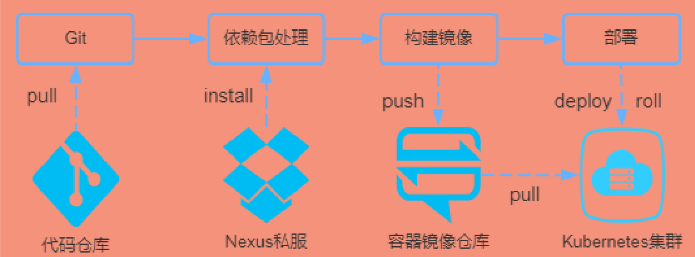

# docker 基础

## 1. 什么是 docker 容器？

Docker 是一个开放源代码软件项目，让应用程序布署在软件容器下的工作可以自动化进行，借此在 Linux 操作系统上，提供一个额外的软件抽象层，以及操作系统层虚拟化的自动管理机制。

- 环境同一
- 轻量省资源
- 快速部署迁移

### 原理

和宿主机共享内核，所有容器运行在容器引擎之上，容器并非一个完整的操作系统，所有容器共享操作系统，在进程级进行隔离。

**优点**
高效、集中，一个硬件节点可以运行数以百计的的容器，非常节省资源

## 2. image vs container

1. 镜像 Image：静态模板、安装包
   只读文件，程序 + 环境打包好的蓝本，不能直接运行。

2. 容器 Container：运行实例、程序进程
   镜像启动后产生的运行实体，真正干活的程序。

## 3. dockerfile

Dockerfile：构建镜像的脚本文件，纯文本写指令，自动打包出镜像

```
Dockerfile → 编译生成 Image 镜像 → 运行出 Container 容器
```

### 常用指令

1. FROM：指定基础镜像，必须放在第一行
   如果不以任何镜像为基础，那么写法为`from scratch`，同时意味着接下来缩写的指令将作为镜像的第一层开始。

   语法：

   ```
   FROM <image>
   FROM <image>:<tag>
   FROM <image>:<digest>
   ```

   三种写法，其中<tag>和<digest> 是可选项，如果没有选择，那么默认值为latest

2. MAINTAINER：镜像的作者
   语法：

   ```
   MAINTAINER <name>
   ```

3. RUN：运行指定命令

   ```
   RUN chmod +x /init.sh /wait_env.sh \
   && chmod 600 /root/.ssh/id_rsa \
   && docker-php-ext-enable molten
   ```

   > 注意：多行命令不要写多个RUN，原因是Dockerfile中每一个指令都会建立一层.多少个RUN就构建了多少层镜像，会造成镜像的臃肿、多层，不仅仅增加了构件部署的时间，还容易出错。RUN书写时的换行符是

4. CMD：容器启动时执行的命令

   语法：

   ```
   1. CMD ["executable","param1","param2"]  ##“JSON数组格式的CMD”，也称为“直接执行格式的CMD”
   2. CMD ["param1","param2"]             ##“JSON数组格式的CMD”，与第一种格式进行区别时就看第一个参数是否是可执行文件
   3. CMD command param1 param2        ##“shell格式的CMD”
   ```

   > RUN & CMD
   > 不要把RUN和CMD搞混了。
   > RUN是构建镜像时执行的命令，需提交运行结果到只读层。
   > CMD是容器启动时执行的命令，在构建镜像时并不运行，构建镜像时仅仅指定了这个命令的内容

5. ENTRYPOINT：容器启动时执行的命令，可被覆盖

   ```
   1. ENTRYPOINT ["executable", "param1", "param2"]   ##“JSON数组格式的entrypoint”---接受CMD提供参数
   2. ENTRYPOINT command param1 param2          ##“shell格式的entrypoint”---不接受CMD提供参数，直接覆盖CMD
   ```

6. ENV：设置环境变量

   ```
   1. ENV <key> <value>
   2. ENV <key>=<value> <key>=<value> .
   ```

   - 两者的区别就是第一种是一次设置一个，
   - 第二种是一次设置多个值也可以用双引号引起来

7. COPY：复制文件，只复制本地文件 / 文件夹，单纯拷贝

   ```
   COPY test relativeDir/
   ```

8. ADD：复制文件，COPY + 额外功能（比如自动解压、下载网络文件、自带文件权限）

### 常用命令

```
docker search  // 搜索镜像
docker images // 查看镜像
docker rmi // 删除镜像
docker rm // 删除容器
docker run // 运行容器
docker ps // 查看运行中的容器
docker start/stop/restart #启动/停止/重启容器
docker pull // 拉取镜像
docker tag
docker logs // 查看docker示例运行日志
docker push // 推送镜像
```

# docker compose

批量编排管理多个 Docker 容器的工具，单个容器手动启停，多服务一键统一部署、启停、组网

docker-compose.yml：多容器配置文件

```
# 启动服务
docker-compose up -d
# 停止服务
docker-compose down
# 查看运行状态
docker-compose ps
```

同时跑前端、后端、数据库三个容器，无需逐个手动启动。

```yml
version: "3.8"

services:
  # 前端服务
  web:
    build: ./frontend
    ports:
      - "80:80"
    depends_on:
      - api

  # 后端服务
  api:
    build: ./backend
    ports:
      - "3000:3000"
    environment:
      DB_HOST: mysql
      DB_USER: root
      DB_PWD: 123456
    depends_on:
      - mysql

  # 数据库
  mysql:
    image: mysql:8.0
    ports:
      - "3306:3306"
    environment:
      MYSQL_ROOT_PASSWORD: 123456
      MYSQL_DATABASE: test_db
    volumes:
      - mysql_data:/var/lib/mysql

volumes:
  mysql_data:
```

# Kubernetes（K8s）

## 解决什么痛点？

用 Docker Compose 跑几个容器还行，但：

- 容器多了（上百个），手动管不过来
- 挂了没人自动重启
- 流量大了不会自动扩容
- 多服务器怎么统一调度？

## 特点

- 一个平台搞定所有
- 云环境无缝迁移
- 高效的资源利用

## CI/CD

ins--->克隆应用代码和Dockerfile--->从私服下载依赖包--->根据Dockerfile构建容器镜像--->push镜像到镜像仓库--->远程驱动k8s更新镜像---k8s集群pull最新镜像。


## 核心概念

1. Pod（最小单位）
   K8s 不直接管容器，管 Pod
   一个 Pod = 1 个或多个容器（共享网络、存储）
   类比：Pod 是 “宿舍”，容器是 “住客”
2. Node（节点）
   集群里的每台服务器（物理机 / 虚拟机）
   所有 Pod 都跑在 Node 上
3. Deployment（部署）
   定义 “要跑几个 Pod、用什么镜像、怎么升级”
   你说：我要 3 个前端 Pod → K8s 帮你维持 3 个，挂了自动补
4. Service（服务）
   给一组 Pod 一个固定 IP + 域名，做负载均衡Kubernetes
   Pod 可以随时重启、漂移，但访问地址不变
5. 其他常用
   ConfigMap/Secret：配置、密码
   Ingress：外部访问入口（域名→服务）
   HPA：自动扩缩容（CPU 高了自动加 Pod）
