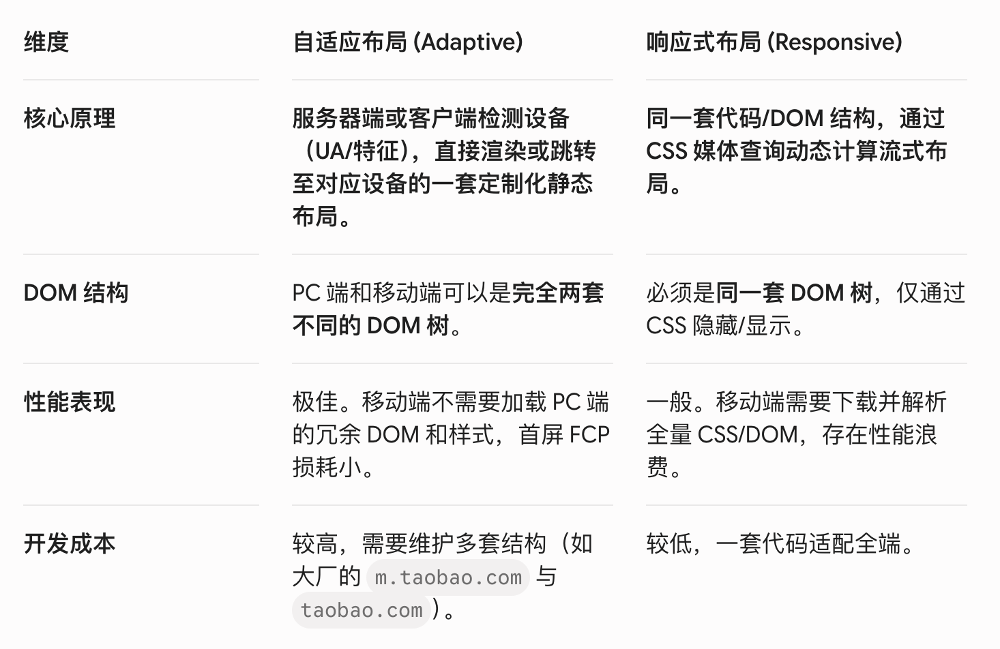
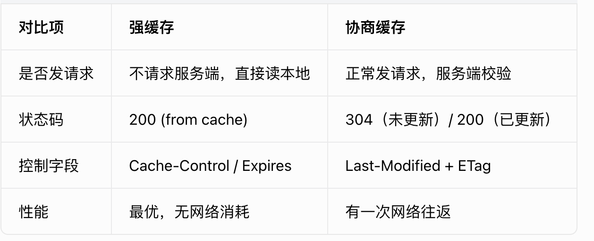

# 一、React 中 useEffect 的依赖数组如果传了一个对象，为什么会导致无限执行？你平时怎么处理这类问题？

对象依赖导致无限执行，核心原因是 React 对 useEffect 依赖项采用的是 Object.is(a, b) 这种「浅比较」：，每次渲染生成的新对象引用会被判定为变化，从而触发循环。
解决这个问题，我会分场景处理：
1. 静态对象提到组件外定义；
2. 动态对象用 useMemo 缓存，或直接解构原始值作为依赖；
3. 如果对象变化不希望触发 effect，会用 useRef 保存。
这也是我在大型项目中避免性能问题的常规做法。 

对象依赖导致无限执行，本质不是「内容变了」，而是「地址变了」。
React 的浅比较只认内存地址，不认内容，每次渲染生成的新对象地址都是新的，所以会被判定为依赖变化，导致 useEffect 无限执行。

# 二、那你是如何在 SDK 中实现 XMLHttpRequest 和 fetch 的劫持的？劫持过程中，需要注意哪些兼容性和边界问题？  

我在自研监控 SDK 中通过原型重写无侵入劫持 XHR 和 fetch，整体分为劫持逻辑、异常判定、边界处理三部分：
1. 劫持实现
针对 XMLHttpRequest：先保存原生构造函数和 open、send 方法，重写原型方法；在 open 阶段记录请求地址、请求方式，send 阶段监听 load、error、timeout、abort 全量事件，收集耗时、状态码等信息。为了防止业务覆盖回调，我使用 addEventListener 绑定事件。
针对 fetch：保存全局原生 fetch 方法，重写后捕获 URL 和配置；利用 Promise 流程区分错误：网络级错误进入 catch，HTTP 4xx/5xx 在 then 中通过 response.ok 判断。由于 fetch 响应是可读流，我会调用 clone () 克隆响应体，避免影响业务读取。
2. 异常判定
不会只依靠 HTTP 状态码：首先判断网络异常、超时这类无状态码场景；再判断 4xx/5xx HTTP 错误；最后解析响应体，捕获 HTTP 200 但业务自定义错误码的场景。所有异常统一推入监控队列。
3. 边界与兼容问题
- 做接口白名单，过滤 SDK 自身上报请求，防止循环上报；
- 对请求、响应数据脱敏，保护敏感信息；
- 高频接口加节流，避免重复上报和性能损耗；
- 兼容低版本浏览器 XHR 事件，同时监听 readystatechange；
- 处理 AbortController 取消请求、跨域无法读取响应体等场景，全量加 try/catch 容错；
- 最终结合内存队列 + 阈值 / 延时，做批量上报，减少网络请求。

# 三、前端监控 SDK 采集了海量日志，日均上报量很高，你在前端层面做了哪些 流量削峰、降级、容错 策略，保证 SDK 本身不影响业务页面性能与稳定性？请详细说明。

监控 SDK 前端侧稳定性策略：流量削峰、防抖节流、多级降级、缓存兜底。

核心目标：SDK 采集 / 上报逻辑绝不阻塞业务主线程、不打爆网络、自身报错不影响页面，整套策略分为：流量控制、队列策略、多级降级、异常隔离、资源管控五大块。

在我自研的前端监控 SDK 中，面对日均百万级上报流量，前端侧从流量削峰、队列管理、多级降级、线程隔离、边界防护五个维度做了完整策略，保障不影响业务：
第一，流量削峰。首先采用队列批量上报，维护内存日志队列，设置「满条数立即上报 + 超时强制上报」双规则，合并请求减少网络开销；其次对高频接口报错、页面轮询等场景做节流，路由、滚动行为做防抖，避免短时间内产生海量日志；线上还配置了概率采样，峰值流量可动态调整采样率，从源头控制上报总量。
第二，队列与内存管控。给上报队列设置最大长度，防止内存溢出；监听页面卸载事件，配合 keepalive 兜底上报剩余日志；同时把普通日志和 rrweb 录屏分片拆分为独立队列，大体积数据不影响常规日志传输。
第三，多级降级容错。上报失败会先进行有限次数的延迟重试；重试失败、断网时，将日志存入 IndexedDB 离线缓存，网络恢复后自动补发；如果离线存储也失败，就直接丢弃数据，避免逻辑死循环。
第四，主线程隔离。所有上报、数据处理逻辑优先使用 requestIdleCallback 在浏览器空闲时执行，不抢占页面渲染和交互资源；并且所有 SDK 代码都包裹 try/catch 做错误隔离，SDK 内部异常不会导致业务页面报错。
最后补充边界防护：配置接口白名单，过滤 SDK 自身上报请求，防止循环劫持；对超长文本截断、敏感数据脱敏，缩小传输体积；分片上传采用串行模式，限制请求并发量，全方位保障页面稳定性。

# 四、在等比缩放（scale）自适应方案中，ECharts 图表或者 Three.js 场景会出现鼠标点击/悬浮位置偏移，怎么解决？

- 致命原因： transform: scale 改变了元素的视觉呈现尺寸，但并没有改变 DOM 元素的 getBoundingClientRect() 原始物理尺寸和事件坐标系。导致图表内部计算 clientX/clientY 时出现像素级错位。

- 标准破局：

1. ECharts： 不能直接对图表外层做 scale。应该使用流式布局，并在 window.resize 时，利用 requestAnimationFrame 防抖触发 myChart.resize()，让 ECharts 内部通过 Canvas 重新计算像素点。

2. Three.js： 必须在窗口变化时更新相机的纵横比（Aspect Ratio）并调用 camera.updateProjectionMatrix()，同时 renderer.setSize 动态调整渲染画布大小，千万不要用 CSS 去硬缩放 Canvas。

# 五、 使用 rem 自适应方案时，如何避免页面刚加载时的“闪烁”（FOUT/闪屏）现象？

出现原因：“自适应布局闪烁的本质原因是：浏览器首次渲染（First Paint）时使用的布局基准值，与 JS 脚本计算后的最终值不一致，导致了二次重排（Relayout）。”

解决方案：
1. 针对 rem 方案：控制渲染时序
“如果是为了兼容性或边界控制（如最大/最小宽度限制）而使用 rem，我会采取 ‘内联、置顶、阻塞’ 的策略：”

将计算 rem 的 JS 代码进行压缩，直接内联在 HTML 的 <head> 标签最顶部。

理由： 确保在浏览器解析任何可见 DOM 元素之前，html 的字号已经确定。这样浏览器在进行第一次 Layout 时拿到的就是正确值，从而实现零闪烁。

2. 针对 PostCSS + vw 方案：利用原生能力
“在现代项目中，我更倾向于使用 PostCSS 自动转 vw 的方案。它能从根本上规避闪烁：”

理由： vw 是浏览器原生单位，不依赖 JS 计算。它在 CSS 解析阶段（Recalculate Style）直接生效，早于主线程的 JS 执行。

深度补充： 此时的性能瓶颈转移到了 CSS 的体积上，我会通过 Critical CSS（关键路径 CSS 内联） 来优化首屏白屏时间。

3. 针对 3D/大屏方案：GPU 合成层优化
“对于三维可视化项目，我会使用 transform: scale 结合 CSS 变量进行等比缩放。利用 transform 在 合成线程（Compositor Thread） 执行的特性，规避主线程的重排，确保 3D Canvas 不会因窗口抖动而出现渲染异常。”

“在实际选型中，我不会盲目追求某一种单位。我会根据业务对首屏性能的要求（是否需要极致 LCP）以及视觉还原的复杂度（是否涉及三维缩放）来做权衡。适配方案不仅是视觉上的‘自适应’，更是针对渲染流水线（Rendering Pipeline）的精准调优。”

# 六、自适应布局（Adaptive Layout）和响应式布局（Responsive Layout）

# 七、 如何处理不同浏览器的兼容性问题？
“我将兼容性治理分为事前、事中、事后三个阶段：

事前约束： 通过 Browserslist 规范技术边界，利用 eslint-plugin-compat 在编码期拦截不兼容的 API 使用。

事中自动化： 构建链中集成 PostCSS 和 Babel。针对 CSS，利用 autoprefixer 处理前缀；针对 JS，采用按需注入 Polyfill 的策略，避免冗余代码影响首屏 FCP。针对我的 3D 可视化项目，我会额外进行 WebGL 特性检测，针对低端设备进行降级渲染。

事后闭环： 利用自研监控平台收集生产环境的异常日志。通过对错误进行浏览器版本的维度聚类，能快速定位出类似‘Safari 特定版本不支持某 API’的隐蔽 Bug，实现从发现到修复的快速响应。”

# 八、你在项目中做过大量前端性能优化工作，请你梳理一下，从加载阶段、渲染阶段、运行时三个维度，分别说说你常用的优化手段，并举 1-2 个你项目中落地的真实案例。

我会按照加载、渲染、运行时三个阶段做全链路性能优化，结合项目落地有对应的方案和收益：

1. 加载阶段
首要目标是缩短首屏加载时间。
- 工程上做代码压缩、Tree-Shaking、图片转 WebP 格式减小资源体积；
- 通过 Webpack/Nest 打包做路由懒加载、公共依赖分包，拆分大包。同时优化资源加载策略，核心 CSS 内联，非核心 JS 使用 defer 延迟加载，避免阻塞渲染。
- 网络层面开启 CDN 和 HTTP2，静态资源配置带 hash 的强缓存，动态接口使用协商缓存，大幅提升重复访问速度。
- 项目中还搭配骨架屏，解决弱网下白屏问题。

2. 渲染阶段
重点规避重排和重绘。
- 首先做到批量操作 DOM、读写样式分离；
- 动画元素使用 transform/opacity 实现，提升独立合成层，避免触发全局重排。
- 针对监控平台、数据列表这类长列表场景，落地虚拟滚动，只渲染可视区域 DOM，解决海量 DOM 节点导致的滚动卡顿。
- 同时简化 CSS 选择器，降低样式匹配开销。

3. 运行时阶段
核心是减轻主线程压力。
- 对滚动、点击这类高频事件统一使用防抖和节流；
- 大量计算、数据解析放到 Web Worker 执行。
- DOM 事件采用事件委托统一管理，页面销毁时及时清除定时器、事件监听和第三方实例，避免内存泄漏。
- 另外用 requestIdleCallback 拆分长任务，保证页面交互流畅。

整套优化落地后，项目首屏加载速度、滚动帧率、长时间运行稳定性都有明显提升。

# 九、Next 与 React 相比，在性能和 seo 上有哪些优势，你做过哪些针对性的优化？

第一部分：Next.js 对比纯 React SPA 的优势（SEO + 性能两大维度）
1. SEO 优势（SPA 天生短板，Next.js 完美弥补）
纯 React SPA 是客户端渲染 (CSR)：浏览器下载 JS 后才渲染页面，爬虫执行 JS 能力弱，容易抓取到空 HTML，SEO 极差。 Next.js 提供多种渲染模式，从根源解决问题：
● 服务端渲染 SSR：请求到达服务端，先渲染出完整 HTML 再返回给浏览器，爬虫直接抓取完整页面内容，天然友好；
● 静态生成 SSG（静态站点生成）：构建阶段就生成完整静态 HTML/CSS/JS，CDN 托管，爬虫抓取效率最高，是 SEO 最优方案；
● 增量静态再生成 ISR：结合 SSG + 动态更新，静态页面定时增量刷新，兼顾 SEO 和动态数据；
● 框架原生支持 next/head / Metadata API，统一管理 title、meta、Open Graph 等标签，规范且易用，无需额外封装工具。
2. 性能优势（相比 CSR React）
1. 首屏性能指标大幅优化 CSR 需要下载大包 JS → 解析执行 → 渲染，白屏时间长； Next.js SSR/SSG 直接返回可直接展示的 HTML，显著优化 FCP、LCP、TTI 等核心 Web 指标。
2. 内置开箱即用的优化能力
  ○ 原生 next/image：自动图片压缩、格式转换 (WebP/AVIF)、自适应尺寸、懒加载、占位图，无需自行封装；
  ○ next/font：字体文件本地化，规避字体闪烁 (FOIT/FOUT)，提升渲染体验；
  ○ 路由预加载：链接进入视口后，自动预加载对应路由资源，页面跳转近乎秒开；
3. 路由与打包优化 基于文件系统的路由，天然支持路由代码分割，每个页面单独打包，避免 SPA 单包体积过大；
4. 网络与缓存 支持边缘函数、中间件，可在边缘节点处理请求、做缓存、鉴权，降低源站压力；静态资源默认配置最优缓存策略。

2. Next.js 专项性能优化（结合项目落地，分维度）
结合框架特性，分「资源优化、代码分割、渲染策略、缓存、请求优化」五大方向：
1. 图片 / 字体优化 全面使用 next/image 组件，替代原生 ，开启自动格式降级、懒加载、尺寸约束；字体使用 next/font 托管，消除字体闪烁。
2. 组件 / 路由懒加载
  ○ 路由层面：利用文件路由天然分包，复杂页面 / 大组件使用 dynamic 动态导入（Next.js 官方 API），搭配 loading 状态，拆分非首屏代码；
  ○ 区分：React 原生 React.lazy 仅客户端生效，Next.js 推荐框架内置 dynamic，兼容 SSR/SSG。
3. 渲染模式选型（核心优化） 根据页面场景选择最优渲染方案： 
  ○ 营销页、文档、活动页：用 SSG 静态生成，极致首屏 + CDN 缓存；
  ○ 个性化页面、实时数据页：用 ISR 增量静态再生，平衡静态优势与数据实时性；
  ○ 强实时、登录态强关联页面：按需使用 SSR，避免全局 CSR。
4. 打包与体积优化
  ○ 开启 swc 替代 Babel，提升编译、压缩速度；
  ○ 配置 externals 剥离超大第三方依赖，减少打包体积；
  ○ 移除未使用依赖、Tree-Shaking 清理死代码；
5. 数据请求 & 缓存优化
  ○ 数据请求放在 getStaticProps / getServerSideProps 服务端执行，减少客户端网络请求；
  ○ 合理配置 ISR 重校验时间、静态资源缓存头，复用缓存；
  ○ 接口请求做聚合、节流，重复请求做内存缓存。
6. 运行时优化 复用 React 通用优化：长任务拆分、虚拟列表处理大数据表格、防抖节流高频事件；中间件统一拦截请求，做路由跳转、权限前置处理。

# 十、Next.js 中水合（Hydration）是什么？日常开发中你遇到过哪些水合不匹配的问题？如何排查和解决？

水合 = 客户端 JS 激活服务端返回的静态 DOM，赋予交互能力的过程。

水合概念
Next.js SSR/SSG 会先在服务端生成静态 HTML 返回浏览器，页面可见但无交互；浏览器加载 JS 后，React 把事件、状态绑定到现有 DOM，让页面可交互，这个激活过程就是水合。Next13+ 的服务端组件不参与水合，只有加了 use client 的客户端组件才会执行水合。

常见不匹配问题
大多是服务端 Node 环境和客户端浏览器环境不一致导致：
组件顶层直接使用 window、document、localStorage 等浏览器 API；
使用随机数、时间戳，两端渲染内容不同；
条件渲染依赖客户端环境，DOM 结构不一致；
引入不支持 SSR 的第三方组件库、地图、弹窗等；
深色模式、动态样式、接口数据两端不统一。

排查与解决
排查主要依靠控制台报错定位组件，查看页面源码对比两端 DOM，注释代码缩小范围。

解决方式：
把浏览器专属逻辑放到 useEffect 里执行；
用 typeof window 判断环境做兜底；
不兼容 SSR 的组件使用 next/dynamic 并关闭 ssr；
随机值、本地存储全部放到客户端生命周期中处理；
统一前后端接口数据与动态渲染逻辑。

# 十一、请说说 Redux / Zustand / Jotai 这类状态库的选型思路，以及你在大型项目中如何做状态拆分、状态性能优化？

我在项目中主要使用过 Redux、Zustand、Jotai 三款状态库，选型会结合项目规模、团队协作、状态场景综合判断：
首先是选型思路：
对于超大型、多人协作、业务逻辑复杂的传统项目，我会选用 Redux + Redux Toolkit。它规范严格、单向数据流可预测，配套调试工具、中间件生态完善，适合统一团队编码规范，处理复杂异步逻辑。
绝大多数中大型新项目，优先使用 Zustand。它轻量简洁、API 简单，没有冗余模板代码，开发效率高，同时性能表现优秀，足以满足全局、模块级状态管理需求，是目前我最常用的方案。
如果项目里有大量表单、高频交互组件、需要细粒度状态共享的场景，会选用 Jotai。它基于原子化思想，状态颗粒度极小，能做到精准更新，大幅减少无效渲染。
其次在大型项目中，我会做好状态拆分，避免状态臃肿：
整体按作用域拆分，分为全局状态、业务模块状态、组件局部状态。全局状态只存放登录信息、系统配置这类全项目通用数据；每个业务模块单独维护独立 Store/Slice，模块之间解耦；而弹窗、临时表单等页面私有数据，优先使用 React 原生 useState，不侵入公共状态。同时区分持久化状态和临时状态，按需做本地存储。
最后是性能优化，核心是减少无效重渲染：
第一，坚持多 Store / 多 Slice 拆分，缩小状态变更的影响范围；
第二，组件做到精准订阅，只获取自身依赖的状态片段，不订阅整个根状态；对象、数组类型搭配浅比较函数，避免引用变更导致的渲染；
第三，Redux 项目使用 reselect 缓存计算属性，避免重复逻辑执行；
第四，接口请求、列表这类服务端数据，结合 React Query 管理，和客户端状态做分离；最后配合 React.memo 优化纯展示组件，全方位提升渲染性能。

# 十二、React 性能优化

我对 React 性能优化分为运行时渲染优化和工程化打包优化两大块，核心思路是：减少无效重渲染、减轻主线程压力、规避框架渲染陷阱。
第一，减少不必要的组件重渲染，这是 React 最核心的优化方向。
首先使用 React.memo 缓存纯展示组件，props 不变就不重渲染；配合 useCallback 稳定事件函数引用、useMemo 缓存复杂计算值和对象引用，避免因为引用变化导致组件频繁更新。同时我会合理拆分组件，把高频更新的部分拆成独立小组件，缩小渲染影响范围。
第二，列表场景专项优化。
渲染列表时，坚决使用业务唯一 ID 作为 key，不使用数组索引，防止 Diff 错乱和多余渲染。项目里监控平台的海量日志列表，我使用了虚拟列表，只渲染可视区域 DOM，解决大数据滚动卡顿问题。
第三，主线程与长任务优化。
针对大数据遍历、复杂解析这类耗时逻辑，我会用 requestIdleCallback 分片执行，或是放到 Web Worker 中运行，避免阻塞主线程造成页面卡顿。对于滚动、输入等高频事件，统一做防抖和节流处理。
第四，遵循 Diff 算法规则 + 样式动画优化。
React Diff 是同层对比、依靠 key 复用节点，开发中我不会随意改动 DOM 层级、乱用索引 key。动画场景优先使用 transform 和 opacity，只触发图层合成，避免开销更大的重排重绘。
第五，内存泄漏防护。
组件卸载时，统一清除定时器、事件监听、ECharts 实例、未完成的异步请求等，避免页面长期运行越用越卡。
最后补充工程化层面：借助 Webpack 做 Tree-Shaking、代码分割、懒加载和资源压缩，从包体积和加载速度上进一步优化整体体验。

# 十三、讲讲 React 中 useEffect、useLayoutEffect 的区别，以及各自的使用场景？

两者核心区别在于执行时机和同步 / 异步特性，并且依赖规则、副作用清理能力完全一致。
第一，useEffect 是异步执行，在浏览器完成 DOM 布局、页面绘制展示之后才触发，不会阻塞页面渲染。日常业务里，接口请求、定时器、事件监听、日志上报这类纯逻辑副作用，我都使用它。它支持依赖数组控制执行时机，返回的函数用于组件更新或卸载时清理副作用。
第二，useLayoutEffect 是同步执行，在 DOM 布局完成、页面绘制之前执行，执行过程会阻塞页面渲染。它专门用来处理 DOM 相关操作，比如获取元素尺寸、修改样式、操作 DOM 节点。如果这类逻辑用 useEffect，会出现页面先展示旧样式、再刷新的闪烁问题，而 useLayoutEffect 能在画面呈现前完成修改，规避视觉抖动。
最后补充两点：一是执行顺序上，同一个组件内 useLayoutEffect 永远先于 useEffect 执行；二是开发规范，普通逻辑优先用 useEffect，仅 DOM 读写场景使用 useLayoutEffect，同时不在 useLayoutEffect 中编写耗时逻辑，避免页面卡顿。

# 十四、React 中如何避免闭包陷阱？结合实际代码举例说明。
React 闭包陷阱本质是：函数组件每次重渲染都会生成全新作用域，useEffect、useCallback 这类回调会通过闭包捕获当前渲染轮次的 state 和 props，如果依赖配置不当，回调会一直读取旧值，造成逻辑异常。
我遇到最多的场景是定时器、异步回调、延时函数。比如定时器回调里打印 state，页面数值已经更新，但控制台一直输出初始值。
日常开发中我有四种解决方式：
补全依赖数组，遵守 React Hook 规则，把回调里用到的 state、props、函数全部写入依赖，配合 ESLint 校验，从源头规避；
状态更新优先使用函数式更新，通过 prev 拿到上一次状态，不再依赖外部变量；
针对定时器、长延时这类场景，用 useRef 存储最新的 state 或 props，ref 的 current 属性在所有渲染中共享，能稳定拿到最新值；
复杂场景合理拆分组件与自定义 Hook，缩小闭包作用范围。
同时团队项目会开启 Hook 依赖校验的 ESLint 规则，提前拦截依赖缺失问题。

# 十五、说说 React 中 forwardRef 的作用与使用场景，并写一段简单示例代码。
作用
forwardRef 是 React 提供的 API，用来转发 ref。因为 ref 不会作为 props 传递，普通函数组件无法接收 ref，通过它可以让父组件拿到子组件内部的 DOM 元素或组件实例。
使用场景
主要用于封装通用 UI 组件，比如自定义 Input、按钮、弹窗；也用于 HOC 透传 ref、父组件需要主动操作子组件 DOM（聚焦、滚动、获取尺寸）等场景。
补充
实际项目中一般配合 useImperativeHandle 使用，只对外暴露必要方法，避免直接暴露完整 DOM，保证组件封装性。

# 十六、简单讲讲 React 合成事件，以及和原生 DOM 事件的区别？
React 合成事件是框架对原生 DOM 事件的封装，主要作用是抹平各浏览器的兼容问题，同时采用事件委托机制，将事件统一挂载到根节点，减少事件绑定数量，优化性能。

它和原生事件主要有三点区别：
第一是绑定位置，合成事件不绑定在目标元素上，而是统一挂载到应用根容器；原生事件直接绑定在对应 DOM 节点。
第二是事件对象，合成事件对象来自事件池，执行完成后会被重置，异步代码中直接访问会失效，可通过 persist() 保留；原生事件对象无复用机制。
第三是执行顺序，同节点下原生事件优先触发，合成事件后执行，两者的冒泡阻止无法互相拦截。

日常开发我优先使用 React 合成事件，仅在需要兼容第三方库、操作原生 DOM 时才使用原生事件。

# 十七、React 中 key 的作用是什么？为什么不建议用数组索引作为 key？
key 是 React Diff 算法用来识别节点身份的唯一标识，帮助框架精准对比新旧虚拟 DOM，尽可能复用现有 DOM，减少节点创建与销毁，提升更新性能。

不建议使用数组索引作为 key，因为当列表进行新增、删除、排序操作时，元素索引会发生变动。这会让 Diff 错误判断节点身份，造成大量 DOM 重新渲染；如果列表包含输入框、开关这类带内部状态的组件，还会出现状态串位、数据错乱的问题。
实际开发中，我都会使用业务唯一 ID 作为 key。

# 十八、 跨域及解决方案
前端跨域是浏览器同源策略导致，日常常用方案及场景如下：
本地代理：通过 Webpack/Vite 的 devServer 转发请求，只用于开发环境，方便本地联调接口，不能部署到线上。
CORS 跨域：后端配置响应头，设置允许跨域的域名、请求头，是目前生产环境最主流的方案，支持所有请求方式。
Nginx 反向代理：运维配置 Nginx 统一域名，把前端和接口归为同源，线上项目部署广泛使用，稳定性强。
JSONP：借助 script 标签绕过跨域，但仅支持 GET 请求，安全性差，现在只用来兼容老旧接口。
postMessage：专门解决 iframe、跨域弹窗这类页面之间的数据通信。
我们团队常规做法：本地用代理联调，线上优先后端 CORS 或 Nginx 代理。

# 十九、说说 HTTP 缓存机制，强缓存和协商缓存的区别、使用场景？

强缓存
用于长期不变的静态资源（图片、样式、脚本、字体），设置较长 max-age，搭配文件哈希实现更新。
协商缓存
用于频繁变动、需要实时校验的资源：动态接口、动态页面、频繁迭代的 HTML 模板。
组合用法（线上最优实践）
静态资源：开启强缓存 + ETag/Last-Modified 兜底；
动态接口：关闭强缓存（Cache-Control: no-cache），只走协商缓存。

HTTP 缓存分为强缓存和协商缓存，浏览器优先命中强缓存。
强缓存通过 Cache-Control 和 Expires 设置过期时间，命中时浏览器不会向服务端发送请求，直接读取本地缓存，状态码为 200。主要用于图片、JS、CSS 这类更新频率低的静态资源，通常配合文件哈希使用，资源更新后自动触发新请求。

当强缓存过期或被禁用，就会进入协商缓存。浏览器会带上资源标识向服务端发请求，标识分为 Last-Modified 最后修改时间和 ETag 资源哈希指纹。服务端对比后，如果资源无更新，返回 304 状态码，浏览器继续使用本地缓存；如果资源已更新，返回 200 和新数据。协商缓存适合动态接口、实时页面这类需要频繁校验更新的场景。

项目中我一般对静态资源开启长时间强缓存，动态接口则关闭强缓存，仅使用协商缓存。

# 二十、说说 HTTP1.1、HTTP2、HTTP3 的主要区别和各自优势？
三个版本底层和核心能力差异明显：

- HTTP/1.1 基于 TCP，支持长连接，但同一连接内请求串行执行，存在队头阻塞；请求头为文本格式、冗余大，浏览器对单域名并行连接数也有限制。优点是兼容性最好，至今广泛使用。
- HTTP/2 底层仍为 TCP，做了大幅优化：采用二进制帧传输，支持多路复用，单连接可并行处理所有请求，解决了应用层队头阻塞；同时新增头部压缩、服务器推送能力，加载速度明显提升。但受限于 TCP 本身，网络丢包时依然会出现阻塞。
- HTTP/3 底层改用基于 UDP 的 QUIC 协议，从根源彻底解决所有队头阻塞问题，弱网、网络切换场景体验更好，握手流程也更精简。目前性能最优，但生态和兼容性还在逐步完善。

补充：SSL/TLS 是 HTTPS 的加密方案，三个版本都可以搭配使用，并非 HTTP2 独有。

# 二十一、简单讲一下 TCP 三次握手、四次挥手的过程和作用？
TCP 是面向连接、可靠传输的协议，通信前必须建立连接，通信结束后正常断开连接。
三次握手：建立 TCP 连接
四次挥手：断开 TCP 连接

三次握手（建连）

TCP 三次握手用于建立可靠连接：
1. 客户端发送 SYN 报文，请求建立连接；
2. 服务端返回 SYN+ACK，告知客户端自身收发正常；
3. 客户端再次发送 ACK 确认，双方连接正式建立。
目的是校验双方收发能力，保证通信可靠。

四次挥手（断连）
TCP 是全双工通信，断开需要四次挥手：

1. 主动方发送 FIN，告知对方不再发送数据；
2. 被动方回复 ACK，确认收到关闭请求，仍可继续传输残留数据；
3. 被动方数据传输完成后，发送 FIN，告知己方也要关闭；
4. 主动方回复 ACK，双方彻底断开连接。
目的是保证所有数据传输完成，安全释放连接。

# 二十二、 讲讲什么是 01 背包？简单说下解题思路。
01 背包是经典动态规划问题：每个物品最多选一次，在背包容量限制下求最大总价值。
解题使用一维 DP 数组：
定义 dp[j] 表示背包容量为 j 时的最大价值；
逐个遍历物品，倒序遍历背包容量，避免物品重复选取；
状态转移：对每个容量，比较「不选当前物品」和「选当前物品」两种情况，取价值更大的那个；
最终 dp[背包总容量] 就是答案。

# 二十三、贪心算法

贪心算法的核心是每一步都选择当前局部最优解，不回头、不做全局预判，代码简单、执行效率高。
但它有局限性：局部最优不一定能推出全局最优，所以要判断场景再使用。
我接触较多的场景：
区间调度问题，比如选择最多不重叠的活动，贪心策略是每次选结束最早的活动；
零钱兑换（常规面值纸币），每次优先取最大面额，实现最少纸币数量；
前端资源加载，优先加载可视区内图片、脚本，也是贪心思想的体现。

# 二十四、讲一下 JS 原型、原型链，以及 instanceof 的原理？

1. 基础名词区分
- prototype
仅函数拥有的属性，是函数的显式原型，用来存放实例共享的方法 / 属性。
- __proto__
所有对象（包括函数实例、普通对象） 都有的属性，是隐式原型，指向构造函数的 prototype。
- constructor
原型对象 prototype 上的属性，指回构造函数本身。
2. 原型链
对象查找属性 / 方法时，先在自身查找；找不到就顺着 __proto__ 向上查找，直到 null，这条链式结构就是原型链。
顶端：Object.prototype.__proto__ === null，原型链到此终止。

instanceof 原理
作用：判断构造函数的 prototype 属性，是否出现在某个实例对象的原型链上。本质是遍历实例的原型链，检查链上是否存在该构造函数的 prototype，存在则返回 true，遍历到 null 仍未找到则返回 false。

# 二十五、说说 JS 中 call、apply、bind 的区别与使用场景？
call、apply、bind 都能改变函数 this 指向，主要区别有三点：
传参：call 逐个传参，apply 接收数组形式参数，bind 传参规则和 call 一致；
执行：call 和 apply 调用后函数立即执行，bind 只返回绑定好 this 的新函数，不会立刻执行；
场景：参数少用 call，参数为数组或个数不定用 apply；需要延迟执行、绑定回调上下文时用 bind。

# 二十六、答题技巧

面试公式：
原理 + 区别 + 场景 + 优缺点 + 项目案例

不要只答名词！不要只答名词！不要只答名词！不要只答名词！
