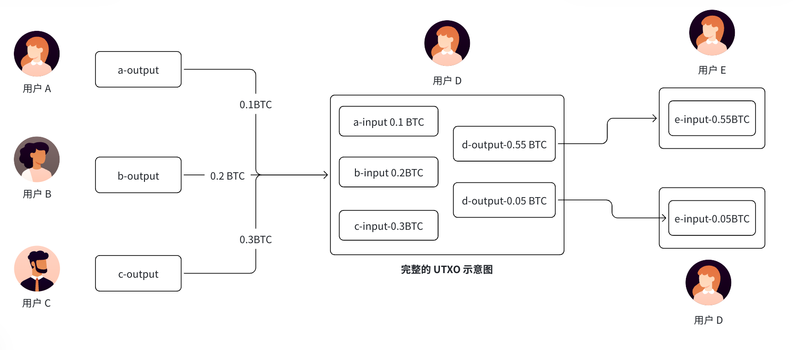
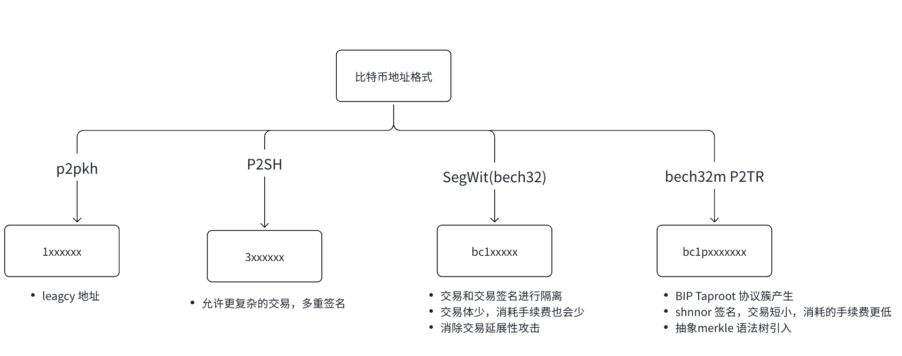

# 比特币基础

比特币（BitCoin, BTC）是基于区块链技术的一种数字货币实现，比特币网络是历史上首个经过大规模、长时间检验的数字货币系统。它诞生于08年，中本聪发布比特币的白皮书（比特币：一种点对点的电子现金系统）。

**特点**

- 去中心化：意味着没有任何独立个体可以对网络中的交易进行破坏，任何交易请求都需要大多数参与者的共识；
- 匿名性：比特币网络中账户地址是匿名的，无法从交易信息关联到具体的个体，但这也意味着很难进行审计；
- 通胀预防：比特币的发行需要通过挖矿计算来进行，发行量每四年减半，总量上限为2100万枚，无法被超发。
- 不可篡改
- 去中心化
- 可追溯性

它具备银行的功能：

- 通过 POW 挖矿铸币

它具备法币的属性：支付功能、交换媒介、投资属性。

## 原理

比特币网络是一个分布式的点对点网络，网络中的矿工通过“挖矿”来完成对交易记录的记账过程，维护网络的正常运行。
区块链网络提供一个公共可见的记账本，该记账本并非记录每个账户的余额，而是用来记录发生过的交易的历史信息。该设计可以避免重放攻击，即某个合法交易被多次重新发送造成攻击。

### UTXO模型

全称：Unspent Transaction Output，未花费交易输出。
UTXO模型是比特币网络中一种数据结构，它将交易中的输出作为数据单元，并记录在区块链中。

规则：UTXO 只能整笔消耗，不能拆开花；每次找零生成新地址，不容易追踪身份

**和传统账户模型最大区别**

- 账户模型：改数字、加减余额
- UTXO 模型：销毁旧零钱，生成新零钱



## 挖矿机制

### 工作量证明（PoW）原理

**什么是挖矿？**

矿工通过计算来求解数学难题，第一个求解的矿工获得：

- 区块奖励（Block Reward）：新铸造的比特币
- 交易费（Transaction Fees）：所有交易中的手续费总和

**难题是什么？**

找一个 nonce（任意数），使得：

```
SHA256(区块头 + nonce) < 目标难度
```

即哈希值以一定数量的零开头（难度越高，零越多）。

**没有捷径**：

- 无法预测有效的 nonce
- 只能不断尝试（暴力计算）
- 但验证很快（只需计算一次哈希）
- 这就是工作量证明的本质：计算困难，验证容易

**难度调整**

比特币每 2016 个区块（约 2 周）调整一次难度：

- 目标：维持 10 分钟出一个区块
- 公式：新难度 = 旧难度 × （预期时间 / 实际时间）
- 效果：算力增加 → 难度上升；算力减少 → 难度下降
- 结果：无论全网算力如何变化，出块时间始终稳定在 10 分钟

### 区块结构

**区块头（80 字节）**

- 版本号（4 字节）
- 前一个区块哈希（32 字节）：形成链
- Merkle Root（32 字节）：所有交易的哈希树根
- 时间戳（4 字节）：区块生成的 Unix 时间
- 难度目标（4 字节）：当前难度
- Nonce（4 字节）：矿工尝试的随机数

**区块体**

- 交易列表：包括 Coinbase 交易（矿工收入）和其他交易

### 挖矿流程

1. **收集交易**：从内存池（mempool）选择高手续费交易
2. **构建 Merkle Tree**：计算所有交易的哈希树
3. **尝试 Nonce**：不断改变 nonce，计算区块头哈希
4. **找到有效 Nonce**：哈希值 < 目标难度时，挖矿成功
5. **发布区块**：广播到全网，其他节点验证
6. **获得奖励**：矿工获得区块奖励 + 交易费

### 矿池和 ASIC

**为什么需要矿池？**

- 单个矿工找到有效 nonce 的概率极低
- 需要数年才能挖到一个区块
- 矿池聚合算力，定期分配奖励

**矿池工作原理**

- 矿工连接到矿池节点
- 矿池分配更容易的任务（低难度）
- 矿工完成任务证明贡献
- 矿池定期给矿工分配收益

**ASIC 矿机**

- ASIC（Application-Specific Integrated Circuit）：专为 SHA256 优化
- 相比 GPU/CPU：快 1000+ 倍
- 结果：挖矿变成工业级生意，个人矿工退出
- 问题：中心化风险（大矿池掌握算力）

### 主要矿池（2024）

| 矿池        | 算力占比 | 所在地   | 特点           |
| ----------- | -------- | -------- | -------------- |
| Foundry USA | ~30%     | 美国     | 最大 ASIC 矿池 |
| AntPool     | ~20%     | 中国     | Bitmain 旗下   |
| F2Pool      | ~15%     | 中国     | 老牌矿池       |
| Ocean       | ~3-5%    | 去中心化 | 反审查矿池     |

---

## 比特币经济学：减半周期

### 供给曲线

**总量有限**

比特币总量固定 2100 万枚，通过减半机制实现：

| 周期      | 年份      | 区块奖励  | 持续时间     |
| --------- | --------- | --------- | ------------ |
| 第 1 周期 | 2009-2012 | 50 BTC    | 210,000 区块 |
| 第 2 周期 | 2012-2016 | 25 BTC    | 210,000 区块 |
| 第 3 周期 | 2016-2020 | 12.5 BTC  | 210,000 区块 |
| 第 4 周期 | 2020-2024 | 6.25 BTC  | 210,000 区块 |
| 第 5 周期 | 2024-2028 | 3.125 BTC | 210,000 区块 |
| ...       | ...       | ...       | 每次减半     |

**最终结果**

- 2140 年左右，挖矿奖励变为 0
- 总供给：≈ 21,000,000 BTC（精确值 20,999,999.9769 BTC）
- 后期矿工收入：仅来自交易费

### 减半的经济学意义

**1. 类似黄金开采**

- 黄金：产量随时间递减
- 比特币：内生稀缺性（代码写死）
- 不会像法币那样无限增发

**2. 通胀率递减**

- 2009-2012：每年供给 +210 万 BTC（高通胀）
- 2012-2016：每年供给 +105 万 BTC
- 2020-2024：每年供给 +32.85 万 BTC
- 最终：通胀率 → 0%

**3. 市场周期**

- 减半前：预期稀缺性 → 价格上升
- 减半后 6-12 个月：新矿工需要更高价格以盈利 → 价格进一步上升
- 过度炒作后：调整下跌
- 历史规律：每次减半后 1-2 年内都会创新高

**历史减半事件**

| 减半日期   | 奖励       | 价格变化 | 备注             |
| ---------- | ---------- | -------- | ---------------- |
| 2012.11.28 | 50→25      | $13      | 次年达到 $1000   |
| 2016.7.9   | 25→12.5    | $650     | 次年达到 $20000  |
| 2020.5.11  | 12.5→6.25  | $8600    | 次年达到 $60000+ |
| 2024.4.19  | 6.25→3.125 | $62000   | 预计继续上升     |

---

## 交易费用机制

### 为什么要交易费？

1. **激励矿工**：当区块奖励变为 0 时，矿工依靠交易费维持网络
2. **防止垃圾交易**：交易费越高，垃圾交易越少
3. **优先级排序**：高费交易优先打包

### 费用计算

**基础公式**

```
交易费 = (交易体积 in Bytes) × (单位费率)
```

例：

- 交易大小：250 Bytes
- 单位费率：50 satoshi/Byte
- 总费用：250 × 50 = 12,500 satoshi ≈ 0.000125 BTC

**注意**

- 比特币以 satoshi 计费（1 BTC = 100,000,000 satoshi）
- 不同地址格式体积不同：P2PKH > P2SH > P2WPKH > P2TR
- 同一交易，用 P2TR 地址可节省 ~40% 费用

### Mempool 和 Fee Market

**Mempool（内存池）**

- 存储未打包的交易
- 矿工从中选择交易组成区块
- 一个区块 ~1 MB，约 2000-3000 笔交易

**竞争机制**

- 正常时期：费率 10-20 satoshi/Byte，绝大多数交易快速确认
- 拥堵时期：费率 100-500+ satoshi/Byte，费用可能翻倍
- 极端情况（2017 年）：费率飙升至 1000+ satoshi/Byte，一笔转账费用数百美元

**RBF（Replace-By-Fee）**

- 如果交易过久未确认，可以发起新交易，提高费用
- 原交易会被新交易替代
- 用途：加速交易

### 交易体积优化

使用不同地址格式的费用对比：

| 地址类型      | 典型大小  | 费用（50 sat/B） | 相对成本 |
| ------------- | --------- | ---------------- | -------- |
| P2PKH (1)     | 226 Bytes | 11,300 sat       | 100%     |
| P2SH (3)      | 180 Bytes | 9,000 sat        | 80%      |
| P2WPKH (bc1q) | 141 Bytes | 7,050 sat        | 62%      |
| P2TR (bc1p)   | 141 Bytes | 7,050 sat        | 62%      |

**结论**：使用 P2WPKH 或 P2TR 可以节省 38-40% 的费用

---

## 比特币安全模型

### 工作量证明的安全性

**51% 攻击的成本**

要发动 51% 攻击，需要：

1. 控制全网 50%+ 的算力
2. 截至 2024 年，全网算力约 **600+ EH/s**（Exahash per second）
3. 购买足够 ASIC 矿机：需要数十亿美元
4. 承担巨大的电费和运维成本
5. 即使发动攻击，比特币可能会硬分叉改变算法

**成本 vs 收益**

- 成本：数十亿美元
- 收益：最多回滚自己的交易、造成短期混乱
- 无法伪造虚假交易或凭空创造比特币
- 结论：经济上不划算

### 防止双重支付

**场景**：Alice 有 1 BTC，企图同时发给 Bob 和 Charlie

**比特币如何防止**：

1. UTXO 模型：同一个 UTXO 只能被花一次
2. 交易排序：如果两个冲突交易都被广播，矿工只会打包第一个
3. 确认机制：交易被打包进区块后，需要等待后续区块确认

**6 确认规则**

- 1 确认 = 1 个区块包含你的交易
- 6 确认 = 后续 6 个区块也确认了该交易
- 6 个区块 ≈ 60 分钟，攻击者需要重新计算这 7 个区块
- 难度：需要控制 50% 算力，且概率极低

### 不可逆性

**为什么比特币不可逆？**

一旦交易被打包进区块，要推翻它需要：

1. 重新计算该区块之后的所有区块（工作量极大）
2. 控制 50%+ 算力进行 51% 攻击
3. 攻击者的计算速度必须快于诚实节点

**历史上的例子**

- 2010 年：有人通过 Bug 凭空创造 184 亿 BTC，社区发现后硬分叉回滚
- 2012 年：意外分叉导致 24 小时内有两条主链，交易所等待 6 确认规则化解
- 至今：没有任何交易成功被回滚过（除非硬分叉改规则）

### 为什么 UTXO 比账户模型更安全？

| 特性         | UTXO               | 账户模型            |
| ------------ | ------------------ | ------------------- |
| 状态复杂性   | 低（仅记录 UTXO）  | 高（全局账户状态）  |
| 平行处理能力 | 强（UTXO 独立）    | 弱（账户相互依赖）  |
| 重放攻击风险 | 低（UTXO 一次性）  | 高（需要特殊防护）  |
| 交易延展性   | 低（交易 ID 稳定） | 低（但需 Gas 机制） |
| 例子         | Bitcoin            | Ethereum            |

---

## 比特币的技术权衡与问题

### 1. TPS 限制（Throughput）

**为什么比特币 TPS 这么低？**

- 区块大小限制：1 MB（2017 年 SegWit 后软提升至 ~4 MB）
- 出块时间：10 分钟
- 平均交易大小：200 字节

计算：

```
TPS = (1,000,000 Bytes / 10 min) / 200 Bytes = 7-15 TPS
```

对比：

- Visa：~65,000 TPS
- Ethereum：15-30 TPS
- Solana：50,000+ TPS

**权衡**

- 限制大小的原因：保证任何人都能运行全节点
- 如果区块太大，数据量巨大，只有大节点能参与
- 结果：更去中心化，但 TPS 低

**解决方案**

- Lightning Network：链下支付，TPS 可达 100,000+
- Rollups：侧链累积交易

### 2. 能耗问题

**年耗电量**

- 比特币挖矿：约 150-200 TWh/年（全球电力 0.5-1%）
- 相当于：全球前 20 国家中等规模国家的电力消耗

**能耗来自哪里？**

- ASIC 矿机：消耗大量电力计算 SHA256
- 矿池运营：数据中心冷却系统
- 不产生价值的"废热"

**环保争议**

- 批评：浪费能源
- 辩护：
  - 提高电网稳定性（矿工在能源过剩时挖矿）
  - 可再生能源激励（矿池建在水电站、风电站附近）
  - 安全代价（高能耗 = 高 51% 攻击成本）

**事实**

- 约 39% 比特币挖矿使用可再生能源（2024 年）
- 高于全球平均 29% 的可再生能源比例
- 趋势：越来越多矿池采用可再生能源

### 3. 不可逆性与 UX

**好处**

- 交易一旦确认就永久不变
- 没有"冻卡"、"退款"的风险
- 安全性最高

**坏处**

- 误转账无法撤销
- 用户体验不佳（需要等 6 确认）
- Layer 2 需要复杂的退出机制

**实际中的应对**

- Custodial 服务（交易所、钱包）可以人工审核
- 多签钱包可以设置延迟，防止误操作
- Lightning Network 支持快速退款

---

## BIP 标准与钱包

### BIP（Bitcoin Improvement Proposal）

重要的 BIP 标准：

**BIP32：分层确定性钱包（HD Wallet）**

- 从一个主种子生成无限个子钱包
- 支持公钥推导（xpub）
- 应用：所有现代钱包都用 BIP32

**BIP39：助记词标准**

- 12 或 24 个单词的助记码
- 可以恢复整个钱包
- 更容易备份和恢复

**BIP44：账户层级标准**

- 定义钱包多账户结构
- `m/44'/0'/0'/0/0` 形式
- 应用：Ledger、MetaMask 等都遵循 BIP44

**BIP141：隔离见证（SegWit）**

- 将签名分离
- 解决交易延展性
- 增加区块容量

### 私钥管理的最佳实践

1. **永不联网**（冷钱包）
   - 硬件钱包（Ledger、Trezor）
   - 纸质钱包
   - 离线生成的私钥

2. **多签钱包**
   - 3-of-5：5 把私钥中任意 3 把可恢复
   - 不同地点、不同人保管
   - 即使 2 把被盗也安全

3. **定期备份**
   - 备份 BIP39 助记词
   - 异地存放（保险箱、多个地址）
   - 确保被授权人知道恢复流程

---



比特币主流地址共 4 种：P2PKH (1 开头)、P2SH (3 开头)、Native SegWit(bc1q)、Taproot(bc1p)。

1. P2PKH (1 开头) --- Legacy 传统地址

- 格式：以 1 开头，Base58Check 编码，长度 26–34 位
  例：1A1zP1eP5QGefi2DMPTfTL5SLmv7DivfNa
- 特点：2009 年原始格式，“支付到公钥哈希”，无隔离见证
- 优点：兼容性最强，所有旧钱包 / 交易所都支持
- 缺点：交易体积最大、手续费最高（贵约 40–60%）、区块占用多、无隔离见证、隐私弱
- 适用：仅与极老旧服务交互，日常不推荐

2. P2SH (3 开头) --- 嵌套隔离见证 / 脚本哈希

- 格式：以 3 开头，Base58Check 编码，固定 34 位
  例：3FVeDqkWXGPmgugHD1FLn9xMfeZcF181RG
- 特点：2012 年引入，“支付到脚本哈希”，可存多重签名 / 复杂脚本；2017 年后常用于兼容版隔离见证（P2SH-P2WPKH）
- 优点：兼容旧钱包、支持多重签名、比 P2PKH手续费低约 20%
- 缺点：仍比原生 SegWit 大、手续费更高；逻辑稍复杂，比P2PKH复杂
- 适用：旧平台兼容、多重签名钱包（如多签保管）

3. Native SegWit (bc1q 开头) --- P2WPKH 原生隔离见证，Bech32

- 格式：以 bc1q 开头，Bech32 小写编码，固定 42 位
  例：bc1qxy2kgdygjrsqtzq2n0yrf2493p83kkfjhx0wl
- 特点：2017 年 SegWit 升级原生格式，签名数据分离，交易体积最小
- 优点：手续费最低（比 P2PKH 省 40–60%）、区块效率最高、防交易延展性、隐私更好
- 缺点：极少数超旧钱包不支持；只能小写，复制需注意
- 适用：日常转账首选，主流钱包 / 交易所全支持

4. Taproot (bc1p 开头) --- P2TR 原生隔离见证，Bech32

- 格式：以 bc1p 开头，Bech32m 编码，固定 62 位
  例：bc1p5d7rjq7g6rdk2yhzks9smlaqtedr4_keyuh4g
- 特点：2021 年 Taproot 升级，基于 SegWit，隐私最强、脚本灵活、支持复杂智能合约
- 优点：隐私最优（多签 / 单签无区别）、脚本成本低、支持高级合约、抗追踪
- Bech32m 格式非常注重防止用户在手动输入地址时的复制和输入错误。通过精确的校验和设计，能够高效地检测和纠正错误输入。
- Bech32m 不区分大小写，避免了用户在输入地址时因大小写混淆而犯错误，提升了使用体验。
- 缺点：兼容性一般（部分小平台未支持）；地址更长
- 适用：注重隐私、高级合约、长期持有；主流钱包已支持

### 隔离见证（SegWit）详解

**什么是隔离见证？**

SegWit（Segregated Witness，分离见证）是 2017 年 8 月比特币的重大升级，解决了 **交易延展性（Transaction Malleability）** 问题，并提高了交易吞吐量。

**核心原理**：将签名（见证数据）从交易主体中分离出来，存储在单独的区域。

**传统交易结构**：

```
交易数据 = 输入 + 签名 + 输出  （签名计入 txid 计算）
```

**SegWit 交易结构**：

```
交易数据 = 输入 + 输出
见证数据 = 签名  （见证数据不计入 txid 计算）
```

**好处**：

1. **防止交易延展性攻击**：攻击者无法通过修改签名格式改变交易 ID
2. **减小交易体积**：签名不计入交易体积，实现"软扩展"
3. **增加区块容量**：由于见证数据是分开的，同一区块可容纳更多交易
4. **支持 Layer 2**：为 Lightning Network 等奠定技术基础

### 嵌套隔离见证 vs 原生隔离见证的区别

**核心差异**

| 特性             | P2SH-P2WPKH（嵌套）      | P2WPKH（原生）         |
| ---------------- | ------------------------ | ---------------------- |
| **地址格式**     | 以 3 开头                | 以 bc1q 开头           |
| **编码方式**     | Base58Check              | Bech32                 |
| **引入时间**     | 2017.8 SegWit 后兼容方案 | 2017.8 SegWit 原生方案 |
| **交易体积**     | 较小（但仍有冗余）       | 最小                   |
| **手续费**       | 低 20-40%                | 最低 40-60%            |
| **兼容性**       | 所有钱包都支持           | 少数超旧钱包不支持     |
| **技术复杂度**   | 中等（P2SH 套 P2WPKH）   | 简单（直接隔离见证）   |
| **见证数据存储** | 在交易输入中             | 在独立见证区域         |

**嵌套隔离见证（P2SH-P2WPKH）的设计目的**

2017 年 SegWit 升级时，比特币社区出现分裂：

- **支持者**：想立即使用 SegWit 以太坊的原生 P2WPKH 格式
- **反对者**：担心旧钱包不兼容，需要一个过渡方案

**解决方案**：嵌套隔离见证

- 用 P2SH（旧格式）包装 P2WPKH（新格式）
- 旧钱包：识别为普通 P2SH，可以正常使用
- 新钱包：理解内层 P2WPKH，获得 SegWit 好处
- 结果：**向下兼容 + 渐进式升级**

**示意**

```
P2SH-P2WPKH（嵌套隔离见证）
├─ 外层：P2SH 脚本哈希（旧格式 3...）
└─ 内层：P2WPKH 隔离见证（新格式）
      → 旧钱包看到 P2SH，能发送
      → 新钱包看到 P2WPKH，获得 SegWit 好处

vs

P2WPKH（原生隔离见证）
└─ 直接 SegWit（新格式 bc1q...）
   → 只有新钱包才完全识别
   → 超旧钱包可能不支持
```

## 比特币的脚本编程

比特币脚本（Bitcoin Script）是一套基于堆栈、非图灵完备的极简语言，用来给 UTXO 设定 “花费条件”（锁定脚本）并在花费时提供证据（解锁脚本）。

### 什么是比特币脚本？

- 基于堆栈：逆波兰表示法，数据先入栈，操作码后执行，无变量 / 函数。
- 非图灵完备：无循环 / 递归，执行步数有限，避免死循环与 DoS。
- 无状态：每次执行独立，不保存中间结果。
- 验证结果：最终栈顶为 1（真） 则通过，0（假） 则拒绝。

每笔交易由 输入（Input） 和 输出（Output） 组成：

- 输出（UTXO）：含 锁定脚本（scriptPubKey），定义 “谁能花”。
- 输入：含 解锁脚本（scriptSig），提供 “我有权花” 的证据。
- 验证流程：节点将 scriptSig + scriptPubKey 拼接执行，栈顶为真则有效。

### 比特币脚本：独立的编程语言

**是的，它是一个独立的编程语言。**

比特币脚本是为区块链设计的专用编程语言，不是通用编程语言，有其独特的设计哲学和应用场景。

**vs. 主流编程语言的对比**

| 特性        | Bitcoin Script   | Python / Go    | Solidity (Ethereum) |
| ----------- | ---------------- | -------------- | ------------------- |
| 图灵完备    | ❌ 否            | ✅ 是          | ✅ 是               |
| 循环 / 递归 | ❌ 无            | ✅ 支持        | ✅ 支持             |
| 变量 / 函数 | ❌ 无            | ✅ 支持        | ✅ 支持             |
| 执行模型    | 堆栈             | 调用栈         | 虚拟机 (EVM)        |
| 状态管理    | 无状态           | 有状态         | 有状态 (Storage)    |
| 主要用途    | UTXO 交易验证    | 通用应用       | 智能合约            |
| 执行成本    | 最小             | 可控           | Gas 消耗            |
| 安全性      | 高（简陋即安全） | 低（容易漏洞） | 中等（需审计）      |

**为什么要设计成这样？**

1. **安全第一**
   - 代码简单 = 漏洞少
   - 非图灵完备 = 无死循环 = 无 DoS 风险
   - 比特币不能承受智能合约的风险（价值太高）

2. **确定性执行**
   - 每个节点都能快速、一致地验证
   - 不存在 "在我机器上能跑，别人机器上不能跑" 的问题

3. **高效验证**
   - 执行速度快（无复杂编译）
   - 网络中任何节点都能验证
   - 无需信任：代码透明，结果可验证

4. **专用性**
   - 不需要通用编程语言
   - 只需定义 "谁能花这个币"
   - 使用 UTXO 模型，需要堆栈式编程

**为什么 Bitcoin Script 看起来"原始"？**

这不是技术落后，而是**深思熟虑的设计权衡**：

- Ethereum 选择了 Solidity + 完全图灵完备，结果：DAO 漏洞、重入攻击、代币冻结
- Bitcoin 选择了 Script + 非图灵完备，结果：16 年来零安全事故

**类比**

- Bitcoin Script ≈ 汇编语言（底层、精简、安全、难写）
- Solidity ≈ Python（高层、灵活、强大、容易出 Bug）

**Taproot 的改进**

2021 年的 Taproot 升级让比特币脚本更强大：

- 引入 **Schnorr 签名**：支持多重签名的聚合和隐私增强
- 引入 **脚本树**（Script Tree）：一个 UTXO 可携带多条解锁脚本，选择性公开，隐私最优
- 支持 **更复杂的智能合约**（如原子交换、条件支付）

所以 Bitcoin Script 在保持极简的同时，逐步支持更多功能。

### 常用操作码（Opcodes）

比特币脚本通过操作码进行运算，主要分为以下几类：

**数据压栈**

- `OP_0` / `OP_FALSE`：推入 0
- `OP_1` ~ `OP_16`：推入 1-16
- `<数据>`：直接推入数据字节

**栈操作**

- `OP_DUP`：复制栈顶元素
- `OP_DROP`：弹出栈顶元素
- `OP_SWAP`：交换栈顶两个元素
- `OP_OVER`：复制倒数第二个元素到栈顶

**逻辑运算**

- `OP_IF` / `OP_ELSE` / `OP_ENDIF`：条件分支
- `OP_EQUAL`：比较栈顶两个元素是否相等
- `OP_VERIFY`：检查栈顶是否为真，假则脚本失败
- `OP_NOT`：取反

**加密哈希**

- `OP_SHA256`：计算 SHA256 哈希
- `OP_HASH160`：先 SHA256 再 RIPEMD160（用于生成地址）
- `OP_HASH256`：双 SHA256（比特币挖矿哈希）

**数字运算**

- `OP_ADD` / `OP_SUB` / `OP_MUL`：加减乘
- `OP_EQUAL`：相等判断
- `OP_GREATERTHAN` / `OP_LESSTHAN`：大小比较

**签名验证**

- `OP_CHECKSIG`：验证单个签名
- `OP_CHECKMULTISIG`：验证多重签名
- `OP_CHECKLOCKTIMEVERIFY`：验证时间锁
- `OP_CHECKSEQUENCEVERIFY`：验证序列锁

### 常见脚本类型详解

**1. P2PKH（Pay to Public Key Hash）**

- **锁定脚本（scriptPubKey）**
  ```
  OP_DUP OP_HASH160 <pubkey_hash> OP_EQUALVERIFY OP_CHECKSIG
  ```
- **解锁脚本（scriptSig）**
  ```
  <signature> <pubkey>
  ```
- **执行流程**
  1. 解锁脚本推入签名和公钥
  2. 复制公钥（OP_DUP）
  3. 对公钥哈希 160（OP_HASH160），与预存的 pubkey_hash 对比
  4. 验证签名（OP_CHECKSIG）
  5. 栈顶为 1 则交易有效

- **特点**：最传统的格式，兼容性强

**2. P2SH（Pay to Script Hash）**

- **锁定脚本**
  ```
  OP_HASH160 <script_hash> OP_EQUAL
  ```
- **解锁脚本**
  ```
  <...解锁数据...> <实际脚本>
  ```
- **特点**：不公开实际脚本，只存脚本的哈希；适合多重签名、复杂合约

**3. P2WPKH（Pay to Witness Public Key Hash）- 原生隔离见证**

- **锁定脚本**
  ```
  OP_0 <pubkey_hash>
  ```
- **特点**：见证数据存在单独的见证区域，不计入交易体积，降低手续费

**4. P2TR（Pay to Taproot）- 树根**

- **锁定脚本**
  ```
  OP_1 <taproot_key>
  ```
- **特点**：支持脚本树（Script Tree），多签与单签看起来一样，隐私最优；支持复杂合约

### 脚本执行示例

**场景**：Alice 想将比特币发送给 Bob，Bob 需要用私钥签名才能花费

1. **Alice 创建交易**（锁定）
   - Bob 的公钥哈希：`91b24bf9f5288532960ac687abb9e7dbc3d28323`
   - 锁定脚本：`OP_DUP OP_HASH160 91b24bf9f5288532960ac687abb9e7dbc3d28323 OP_EQUALVERIFY OP_CHECKSIG`

2. **Bob 花费交易**（解锁）
   - 解锁脚本：`<Bob的签名> <Bob的公钥>`
   - 完整脚本：`<sig> <pubkey> OP_DUP OP_HASH160 91b24... OP_EQUALVERIFY OP_CHECKSIG`

3. **节点验证执行**

   ```
   初始栈：[]

   推入签名：[sig]
   推入公钥：[sig, pubkey]
   OP_DUP：[sig, pubkey, pubkey]
   OP_HASH160：[sig, pubkey, hash(pubkey)]
   推入预存哈希：[sig, pubkey, hash(pubkey), 91b24...]
   OP_EQUALVERIFY：[sig, pubkey]  // 如果哈希相等，继续；否则失败
   OP_CHECKSIG：[1 或 0]  // 验证签名

   栈顶为 1，交易有效！
   ```

### 高级脚本：多重签名（Multisig）

多重签名要求多个私钥共同签名才能花费资金，常用于提高安全性。

**M-of-N 多重签名**（例如 2-of-3）

- 锁定脚本：

  ```
  OP_2 <pubkey1> <pubkey2> <pubkey3> OP_3 OP_CHECKMULTISIG
  ```

  （OP_2 = 2 个签名，OP_3 = 3 个公钥）

- 解锁脚本：
  ```
  OP_0 <签名1> <签名2>
  ```
  （需要至少 2 个有效签名；OP_0 是 BUG 兼容性考虑）

**应用场景**

- 冷热钱包组合（2/2：冷钱包 + 热钱包同时签名才能转账）
- 多方托管（3/5：5 个共同管理者中任意 3 个同意即可）
- 公司金库（需董事长 + 财务总监两人同意）

### 时间锁和序列锁

**绝对时间锁（Absolute Timelock）**

- 操作码：`OP_CHECKLOCKTIMEVERIFY`（CLTV）
- 作用：资金只能在特定区块高度或时间戳之后花费
- 脚本示例：
  ```
  <目标区块高度或时间戳> OP_CHECKLOCKTIMEVERIFY OP_DROP OP_DUP OP_HASH160 ... OP_CHECKSIG
  ```
- 应用：定时发放奖励、遗产信托

**相对时间锁（Relative Timelock）**

- 操作码：`OP_CHECKSEQUENCEVERIFY`（CSV）
- 作用：资金只能在 UTXO 确认后的特定区块数或时间后花费
- 脚本示例：
  ```
  <延迟区块数或时间> OP_CHECKSEQUENCEVERIFY OP_DROP ...
  ```
- 应用：支付通道（Lightning Network）、原子交换

### 脚本的安全考虑

**1. 重放攻击防护**

- UTXO 模型本身就防重放（每个 UTXO 只能用一次）
- 比 Ethereum 的账户模型更安全

**2. 交易延展性（Transaction Malleability）**

- 问题：攻击者修改签名格式而不改变有效性，导致交易哈希变化
- 解决：Segwit 通过见证数据隔离完全解决

**3. 操作码限制**

- `OP_CHECKMULTISIG` 最多 20 个公钥
- 脚本大小限制 10,000 字节
- 脚本执行步数限制 201 步

**4. 隐私风险**

- P2PKH / P2SH：公钥完全可见，容易追踪
- Taproot：多签与单签无区别，隐私最优

### 脚本的限制与改进

**为什么比特币脚本这么"简陋"？**

设计哲学：

- 非图灵完备：防止 DoS 攻击、无限循环
- 极简设计：易于验证、降低风险
- 确定性执行：不依赖外部状态

vs. Ethereum：

- Ethereum 使用完整编程语言（Solidity），支持复杂逻辑
- 代价：需要 Gas、容易出现安全漏洞

**比特币脚本的进展**

- Taproot（2021）：引入脚本树，支持更复杂的智能合约
- 模块化脚本：正在研究支持更多功能的操作码（如 TLUV、CTV）

比特币脚本是强大的工具，但由于其有限的表达能力，它主要用于交易验证和基本的多签名机制。想要编写更复杂的逻辑，通常需要借助二层协议或其他区块链平台。

## Taproot 升级

Taproot（根茎）是比特币于 2021 年 11 月实施的重大升级，是自 2017 年 SegWit 以来最重要的协议改进。它通过引入 Schnorr 签名、脚本树等技术，提升了比特币的隐私性、可扩展性和智能合约能力。

### Taproot 的核心改进

**1. Schnorr 签名**

传统签名方式（ECDSA）：

- 每个签名独立，无法聚合
- 多重签名需要存储多个完整签名
- 交易体积大，成本高

Schnorr 签名的优势：

- **签名聚合**：多个签名可以合并为一个签名，体积不增加
  - 2-of-3 多签：以前需要 3 个签名 × 72 字节 ≈ 216 字节
  - Schnorr：只需 1 个聚合签名 ≈ 72 字节，节省 66%
- **隐私增强**：多签与单签在链上看起来完全一样
  - 2-of-2 多签看起来像普通账户转账
  - 攻击者无法区分单签和多签，隐私更强

- **阈值签名（Threshold Signature）**：支持 t-of-n 灵活配置，无需 OP_CHECKMULTISIG 的 20 个上限

**效果**：

- 平均交易体积减小 30-50%
- 手续费进一步降低
- 所有交易的隐私增强

**2. 脚本树（Script Tree / MAST）**

什么是脚本树？

- 一个 UTXO 可以携带**多条条件脚本**，存储为树形结构
- 花费时，只需公开实际使用的那条脚本
- 其他脚本路径保持隐藏

例：支付通道脚本树

```
                    根（Root）
                   /          \
            快速路径          慢速路径
         （合作结算）      （争议解决）

- 大多数情况：合作签名直接结算，隐私最优
- 争议情况：触发链上仲裁，公开仲裁逻辑
```

**好处**

- **隐私**：只公开使用的脚本，其他路径隐藏
- **效率**：复杂合约只需存储根哈希，减小交易体积
- **灵活性**：支持多种条件路径（时间锁、多签、原子交换等）

**3. 合并密钥对（Key Aggregation）**

Taproot 地址由两部分组成：

```
修改后的公钥 = 内部公钥 + 脚本树承诺
```

效果：

- **简化多签**：多个参与者的公钥合并为一个"内部公钥"
- **脚本透明性**：脚本的承诺融入公钥，无需额外存储
- **链上简洁**：交易仅显示单个聚合公钥和签名

### Taproot 地址格式（P2TR）

- 格式：`bc1p` 开头，Bech32m 编码
- 例：`bc1p5d7rjq7g6rdk2yhzks9smlaqtedr4_keyuh4g`
- 大小：固定 62 字符

与其他地址的对比：

| 地址格式 | 开头 | 长度  | 签名聚合 | 脚本树 | 隐私 |
| -------- | ---- | ----- | -------- | ------ | ---- |
| P2PKH    | 1    | 26-34 | ❌       | ❌     | 弱   |
| P2SH     | 3    | 34    | ❌       | ✅     | 弱   |
| P2WPKH   | bc1q | 42    | ❌       | ❌     | 中   |
| P2TR     | bc1p | 62    | ✅       | ✅     | 强   |

### Taproot 的应用场景

**1. Lightning Network 2.0**

- 支付通道可以用脚本树存储多种结算方式
- 快乐路径（合作结算）：Schnorr 签名直接确认，链下结算
- 纠纷路径（链上仲裁）：触发树中的仲裁脚本
- 性能提升：更低的链上占用，支持更多并发通道

**2. 原子交换（Atomic Swap）**

- 跨链交换两种资产的脚本树
- 条件路径 1：双方都同意 → 直接交换
- 条件路径 2：一方违约 → 退款机制
- 脚本树隐藏退款逻辑，隐私最优

**3. 多签钱包优化**

- 所有多签看起来像普通转账
- Schnorr 聚合签名减少交易体积 30-50%
- 手续费显著下降

**4. 时间锁和条件支付**

- DLC（Discreet Log Contract）：去中心化的合约
- 脚本树存储多种可能的结果和时间分支
- 只有成交的分支会被发布到链上

**5. 隐私币集成**

- Taproot 的隐私特性接近 Monero
- 可支持混币、隐私交换等高级隐私功能

### Taproot vs Ethereum：智能合约对比

| 特性     | Bitcoin Taproot    | Ethereum Solidity |
| -------- | ------------------ | ----------------- |
| 复杂合约 | 中等（脚本树）     | 强（图灵完备）    |
| 安全性   | 很高               | 中（需审计）      |
| 性能     | 高效               | 消耗 Gas          |
| 隐私     | 优秀               | 透明              |
| 开发难度 | 高                 | 低                |
| 应用类型 | 支付、多签、时间锁 | DeFi、NFT、DAO    |

**权衡**：

- Bitcoin：选择隐私和安全，牺牲灵活性和易用性
- Ethereum：选择灵活性和易用性，牺牲隐私和安全

### Taproot 的实际效果

自 2021 年 11 月升级以来：

**链上数据**

- Taproot 地址占比：约 20%+（持续增长）
- 平均交易体积：减小 30-50%
- 区块空间利用率：提升 20-40%

**生态应用**

- Lightning Network 通道容量翻倍增长
- 多签钱包广泛采用（Unchained Capital、Casa 等）
- DLC 应用逐步上线（预言机、衍生品）

**隐私提升**

- 多签交易完全隐形（与普通转账无异）
- 脚本树隐藏合约逻辑
- 链上可追踪性大幅下降

### Taproot 的后续研究方向

**1. 进一步的操作码**

- `OP_TLUV`（Taproot Leaf Update Verify）：支持递归合约
- `OP_CTV`（CheckTemplateVerify）：支持合约模板

**2. 零知识证明集成**

- STARKs / SNARKs：在链上验证复杂计算
- 智能合约复杂度与 Ethereum 相当

**3. 二层扩展**

- Statechain：支持离链资产所有权转移
- Rollups：比特币侧链累积交易

### 总结：为什么 Taproot 很重要？

| 维度     | 改进                 |
| -------- | -------------------- |
| 隐私     | 多签与单签无区别     |
| 效率     | 交易体积减少 30-50%  |
| 智能合约 | 支持脚本树、条件路径 |
| 互操作性 | 支持复杂的跨链协议   |
| 可扩展性 | Layer 2 解决方案更优 |

**比特币的演进**

- 2009：基础转账（OP_CODE）
- 2017：隔离见证（Segwit）- 解决交易延展性
- 2021：Taproot - 隐私、效率、智能合约的飞跃

Taproot 让比特币从"数字黄金"升级为"可编程价值存储"，同时保持安全和隐私的优势。

## BTC 生态项目分析

比特币生态在 Taproot、Segwit 等升级后，开始支持更复杂的应用。当前主要分为 Layer 1 应用和 Layer 2 应用。

### Layer 2 扩容方案

**1. Lightning Network（闪电网络）**

它是比特币的 layer2(二层扩容方案),把大量小额交易搬到链下（不在主链打包），只在开通道、关通道时才和比特币主链交互，从而实现秒确认、手续费≈0、每秒上万笔的支付网络。

- 特点：支付通道网络，支持毫秒级交易、微额支付
- 技术基础：时间锁（CLTV/CSV）、多重签名
- 主要特性：
  - 链下支付：大多数交易不上链
  - 路由功能：通过中间节点转发支付
  - 原子交换：支持跨链无原子交换
- 应用：El Salvador 国家级应用、Starbucks 试点
- 问题：节点中心化、流动性管理复杂
- 项目：Lightning Labs（主要实现）

出处：Lightning Network 白皮书（2015）

**2. Stacks（STX）**

- 特点：比特币第一个智能合约层（Clarity 语言）
- 实现方式：Proof of Transfer（PoX）共识，通过烧 BTC 来挖矿
- 主要特性：
  - 图灵完备智能合约
  - 借用比特币的安全性
  - 交易最终性有保障
  - DeFi、NFT 支持
- 优势：真正由 BTC 保护，而非侧链
- 代币：STX（治理和激励）
- 应用：Alex（DeFi）、Gamma（借贷）

出处：Stacks 白皮书、https://stacks.co/

**3. Arbitrum（以太坊 Layer 2，可支持 BTC 跨链）**

- 虽然主要是以太坊 Layer 2，但支持跨链资产
- 可将 BTC 桥接到 Arbitrum，获得更多 DeFi 机会
- 项目：Across Protocol（跨链桥）

出处：Arbitrum 技术文档

**4. Sidechains 侧链**

- **Liquid Network**
  - Bitcoin 的官方侧链
  - 特点：5 分钟出块、更多资产支持（美元稳定币）
  - 用途：资产发行、保密交易
  - 由 Blockstream 运营

- **RSK（Rootstock）**
  - EVM 兼容的侧链
  - 双向挂钩到比特币
  - 支持 DeFi、DApp
  - 出处：RSK 官方网站

### DeFi 项目

**1. ALEX（Stacks 上的 DeFi）**

- 类型：去中心化交易所 + 借贷
- 特点：完全在比特币上运行，由 BTC 安全性保证
- 功能：
  - AMM 交易
  - 借贷（aSTX、aUSDh）
  - 流动性挖矿
- 代币：ALEX（治理）
- 风险：生态小，流动性有限

出处：https://www.alexgo.io/

**2. Uniswap on Bitcoin（计划中）**

- Uniswap v4 支持跨链部署
- 计划在 Bitcoin Layer 2 运行
- 预期：为比特币 DeFi 生态注入流动性

**3. Sovryn（RSK 上的 DeFi）**

- 类型：去中心化交易所 + 借贷
- 特点：由比特币社区驱动，强调去中心化和主权
- 功能：
  - 永续合约（杠杆交易）
  - 借贷
  - AMM 交易
- 代币：SOV（治理）
- 挑战：RSK 生态规模小

出处：https://sovryn.app/

### 隐私与安全项目

**1. Wasabi Wallet（隐私钱包）**

- 特点：集成 CoinJoin 混币功能
- CoinJoin 原理：将多个用户的 UTXO 合并，打破地址追踪
- 用途：提高隐私性
- 开源且社区驱动

出处：https://www.wasabiwallet.io/

**2. Samourai Wallet**

- 特点：移动端隐私钱包
- 功能：
  - UTXO 控制
  - Whirlpool 混币（类似 CoinJoin）
  - Tor 集成
- 争议：曾被 FBI 追踪，创始人被逮捕

**3. Casa（多签钱包）**

- 特点：专业级多签冷钱包
- 特性：
  - 3-of-5 多签（5 把私钥，3 把可恢复）
  - 硬件钱包 + 云端备份
  - 保险保护
- 目标用户：高净值用户和机构
- 出处：https://casa.io/

**4. Unchained Capital**

- 特点：比特币借贷和托管
- 服务：
  - 抵押 BTC 获得稳定币贷款
  - 多签地址托管
  - 继承规划
- 费用：较高，面向机构和富人

出处：https://unchained.com/

### NFT & Inscription 项目

**1. Bitcoin Ordinals（数字物品刻录）**

- 2023 年推出，引发 NFT 热潮
- 原理：将数据直接刻录到 Satoshi（最小聪单位）
- 特点：
  - 完全链上存储（无需外部服务器）
  - 不可变性最强
  - Gas 成本高
- 应用：艺术、收藏、游戏资产
- 争议：区块链肥化、手续费飙升

出处：https://ordinals.com/

**2. Stacks NFTs**

- 在 Stacks 智能合约上发行的 NFT
- 特点：由比特币最终性保护
- 优势：手续费低于 Ordinals

**3. Gamma（NFT 借贷）**

- 基于 Stacks
- 功能：用 NFT 做抵押借贷
- 特点：由 BTC 保护的 NFT 借贷

### 跨链桥接项目

**1. Across Protocol**

- 特点：多链资产跨链转移
- 支持：BTC、ETH、Arbitrum 等
- 机制：流动性提供者充当中介，验证交易

出处：https://across.to/

**2. Synapse Protocol**

- 支持 BTC 跨链到其他区块链
- 类型：通用资产桥
- 基础：AMM + 流动性池

**3. Threshold（Keep Network + NuCypher）**

- 特点：阈值加密网络
- 用途：支持跨链资产托管、隐私应用
- 代币：T

出处：https://threshold.network/

### 预言机项目

**1. Chainlink Oracle**

- 虽然主要基于以太坊，但支持比特币数据喂送
- 用途：为智能合约提供链外数据（BTC 价格等）

**2. Band Protocol**

- 跨链预言机
- 支持比特币相关数据喂送
- 代币：BAND

### 挖矿和矿池项目

**1. Antpool / F2Pool / Foundry USA**

- 特点：主要比特币矿池
- 功能：聚合算力，分配矿块奖励
- 问题：中心化风险

**2. Ocean Mining（P2Pool 现代化）**

- 特点：去中心化矿池
- 目标：打破矿池中心化
- 技术：P2Pool + 现代化改进

### 交易所和托管项目

**1. Coinbase、Kraken、OKX**

- 传统交易所，支持 BTC 交易和托管
- 特点：中心化、KYC

**2. Swan Bitcoin**

- 特点：比特币定投平台
- 功能：定期购买 BTC、自托管
- 目标：鼓励长期持有（HODLing）

出处：https://www.swanbitcoin.com/

### 主要问题和机遇

**当前挑战**

1. **扩展性限制**
   - Bitcoin Layer 1 TPS：7-15 交易/秒
   - Layer 2 能提升到 1000+ TPS，但需要采纳
   - Lightning Network 仍是支付应用的主流

2. **生态分裂**
   - Ordinals vs 传统用户的争议
   - STX vs RSK vs Liquid 的生态竞争
   - 没有统一的"比特币生态标准"

3. **流动性不足**
   - 大多数项目流动性有限
   - 用户倾向于在以太坊进行 DeFi
   - BTC 生态 DeFi 总锁仓量 < 1000 万美元（vs 以太坊数十亿美元）

4. **安全折衷**
   - Layer 2 需要信任假设（侧链、中继链）
   - 与比特币原生安全性有所妥协
   - 跨链桥接风险高

**发展机遇**

1. **支付和小额支付**
   - Lightning Network 已证明可行
   - El Salvador 试点成功
   - 稳定币 + Layer 2 = 实用支付系统

2. **隐私增强**
   - Taproot 已实现多签隐私
   - CoinJoin 等混币进一步提升
   - 可能达到 Monero 级别的隐私

3. **智能合约应用**
   - Stacks 已有可用的 DeFi
   - Taproot 脚本树开启新可能
   - DLC、预言机支持条件合约

4. **机构采纳**
   - 比特币作为储备资产地位确立（MicroStrategy、Marathon Digital）
   - Layer 2 安全性不断提升
   - 机构级托管 + 多签方案成熟

### 推荐学习资源

- Bitcoin Optech：https://bitcoinops.org/（技术深度研究）
- Stacks 文档：https://docs.stacks.co/（Clarity 智能合约）
- Lightning Network 指南：https://github.com/lightningnetwork/lightning-rfc（协议规范）

### 总结：Bitcoin 生态的发展阶段

| 时期      | 特征           | 代表项目                  |
| --------- | -------------- | ------------------------- |
| 2009-2016 | 支付和存储     | Bitcoin Core              |
| 2017-2019 | 扩展性探索     | Lightning Network、Liquid |
| 2020-2021 | 隐私和智能合约 | Taproot 升级、Stacks      |
| 2022-2023 | NFT 和应用爆炸 | Ordinals、ALEX DeFi       |
| 2024+     | 生态成熟期     | 跨链互操作、主流采纳      |

**核心思想**：Bitcoin 不追求成为"Ethereum 替代品"，而是：

- 专注**安全和去中心化**
- 通过 **Layer 2** 实现扩展
- 通过 **Taproot** 和 **Script Tree** 支持复杂应用
- 保持**价值存储**的核心定位
