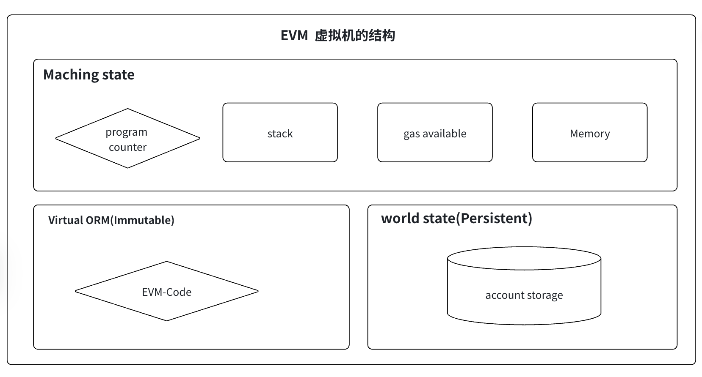

# Ethereum 基础知识

以太坊是由 Vitalik Buterin 在 2015 年提出并创建的第二代区块链平台。与比特币不同，以太坊是一个**可编程的区块链**，支持智能合约和去中心化应用（DApp）。

**核心定位**：

- 比特币：数字货币（Store of Value）
- 以太坊：全球计算机（World Computer）

---

## 以太坊发展历程

| 版本                  | 发布时间 | 关键改进                              |
| --------------------- | -------- | ------------------------------------- |
| **Frontier**          | 2015.7   | 初版以太坊，支持智能合约              |
| **Homestead**         | 2016.3   | 改进交易成本，防止垃圾信息            |
| **Tangerine Whistle** | 2016.10  | Gas 成本优化                          |
| **Spurious Dragon**   | 2016.11  | 防止重放攻击，引入 ETC vs ETH 分叉    |
| **Byzantine**         | 2017.10  | 难度调整算法改进                      |
| **Constantinople**    | 2019.2   | 降低合约部署成本                      |
| **Istanbul**          | 2019.12  | 进一步优化 Gas 成本                   |
| **Muir Glacier**      | 2019.12  | 推迟难度炸弹                          |
| **London**            | 2021.8   | **EIP1559**：引入基础费用销毁机制     |
| **Merge**             | 2022.9   | **从 PoW 转向 PoS**，共识层分离       |
| **Shanghai**          | 2023.4   | 支持 Staking 取款                     |
| **Dencun**            | 2024.3   | Proto-Danksharding，降低 Layer 2 费用 |
| **Verkle**            | 计划中   | 无状态以太坊，超大幅扩展              |

---

## 账户模型 vs UTXO 模型

### 以太坊账户模型

以太坊使用**账户模型**，而不是比特币的 UTXO 模型。

**两种账户**：

1. **外部所有账户（EOA - Externally Owned Account）**
   - 由私钥控制
   - 可以发起交易
   - 无代码
   - 例：MetaMask 钱包地址

2. **合约账户（Contract Account）**
   - 由代码控制（智能合约）
   - 无私钥
   - 存储状态
   - 可以被调用、执行代码
   - 例：Uniswap、AAVE

### 账户结构

每个账户包含：

- **nonce**：交易计数器（防重放）
- **balance**：账户余额（Wei）
- **storageRoot**：合约存储树根
- **codeHash**：合约代码哈希

### vs 比特币 UTXO

| 特性         | 账户模型（以太坊）     | UTXO 模型（比特币）       |
| ------------ | ---------------------- | ------------------------- |
| **状态管理** | 全局账户状态           | 只记录 UTXO               |
| **转账逻辑** | 账户余额减少 → 增加    | 销毁旧 UTXO → 生成新 UTXO |
| **复杂性**   | 高（需要维护全局状态） | 低（UTXO 独立）           |
| **智能合约** | ✅ 原生支持            | ❌ 不支持                 |
| **平行性**   | 弱（账户相互依赖）     | 强（UTXO 可并行处理）     |
| **TPS**      | 中（15-30）            | 低（7-15）                |

---

## Gas 机制

### Gas 是什么？

Gas 是以太坊上执行任何操作所需的"燃料"。

**为什么需要 Gas？**

1. **防止无限循环**：无限循环会导致网络瘫痪，Gas 限制确保计算必须终止
2. **公平分配资源**：每个人都按使用计费
3. **激励矿工/验证者**：通过收取 Gas 费获得收益
4. **防止垃圾交易**：发送垃圾信息需要付费，提高成本

### Gas 计费模型

**三个关键概念**：

```
交易成本 = Gas 用量 × Gas 价格
```

**Gas 用量（Gas Limit）**

- 不同操作消耗不同 Gas
  - 转账：21,000 Gas
  - 调用合约：50,000-500,000+ Gas
  - 部署合约：32,000-1,000,000+ Gas

**Gas 价格（Gas Price）**

- Gwei 为单位（1 Gwei = 10^9 Wei）
- 正常时期：20-50 Gwei
- 拥堵时期：100-500+ Gwei

**计费示例**：

```
转账：21,000 Gas × 50 Gwei = 1,050,000 Gwei = 0.00105 ETH ≈ $3（以太坊价格 $2500）
```

### EIP1559：动态费用机制

2021 年 London 升级引入 EIP1559，改变了 Gas 计费方式。

**改进前（一阶拍卖）**：

- 所有人设置 gasPrice，矿工选择高价交易
- 结果：费用竞争激烈，用户体验差

**EIP1559 后（两部分费用）**：

```
总费用 = 基础费用（Base Fee）+ 小费（Tip/Priority Fee）

基础费用：
- 根据网络拥堵自动调整
- 100% 销毁（不给矿工/验证者）
- 目的：稳定费用

小费（Tip）：
- 用户主动设置
- 给矿工/验证者的激励
```

**好处**：

1. 基础费用销毁 → 通缩（减少 ETH 供给）
2. 用户体验更好（费用更可预测）
3. 防止内存池堵塞

### 历史 Gas 价格

| 事件         | 时期                   | Gas 价格     | 备注              |
| ------------ | ---------------------- | ------------ | ----------------- |
| 正常         | 2021-2022              | 20-50 Gwei   | 平时              |
| 狂热         | 2021.5 Uniswap V3 上线 | 500+ Gwei    | 交易费数百美元    |
| NFT 热潮     | 2022.1                 | 200-800 Gwei | Mint NFT 费用离谱 |
| Merge 后优化 | 2022.9+                | 50-100 Gwei  | PoS 网络更稳定    |
| Dencun 优化  | 2024.3+                | 10-30 Gwei   | Blob 数据大幅降费 |

### Gas 优化技巧

在实际开发中，降低 Gas 成本至关重要。以下是**经过验证的优化方法**：

#### 1. **Storage 存储优化** ⭐ 最重要

**问题**：

- 写入 storage：20,000 Gas（第一次），5,000 Gas（修改）
- 读取 storage：2,100 Gas
- 内存（memory）：最便宜，3 Gas/字
- Stack：免费

**优化策略**：

```solidity
// ❌ 差：每次循环都读 storage
contract Bad {
    uint256 total;

    function sum(uint256[] memory nums) public {
        for (uint256 i = 0; i < nums.length; i++) {
            total += nums[i];  // 频繁读写 total
        }
    }
}

// ✅ 好：先用内存变量，最后一次性写回
contract Good {
    uint256 total;

    function sum(uint256[] memory nums) public {
        uint256 cache = total;  // 读一次
        for (uint256 i = 0; i < nums.length; i++) {
            cache += nums[i];   // 只在内存操作
        }
        total = cache;          // 写一次
    }
}

// 节省：(n-1) × (20,000 - 3) = 节省 20,000 Gas（n=100 时）
```

#### 2. **Calldata 编码优化**

**真实成本**（2021 年 Berlin 升级后）：

- 零字节（0x00）：4 Gas/字节
- 非零字节：16 Gas/字节

**优化方法**：

```solidity
// 打包参数，增加零字节数量
// 这会增加 calldata 中的零字节比例
```

**实际应用**：

- 使用 bytes 替代多个 uint：减少 calldata
- 避免不必要的参数

#### 3. **ERC-20 Transfer 优化**

**标准方法**（需要检查余额、增加 nonce）：

```solidity
function transfer(address to, uint256 amount) public returns (bool) {
    require(balanceOf[msg.sender] >= amount);
    balanceOf[msg.sender] -= amount;
    balanceOf[to] += amount;
    emit Transfer(msg.sender, to, amount);
    return true;
}
// Gas 成本：约 50,000-100,000 Gas
```

**优化版本**（使用 unchecked）：

```solidity
// Solidity 0.8.0+ 支持
function transfer(address to, uint256 amount) public returns (bool) {
    unchecked {
        balanceOf[msg.sender] -= amount;  // 跳过溢出检查
        balanceOf[to] += amount;
    }
    emit Transfer(msg.sender, to, amount);
    return true;
}
// Gas 成本：约 45,000-90,000 Gas（节省 ~5-10%）
```

#### 4. **循环与数组优化**

```solidity
// ❌ 差：多次访问数组长度
for (uint256 i = 0; i < array.length; i++) {
    // 每次都读 array.length（storage 操作）
}

// ✅ 好：缓存长度
uint256 len = array.length;
for (uint256 i = 0; i < len; i++) {
    // 只读一次
}

// 节省：(n-1) × 2,100 Gas
```

#### 5. **合约部署优化**

**构造函数 Gas**：

- 只执行一次
- 不需要过度优化

**但代码大小有限**：

- 以太坊 EIP-3860：24,576 字节上限
- 超出会失败
- 可使用代理模式分离逻辑

```solidity
// 使用代理合约降低主合约大小
// 需要 ERC1967 代理标准
```

#### 6. **合约交互优化**

```solidity
// ❌ 差：逐个调用
for (uint256 i = 0; i < targets.length; i++) {
    IERC20(token).transfer(targets[i], amounts[i]);
}

// ✅ 好：批量操作
IERC20(token).transferBatch(targets, amounts);
// 节省：大约 30-50%（减少函数调用开销）
```

#### 7. **查询优化（View/Pure）**

View 函数**不消耗 Gas**（通过 call 调用）：

```solidity
function getBalance(address account) public view returns (uint256) {
    return balanceOf[account];  // 查询不花钱
}

// 但如果从另一个智能合约中调用会花 Gas：
IERC20 token = IERC20(0x...);
uint256 balance = token.balanceOf(msg.sender);  // 花 Gas
```

#### 8. **真实 Gas 成本表**

| 操作               | Gas 成本 | 备注             |
| ------------------ | -------- | ---------------- |
| SSTORE（首次写入） | 20,000   | 冷存储槽         |
| SSTORE（修改）     | 5,000    | 已存储槽         |
| SLOAD（读取）      | 2,100    | 冷存储槽         |
| SLOAD（热存储槽）  | 100      | 同一交易中已读过 |
| CREATE（部署）     | 32,000   | 起始成本         |
| CALL（调用）       | 100      | 基础成本         |
| LOG0（事件）       | 375      | 基础成本         |

#### 9. **工具与检查**

**Gas 分析工具**：

- **Hardhat gas reporter**：分析每个函数的 Gas 成本
- **Etherscan 高级**：查看已部署合约的 Gas 成本
- **Remix IDE**：部署时显示 Gas 估算

**检查清单**：

- ✅ 是否使用了 `immutable` 替代 storage（可节省 20,000 Gas）？
- ✅ 是否缓存了频繁读取的值？
- ✅ 是否使用了 `unchecked` 块（避免不必要检查）？
- ✅ 是否批量处理而不是逐个操作？

#### 10. **不同链上的 Gas 差异**

| 链             | Gas 价格（典型）  | 特点           |
| -------------- | ----------------- | -------------- |
| 以太坊 Mainnet | 20-100 Gwei       | 最贵，最安全   |
| Arbitrum       | 0.1-1 Gwei        | 便宜 50-100 倍 |
| Optimism       | 0.1-1 Gwei        | 便宜 50-100 倍 |
| Polygon        | 1-10 Gwei         | 便宜 10-100 倍 |
| Solana         | $0.0001（无 Gas） | 按交易计费     |

#### 11. **监控与预测**

**查看实时 Gas 价格**：

- [ETHGasStation](https://ethgasstation.info)（已过时，使用以下替代）
- [Etherscan Gas Tracker](https://etherscan.io/gastracker)
- [GasNow](https://www.gasnow.org)
- 链上预言机：Chainlink Gas Price Feeds

**预测何时发送交易**：

- 美国晚上（10pm-6am EST）：Gas 通常最低
- 周末：通常比平日低 20-30%
- 避免：网络拥堵时刻（NFT 发售、热门 DeFi 事件）

---

## 智能合约与 EVM

### 智能合约概念

智能合约是部署在区块链上的代码，满足条件时自动执行，不需要中介。

**三个特性**：

1. **透明**：代码和状态对所有人可见
2. **不可改变**：一旦部署，代码无法修改
3. **自动执行**：条件满足自动触发，无人为干预

### EVM（以太坊虚拟机）

EVM 是一个**沙盒虚拟机**，执行智能合约代码。


**特点**：

- **图灵完备**：支持任何计算
- **确定性**：每个节点执行相同结果
- **隔离**：合约无法访问网络、文件系统
- **有状态**：可以存储和修改数据

**工作流程**：

```
Solidity 代码
    ↓
编译成字节码（EVM 字节码）
    ↓
部署到区块链
    ↓
交易调用合约
    ↓
EVM 解释执行字节码
    ↓
修改状态 / 返回结果
```

### Solidity 基础

Solidity 是编写以太坊智能合约的主要编程语言。

**基本语法**：

```solidity
// SPDX-License-Identifier: MIT
pragma solidity ^0.8.0;

contract HelloWorld {
    // 状态变量
    string public message = "Hello";

    // 函数
    function greet() public view returns (string memory) {
        return message;
    }

    // 修改状态的函数
    function setMessage(string memory newMsg) public {
        message = newMsg;
    }
}
```

**常用数据类型**：

- `uint`：无符号整数（256 bit）
- `int`：有符号整数
- `address`：20 字节地址
- `bool`：布尔值
- `string`：字符串
- `bytes`：字节数组
- `mapping`：键值对存储

---

## ERC 标准（令牌标准）

ERC 是以太坊请求评论（Ethereum Request for Comments），定义了智能合约的标准接口。最常见的是令牌标准。

### ERC-20：同质化代币标准

**最广泛使用的标准**，几乎所有 DeFi 代币都基于 ERC-20。

**核心概能**：

- 代币可分割（如 0.5 个 USDC）
- 每个单位都相同
- 适用于：稳定币（USDC、USDT、DAI）、治理代币（UNI、AAVE）

**ERC-20 标准函数**：

```solidity
// 查询函数
balanceOf(address)              // 查询余额
allowance(address, address)     // 查询授权额度
totalSupply()                   // 查询总供应量

// 交易函数
transfer(to, amount)            // 直接转账
approve(spender, amount)        // 授权代币给第三方
transferFrom(from, to, amount)  // 从他人账户转账（需授权）

// 事件
Transfer(from, to, value)       // 记录转账
Approval(owner, spender, value) // 记录授权
```

**使用流程**：

```
用户持有 1000 USDC
    ↓
在 Uniswap 调用 approve()，授权 1000 USDC 给 Uniswap 合约
    ↓
调用 Uniswap 的 swap() 函数
    ↓
Uniswap 合约调用 transferFrom()，从用户转 1000 USDC 到自己
    ↓
Uniswap 返回交换的代币给用户
```

**主要 ERC-20 代币**：
| 代币 | 供应量 | 用途 |
|------|--------|------|
| USDC | 300 亿+ | 稳定币 |
| USDT | 1000 亿+ | 稳定币 |
| DAI | 50 亿+ | 去中心化稳定币 |
| AAVE | 1600 万 | 治理代币 |
| UNI | 10 亿 | 治理代币 |

### ERC-721：NFT 标准

**非同质化代币**，每个代币独一无二。

**核心概念**：

- 不可分割（要么拥有，要么没有）
- 每个代币都有唯一 ID
- 每个代币可以有不同的元数据、图片、属性

**标准函数**：

```solidity
// 查询
balanceOf(address)              // 查询地址拥有多少个 NFT
ownerOf(tokenId)                // 查询 NFT 的拥有者
tokenURI(tokenId)               // 获取 NFT 的元数据 URI（通常是 JSON URL）

// 交易
approve(to, tokenId)            // 授权特定 NFT
transferFrom(from, to, tokenId) // 转账特定 NFT

// 事件
Transfer(from, to, tokenId)     // 记录 NFT 转账
Approval(owner, to, tokenId)    // 记录授权
```

**应用场景**：

- 艺术品：Cryptopunks、Bored Ape Yacht Club
- 游戏道具：Axie Infinity
- 域名：ENS（.eth 域名）
- 身份证明：SoulBound Token（灵魂绑定代币）

**著名 NFT 项目**：
| 项目 | 地板价 | 总交易额 |
|------|--------|---------|
| CryptoPunks | 50+ ETH | 16 亿美元+ |
| Bored Apes | 15+ ETH | 8 亿美元+ |
| Pudgy Penguins | 3+ ETH | 3 亿美元+ |

### ERC-1155：混合代币标准

**同时支持 FT 和 NFT**，一个合约可以发行多种代币。

**优势**：

- 一个合约管理多种代币
- 减少合约数量和部署成本
- 支持批量操作（Batch Transfer）

**应用**：

- 游戏道具（可交易的、不可交易的混合）
- 元宇宙资产

### 其他重要标准

**ERC-4626**：代币金库标准

- 用于流动性质押和收益农场
- 例：Lido stETH、Yearn vaults

**ERC-6551**：账户绑定代币

- 为 NFT 绑定账户（类似钱包）
- 让 NFT 本身可以拥有资产和进行交易

---

## 交易生命周期与 Mempool

### 交易结构

以太坊交易包含以下字段：

```
{
  nonce：交易序号（防重放）
  gasPrice：Gas 价格（Wei）
  gasLimit：最多消耗 Gas
  to：目标地址（合约或 EOA）
  value：转账金额（Wei）
  data：合约调用数据（Solidity 函数签名 + 参数）
  v, r, s：ECDSA 签名
}
```

**关键概念**：

- **Nonce**：从 0 开始递增，保证交易顺序
  - 如果 nonce=5 但之前 nonce 2-4 还未打包，交易会卡住
- **Data 字段**：
  - EOA→EOA 转账：data 为空
  - 调用合约：data = 函数选择器（4 字节）+ 参数编码

**交易费用**（EIP1559）：

```
maxFeePerGas：用户愿意支付的最大 Gas 价格
priorityFeePerGas：小费
实际支付 = gasUsed × min(maxFeePerGas, baseFeePerGas + priorityFeePerGas)
基础费用销毁 = gasUsed × baseFeePerGas
```

### 交易生命周期

**第 1 步：创建交易**

```
用户在钱包（MetaMask）中创建交易
    ↓
对交易进行 ECDSA 签名（需要私钥）
    ↓
形成签名交易
```

**第 2 步：广播到 Mempool**

```
签名交易发送到最近的节点
    ↓
节点验证交易（签名、格式、Gas 限制）
    ↓
有效交易进入节点的 Mempool（内存池）
    ↓
节点将交易转播给其他节点
```

**Mempool 是什么**？

- 节点本地的交易队列
- 未被打包到区块的交易存放地
- 验证者/矿工从 Mempool 中选择交易打包

**第 3 步：打包入块**

```
验证者/矿工收到交易
    ↓
根据 gasPrice 或 priorityFee 排序（高费用优先）
    ↓
将交易打包进候选区块
    ↓
验证交易并执行
    ↓
如果执行成功，交易被包含在新区块中
```

**第 4 步：区块确认**

```
区块被其他验证者验证
    ↓
区块被添加到区块链
    ↓
交易进入 1 次确认
    ↓
再有 12 个新区块产生 = 13 次确认（约 3 分钟）
    ↓
区块最终化（Finalized），不可撤销
```

### 交易可能失败的原因

| 失败原因           | 表现                 | 解决方案                   |
| ------------------ | -------------------- | -------------------------- |
| **余额不足**       | Out of Gas（OOG）    | 增加账户余额               |
| **Nonce 错误**     | Invalid nonce        | 检查之前的交易是否确认     |
| **Gas Limit 太低** | Out of Gas           | 增加 Gas Limit             |
| **合约 Revert**    | Transaction reverted | 检查合约逻辑（如授权不足） |
| **地址格式错误**   | Invalid address      | 确保地址格式正确（0x开头） |
| **Mempool 满**     | Dropped from mempool | 重新提交或增加 Gas 价格    |

**例子：为什么 Uniswap 交易失败？**

```
用户想交换 1 USDC 为 1 ETH
    ↓
调用 Uniswap swap 函数，但忘记 approve USDC
    ↓
合约执行到 transferFrom()，发现授权额度为 0
    ↓
合约 revert，交易失败，但 Gas 费仍然被扣
```

---

## 私钥管理与钱包

### 椭圆曲线密码学（ECDSA）

以太坊使用 **secp256k1** 曲线（与比特币相同）。

**生成流程**：

```
生成随机 256 位私钥
    ↓
通过 ECDSA 计算公钥（压缩或未压缩）
    ↓
对公钥进行 Keccak-256 哈希
    ↓
取最后 20 字节 = 以太坊地址
```

**关键性质**：

- 私钥 → 公钥：单向（无法反向计算）
- 公钥 → 地址：单向
- 私钥 ≠ 地址

### HD 钱包（BIP32/39/44）

**为什么需要 HD 钱包？**

- 一个私钥一个地址不安全
- HD 钱包从一个种子短语生成无限个地址

**BIP32：分层确定性钱包**

```
主密钥（Master Key）
    ↓
应用层（m/44'）
    ↓
代币类型（m/44'/60' 表示以太坊）
    ↓
账户（m/44'/60'/0'）
    ↓
更改（m/44'/60'/0'/0 为接收地址）
    ↓
地址索引（m/44'/60'/0'/0/0, /0/1, /0/2 ...）
```

**BIP39：种子短语**

```
生成 12 或 24 个单词
    ↓
转换成二进制种子
    ↓
输入 BIP32 算法
    ↓
生成主私钥
```

**例子**：

```
种子短语："abandon abandon abandon ... abandon about"
    ↓
导入 MetaMask
    ↓
自动生成多个地址
    ↓
每个地址有不同的私钥，但都可以用这个种子短语恢复
```

### 钱包类型对比

| 类型             | 例子                 | 安全性               | 便利性         | 适用场景      |
| ---------------- | -------------------- | -------------------- | -------------- | ------------- |
| **热钱包**       | MetaMask、Phantom    | 中（私钥存在浏览器） | 高             | 日常交易      |
| **移动钱包**     | Trust Wallet、Argent | 中                   | 高             | 手机使用      |
| **冷钱包**       | Ledger、Trezor       | 极高（离线）         | 低             | 大额资金存储  |
| **多签钱包**     | Gnosis Safe          | 极高（需多人批准）   | 低             | DAO、基金管理 |
| **智能合约钱包** | Account Abstraction  | 高（可升级）         | 高（社交恢复） | 未来钱包      |

**安全最佳实践**：

```
小额日常交易：热钱包（MetaMask）
中额资金：移动钱包（备份种子短语）
大额资金：冷钱包（Ledger）+ 多签（Gnosis Safe）

永远不要：
- ❌ 分享私钥或种子短语
- ❌ 在任何网站输入私钥
- ❌ 用交易所钱包存放长期资金
```

---

## 零地址与特殊账户

### Address(0) - 零地址

地址 `0x0000000000000000000000000000000000000000` 有特殊含义。

**常见用途**：

- **销毁代币**：转账到零地址 = 销毁
  ```solidity
  transfer(address(0), 1000); // 销毁 1000 代币
  ```
- **检查账户是否存在**：
  ```solidity
  require(user != address(0), "Invalid address");
  ```
- **合约初始状态**：
  ```solidity
  require(owner != address(0)); // 确保初始化
  ```

**例子**：代币销毁

```
USDC 总供应量：100 亿
    ↓
Circle 公司转 1 亿 USDC 到零地址
    ↓
总供应量自动减少到 99 亿
    ↓
这就是代币通缩
```

### 其他特殊地址

| 地址       | 名称             | 用途                 |
| ---------- | ---------------- | -------------------- |
| 0x0...0    | 零地址           | 销毁代币、初始化检查 |
| 0x1...1    | Ecrecover 预编译 | 签名验证             |
| 0x2...2    | SHA256 预编译    | 哈希计算             |
| 0xdeadbeef | 梗               | 无实际功能           |

---

## MEV 与前置交易

### MEV 是什么？

**MEV = 最大可提取价值（Maximal Extractable Value）**

验证者或矿工通过改变交易顺序获取额外利润。

**例子**：

```
用户想在 Uniswap 交换 100 ETH 为 USDC
    ↓
验证者看到这笔交易
    ↓
验证者先买入 USDC（拉高价格）
    ↓
用户交易执行（支付更高的价格）
    ↓
验证者卖出 USDC（获利）
    ↓
验证者净赚差价
```

**2023 年 MEV 统计**：

- 总提取量：$6.5 亿+
- 平均单笔交易 MEV：$50-5000（取决于交易规模）

### 三明治攻击（Sandwich Attack）

验证者在用户交易前后插入自己的交易。

**攻击流程**：

```
用户交易：swap 100 ETH → USDC（Uniswap）
    ↓
验证者发现这笔交易在 Mempool
    ↓
验证者抢先操作 1：买入大量 USDC（价格上升）
    ↓
用户交易执行（支付更高价格，获得更少 USDC）
    ↓
验证者抢先操作 2：卖出 USDC（获利）

结果：用户亏损 ≈ 验证者收益
```

**影响**：

- 用户滑点增加（预期 1000 USDC，实际 950 USDC）
- DeFi 用户每年损失数亿美元

### Flashbot 机制

**Flashbot = 防止 MEV 的方案**

不再通过公网 Mempool 广播交易，而是私密提交给 Flashbot Relay。

**流程**：

```
用户交易提交到 Flashbot Relay
    ↓
Relay 交给验证者
    ↓
验证者无法提前看到交易（保密）
    ↓
验证者只能选择"打包"或"不打包"
    ↓
交易顺序由用户指定的小费决定
```

**优势**：

- 防止三明治攻击
- 验证者收入更稳定
- 用户体验更好

**劣势**：

- 中心化风险（Flashbot 成为单一入口）
- 仅保护提交给 Relay 的交易

### 防护方法

**用户层面**：

- ✅ 使用私有 RPC（Flashbot、MEV-Blocker）
- ✅ 设置滑点保护（Slippage Tolerance）
- ✅ 使用聚合器（1Inch、Paraswap）分散交易
- ❌ 避免大额单笔交易

**协议层面**：

- 引入 MEV 销毁机制
- 验证者提议者分离（PBS）
- 加密 Mempool

---

## 以太坊浏览器与工具

### 主要以太坊浏览器

**Etherscan（最流行）**

- 网址：https://etherscan.io
- 功能：查看交易、合约、地址、Token 信息
- 可以验证合约源代码

**Blockscout**

- 开源替代品
- 支持 EVM 兼容链

**查询信息示例**：

```
查看地址：输入地址 0x... → 看余额、交易历史、 NFT
查看交易：输入 txHash → 看交易详情、Gas、状态
查看合约：输入合约地址 → 看源代码、调用方法
```

### 其他必用工具

| 工具                  | 用途             |
| --------------------- | ---------------- |
| **MetaMask**          | 最流行的钱包     |
| **Alchemy / Infura**  | RPC 节点服务     |
| **Hardhat / Truffle** | 智能合约开发框架 |
| **OpenZeppelin**      | 安全的合约库     |
| **MythX / Certik**    | 合约审计         |
| **Uniswap**           | DEX（交换代币）  |
| **Aave**              | 借贷协议         |

---

## 以太坊交易深度剖析

### 交易状态与回执（Receipt）

**交易被打包后生成回执**：

```
{
  transactionHash：交易哈希
  blockNumber：所在区块高度
  gasUsed：实际消耗 Gas
  cumulativeGasUsed：累计 Gas
  status：1（成功）或 0（失败）
  logs：事件日志（Log）
  contractAddress：如果是部署合约，返回新合约地址
}
```

**例子**：

```
交易：0xabc123...
    ↓
被打包进第 20000000 区块
    ↓
消耗 150000 Gas
    ↓
status = 1（成功）
    ↓
生成了 3 条 Transfer 事件
```

### 合约部署交易

**第一次部署**：

```
用户编写 Solidity 代码
    ↓
编译成 EVM 字节码
    ↓
创建交易：to = null（没有目标地址）
    ↓
data = 字节码 + 构造函数参数
    ↓
交易被执行
    ↓
EVM 创建新合约账户
    ↓
返回新合约地址
```

**成本**：

- 部署成本：大约 5 万 - 200 万 Gas（取决于合约复杂度）
- 存储成本：每个状态变量占用 32 字节 slot，成本 20000 Gas

### 合约交互交易

**调用函数**：

```solidity
// 合约函数
function transfer(address to, uint amount) public {
    balances[msg.sender] -= amount;
    balances[to] += amount;
}
```

**交易数据编码**：

```
data = 0x + 函数选择器（4 字节）+ 参数编码

函数选择器 = Keccak256("transfer(address,uint256)")[:4]
           = 0xa9059cbb

参数编码（ABI 编码）：
- 第一个参数 to：0x...（20 字节地址，padding 到 32 字节）
- 第二个参数 amount：1000（作为 uint256，32 字节）

完整 data = 0xa9059cbb + [to 的 ABI] + [amount 的 ABI]
```

**执行过程**：

```
验证者收到交易
    ↓
解析 data 字段
    ↓
识别函数选择器 0xa9059cbb = transfer 函数
    ↓
提取参数并反序列化
    ↓
执行函数逻辑
    ↓
修改状态树（balances 映射）
    ↓
生成事件日志（Transfer event）
    ↓
交易完成
```

### 事件与日志（Logs）

**为什么需要事件**？

- 交易执行后无法直接读取返回值（on-chain）
- 事件是合约与外部通信的方式
- 事件被存储在交易回执中

**例子**：ERC-20 Transfer 事件

```solidity
event Transfer(address indexed from, address indexed to, uint256 value);

// 调用
emit Transfer(msg.sender, recipient, amount);
```

**事件日志结构**：

```
{
  address：发出事件的合约地址
  topics：[事件签名, 参数1, 参数2, ...]
  data：非索引参数
}
```

**indexed vs 非indexed**：

- **indexed**：可以用来过滤日志（费用高）
- **非indexed**：存储在 data 中（费用低）

**查询事件**：

```
用户想查找所有"我收到的 USDC Transfer"
    ↓
在 Etherscan 中搜索：
  - 事件：Transfer
  - indexed to = 我的地址
    ↓
返回所有匹配的交易
```

---

## PoW 到 PoS 的演进：Merge

### The Merge（合并）- 2022.9.15

**2015-2022.9：以太坊 1.0（执行层 + PoW）**

- 单层架构
- 工作量证明
- 矿机挖矿

**2020.12-2022.9：信标链（共识层 + PoS）**

- 平行运行的 PoS 链
- 与主网独立运行

**2022.9：Merge 事件**

- 信标链接管主网
- PoW 挖矿完全停止
- 转向 PoS 验证

### PoW vs PoS 对比

| 特性           | PoW（挖矿）              | PoS（质押）          |
| -------------- | ------------------------ | -------------------- |
| **参与门槛**   | 需要 ASIC 矿机（高成本） | 只需 32 ETH（$100k） |
| **能耗**       | 极高（150+ TWh/年）      | 极低（减少 99.95%）  |
| **收益**       | 矿工独占区块奖励         | 验证者分享奖励       |
| **集中化风险** | 矿池中心化               | 质押服务商中心化     |
| **攻击成本**   | 购买矿机（物理成本）     | 质押 ETH（金融成本） |
| **安全假设**   | 工作量不可逆             | 经济利益激励         |

### PoS 的验证流程

**Staking 流程**：

1. 用户存入 32 ETH 到信标链合约
2. 成为验证者候选
3. 被随机选中提案者（Proposer）或证明者（Attester）
4. 参与验证交易和出块
5. 获得奖励或因不当行为被罚没（Slashing）

**奖励 vs 罚没**：

- 奖励：正常验证 +4-8% APR
- 罚没：不当行为 -3-100% ETH
  - 离线超过一定时间：缓慢扣款
  - 提议冲突区块：重罚 1/3 质押
  - 双重投票：重罚 100%（全部没收）

### 防止 PoS 链分叉

**问题**：PoS 中分叉比 PoW 更容易发生，因为没有"最长链规则"

**解决方案**：

1. **最终性（Finality）**
   - Epoch：32 个 slot（约 6 分钟）
   - 需要 66% 验证者投票确认
   - 确认后不可撤销

2. **Slashing 惩罚**
   - 试图分叉：罚没验证者
   - 罚没足够严重，经济上无法发动攻击

3. **分叉选择规则（LMD GHOST）**
   - 选择最多证明的分支
   - 不是最长链，而是最重链

---

## 状态树与 MPT

### 账户状态存储

以太坊使用 **Merkle Patricia Trie（MPT）** 存储账户状态（与比特币相同）。

**两层树结构**：

1. **State Root**：所有账户的树根
2. **Storage Root**：合约内部存储的树根

**每个区块头包含**：

- stateRoot：区块执行后的全局状态
- storageRoot：所有合约状态
- receiptsRoot：交易收据

**优势**：

- 验证任意账户余额（轻客户端）
- 快速状态回滚（保存旧根）
- 支持 Merkle 证明

---

## 区块结构

### 以太坊区块

**区块头**（与比特币类似，但更复杂）：

```
{
  parentHash：前一个区块哈希
  miner/proposer：出块者
  stateRoot：执行后的状态树根
  transactionsRoot：交易树根
  receiptsRoot：收据树根
  gasUsed：实际使用的 Gas
  gasLimit：最大允许 Gas
  difficulty：难度（PoW 时代）
  timestamp：时间戳
  extraData：额外信息
  mixHash + nonce：PoW 证明（PoW 时代）
  ...
}
```

**区块体**：

- 交易列表（通常 100-200 笔）
- 每笔交易包含：发送方、接收方、金额、数据、Gas limit、Gas price 等

### 块生成时间

| 版本     | 目标时间 | 实际情况   |
| -------- | -------- | ---------- |
| PoW 时代 | 15 秒    | 12-15 秒   |
| PoS 时代 | 12 秒    | 严格 12 秒 |

PoS 的优势：时间完全规律化，不受算力变化影响

---

## 以太坊经济学

### ETH 供给

**总供给**：无硬顶限，无限增长

- 区块奖励：2 ETH/块（PoS 后固定）
- 年发行量：约 540,000 ETH/年
- 年通胀率：~2.2%（随 ETH 锁仓而变）

**销毁机制（EIP1559）**：

- 基础费用 100% 销毁
- 当 Gas 费高时，销毁量可观
- 2023 年销毁 1.2M ETH
- 结果：有时 ETH 为通缩

**供给方程**：

```
Net ETH = 新发行 - 销毁 - 质押流出

当销毁 > 新发行时，ETH 通缩
```

### Staking 质押

**参与者**：

- 验证者：运行节点，获得奖励，承担罚没风险
- 委托者：通过质押服务商质押，收取手续费

**APR（年回报率）**：

- 基础 APR：通胀率 ÷ 质押率
- 2024 年：约 3-4% APR（质押率 ~50%）
- 与存银行（0.5% APY）相比，收益高 6-8 倍

**质押服务商**：

- Lido：76% 市场份额（中心化风险）
- Coinbase、Kraken：中心化交易所
- Rocketpool：去中心化选项

---

## Layer 2 扩容

以太坊主链 TPS 仅 15-30，无法满足大规模应用需求。

### 主要 Layer 2 方案

**1. Optimistic Rollup（乐观汇总）**

- Optimism、Arbitrum
- 假设所有交易有效，仅在挑战时证明
- TPS：4000+，费用：降低 90%
- 安全性：1-2 周退出延迟

**2. ZK Rollup（零知识证明汇总）**

- zkSync、Polygon zkEVM、StarkNet
- 使用零知识证明验证交易
- TPS：4000+，费用：降低 95%
- 优势：无退出延迟，安全性最高

**3. Plasma**

- 早期扩容方案，现已被 Rollup 取代
- 遗留项目：Polygon Plasma

**4. Sidechains / Appchains**

- Polygon、Arbitrum Nova
- 独立链，定期提交到以太坊
- 效率高，但安全性依赖于侧链本身

---

## 以太坊生态

### DeFi（去中心化金融）

**主要项目**：

- Uniswap：DEX（自动做市商）
- PanCake：DEX
- Aave：借贷
- Curve：稳定币交换
- Compound：借贷
- MakerDAO：稳定币发行
- Yearn zfinance: 自动化收益聚合器
- 1inch：DEX
- Eigenlayer：去中心化保险(重新质押)
- Symbiotime：去中心化保险

**市场规模**：

- 总锁仓值（TVL）：150-200 亿美元（2024）
- 占全球加密市场 70% 以上

### NFT（非同质化代币） 与游戏

- OpenSea：最大 NFT 市场
- Axie Infinity：游戏代币
- Uniswap V4：NFT 流动性

### DAO（去中心化自治组织）

- MakerDAO：管理 DAI 稳定币
- Aave：社区治理 Aave 协议
- Uniswap：UNI 持有者投票

### Layer2 和 Layer03生态崛起

- Arbitrum\Optimism：是最主要的 Layer2 解决方案
- zkEVM(以太坊虚拟机)
  - Polygon zkEVM：兼容 zkRollup
  - Scroll
  - Linea
  - zkSyncEra
- 技术框架
- OpStack
  - Base
  - Blast
  - Mantle
  - Manta

### LSD（流动性质押衍生品，Liquid Staking Derivatives）

现在行业里更常叫 LST（Liquid Staking Token）

- Lido
- BinaceLsd
- Swell

### 基础设施

#### 跨链桥

- Layerzero
- Orbit
- 虫洞

#### 跨链互操作协议

- ChainLink CCIP
- DappLinkCCIP

#### Layer2

- Op rollup
  - Op---->基于OpStack:Base,mantle, Manta,
  - Arbi---->基于Orbit

- Zk rollup
  - Scroll
  - PolygonZkEvm
  - ZksyncEra
  - Lina
  - Starnet

#### Layer3

- Zklink
- DappLink

---

## 安全与风险

### 智能合约风险

**常见漏洞**：

- 重入攻击（Reentrancy）：2016 年 DAO 被黑，导致 ETH/ETC 分叉
- 整数溢出：合约计算错误
- 访问控制缺陷：函数权限配置不当
- 前置运行（MEV）：矿工/验证者操纵交易顺序

**防护措施**：

- 代码审计（由安全公司进行）
- 形式化验证
- 保险协议（Nexus Mutual）
- 多签钱包（需多人批准）

### 网络安全

**51% 攻击风险**：

- PoS 中成本为：质押 900 万 ETH（~$30 亿）+ 被没收
- 比 PoW 成本高得多（金融成本 vs 物理成本）
- 风险极低

**质押中心化风险**：

- Lido 占 76%，可能威胁网络安全
- 若 Lido 被监管关闭，以太坊短期可能瘫痪
- 社区正在推行"分散质押"

---

## 以太坊的未来

### Roadmap 关键阶段

1. **Dencun（2024）**：Proto-Danksharding，降低 Layer 2 费用

2. **Cancun（2024）**：进一步优化

3. **Verkle Trees**：无状态以太坊
   - 减少节点存储需求
   - 更容易运行全节点

4. **Stateless Ethereum**：
   - 完全无状态
   - 任何人可以在任何时刻验证
   - 扩展性大幅提升

5. **Sharding**：
   - 数据分片
   - 将数据分散存储
   - TPS 可达 100,000+

---

## 总结：以太坊 vs 比特币

| 特性         | 比特币        | 以太坊                  |
| ------------ | ------------- | ----------------------- |
| **目标**     | 数字货币      | 全球计算机              |
| **共识**     | PoW（能耗高） | PoS（能耗低）           |
| **数据结构** | UTXO 模型     | 账户模型                |
| **编程能力** | 有限脚本      | 完全智能合约            |
| **TPS**      | 7-15          | 15-30（Layer 2：4000+） |
| **供给**     | 固定 2100 万  | 无硬顶，通胀 2%+        |
| **应用**     | 支付 / 存储   | DeFi / NFT / DAO        |
| **安全**     | 工作量        | 经济激励 + 罚没         |

两者各有优劣，比特币强调安全和去中心化，以太坊强调灵活性和应用生态。
