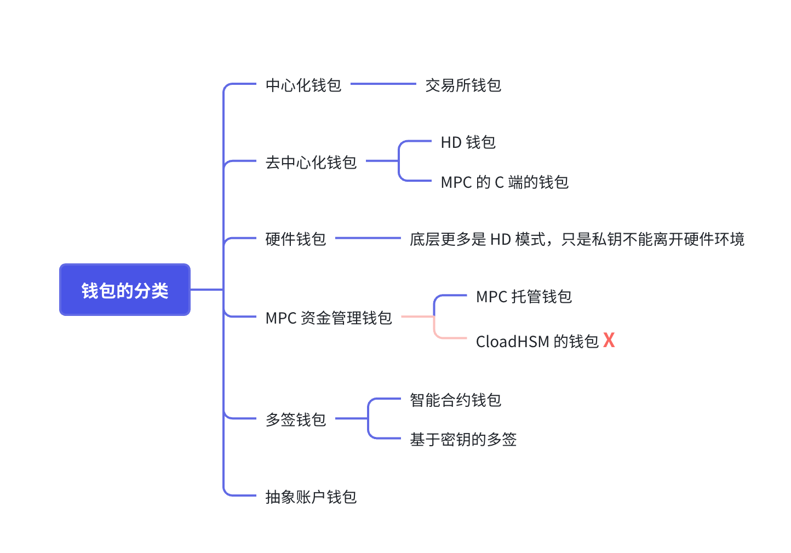
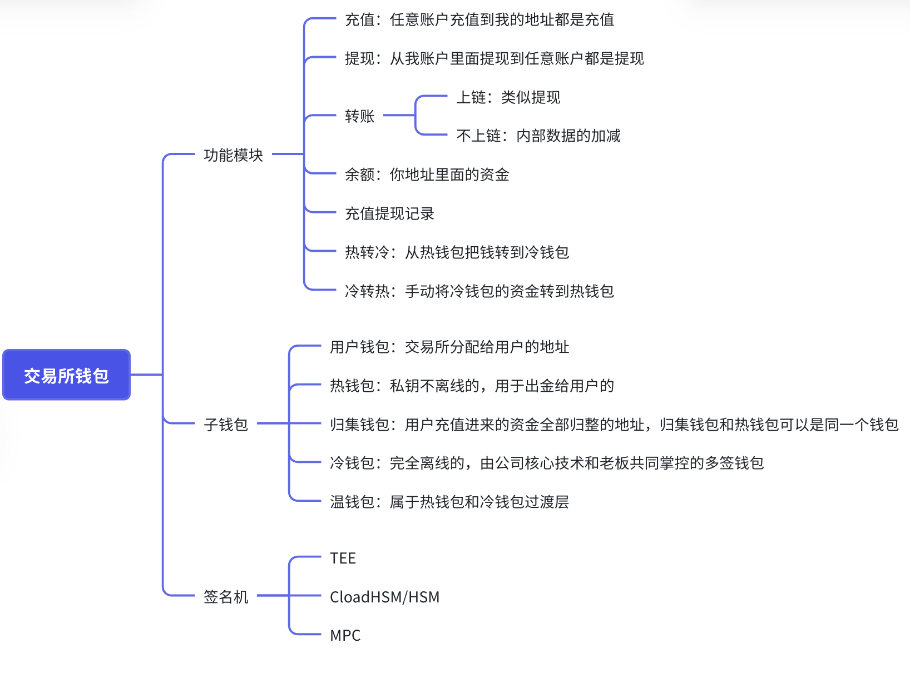
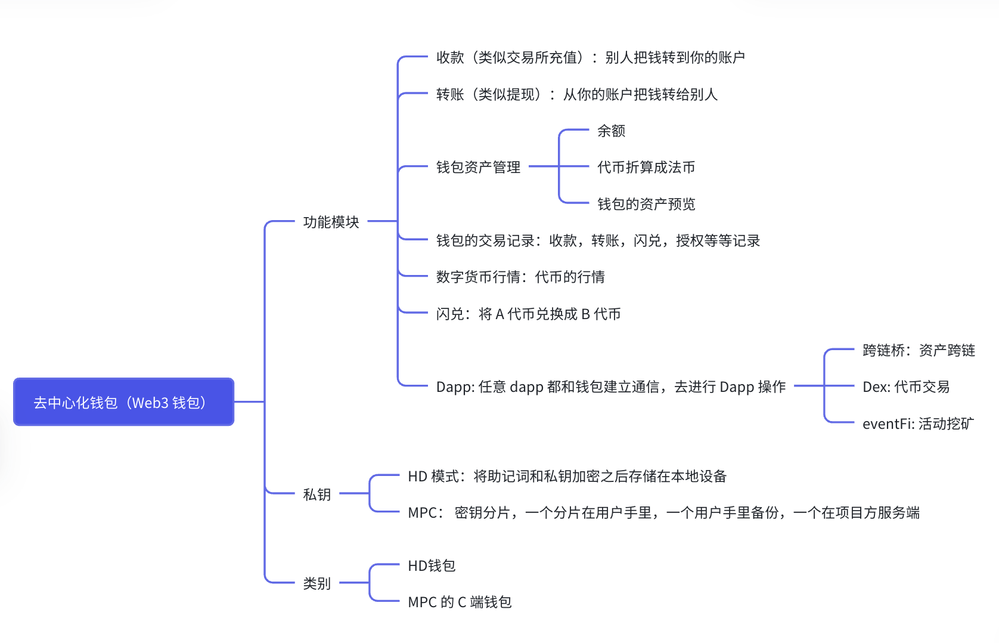

# 钱包基础知识

## 一、web3 钱包的起源与演进

### 核心本质（从未改变）

Web3 钱包的前身就是比特币钱包，本质从来没变：

**钱包不存币，只存私钥；币在链上，私钥签名才能动币。**

这是所有 Web3 钱包的第一原理。

### 历史演进

#### 第一阶段：比特币钱包（2009-2014）

**背景**：

- 2009 年中本聪发布比特币
- 需要一种方式管理私钥
- 早期钱包非常简陋

**特点**：

- **单链**：只支持比特币
- **单私钥**：一个私钥对应一个地址
- **冷存储**：需要手动导出私钥备份
- **体验差**：技术门槛高，容易丢私钥

**代表项目**：

- Bitcoin-Qt（官方钱包）
- Electrum（轻钱包）
- 硬件钱包：Ledger Nano（2014 年）

**问题**：

- 每生成一个新地址需要新的备份
- 私钥备份管理复杂
- 用户经常弄丢钱

#### 第二阶段：HD 钱包与 BIP 标准（2012-2017）

**突破**：BIP32 标准（2012 年）

比特币社区提出分层确定性钱包（Hierarchical Deterministic Wallet）：

**关键创新**：

```
一个种子（Seed）→ 生成无限个私钥
       ↓
一次备份 → 永久备份
       ↓
子钱包、账户、找零地址全部自动生成
```

**BIP 标准体系**：
| 标准 | 发布年 | 功能 | 现状 |
|------|--------|------|------|
| **BIP32** | 2012 | 分层钱包结构 | ✅ 所有钱包标准 |
| **BIP39** | 2013 | 助记词（12/24 个词） | ✅ 业界标准 |
| **BIP44** | 2014 | 多币种支持 | ✅ 所有多链钱包使用 |

**示例**：

```
助记词（12 个词）→ 种子（256 bit）→ 主私钥
                          ↓
                    生成子钥(m/44'/60'/0'/0/0)
                          ↓
                      以太坊地址
                          ↓
                    生成子钥(m/44'/0'/0'/0/0)
                          ↓
                      比特币地址
```

**优势**：

- 一个助记词管理所有币种
- 自动生成多个地址
- 备份只需记住 12-24 个词
- 完全去中心化

#### 第三阶段：以太坊与多链钱包（2015-2018）

**以太坊的影响**：

- 2015 年以太坊上线
- 账户模型与比特币 UTXO 不同
- **需要全新的钱包设计**

**新需求**：

- 支持智能合约交互
- 需要签署交易，不仅是转账
- 需要 Gas 管理
- 需要代币估值

**代表项目**：

- MyEtherWallet（MEW）：2015 年，网页版钱包
- Mist（以太坊官方钱包）：2015 年
- 硬件钱包：Ledger Nano S 支持以太坊（2016）

**问题**：

- 大多数是网页钱包，安全隐患
- 用户需要自己管理私钥
- 容易被钓鱼攻击

#### 第四阶段：浏览器插件与 dApp 革命（2016-2020）

**MetaMask 的出现（2016 年）**：

一个改变 Web3 生态的创新：

```
浏览器插件 MetaMask
         ↓
    自动为每个网站创建隔离环境
         ↓
    用户点击"连接钱包"即可使用 dApp
         ↓
    自动签署交易、拒绝恶意网站
         ↓
    大幅降低用户门槛
```

**MetaMask 为什么成功**：

- ✅ 易用性：一键连接 dApp
- ✅ 安全性：隔离环境，防止网站访问私钥
- ✅ 多链支持：支持以太坊、Polygon、Arbitrum 等
- ✅ 良好 UX：直观的交易确认界面
- ✅ 开源社区：由以太坊爱好者创建

**影响**：

- 2020 年 DeFi 爆发，MetaMask 成为 DeFi 入口
- 用户从数千增长到数百万（2021 年）
- **浏览器钱包成为新标准**

#### 第五阶段：多链与账户抽象（2018-2024）

**新挑战**：

- 用户需要在多个链之间切换
- 每个链需要保管不同的私钥
- 跨链交互复杂
- 新用户体验依然不好

**解决方案**：

1. **多链钱包**（2018-2021）
   - Trust Wallet：支持所有主流链
   - TokenPocket：亚洲用户首选
   - imToken：中国钱包龙头

2. **账户抽象（AA）**（2021-2024）
   - ERC-4337 标准
   - 使用社交账号登录钱包
   - 合约钱包代替 EOA
   - 智能钱包（Smart Wallet）成为趋势

3. **现代钱包**（2022-2026）
   - Rainbow：彩虹钱包，极简设计
   - Ledger Live：硬件钱包新界面
   - Phantom：Solana 生态首选
   - Magic Link：无私钥钱包（社交恢复）
   - MetaMask：浏览器钱包
   - Coinbase：桌面钱包
   - Trust Wallet：移动钱包
   - walletConnect：跨链钱包(跨钱包 DApp 连接标准)

### 钱包发展时间线

| 时期          | 技术突破               | 代表项目          | 用户规模 |
| ------------- | ---------------------- | ----------------- | -------- |
| **2009-2012** | 单私钥                 | Bitcoin-Qt        | 数千     |
| **2012-2014** | HD 钱包（BIP32）       | Electrum          | 数万     |
| **2015-2016** | 以太坊 + ERC20         | MyEtherWallet     | 数十万   |
| **2016-2020** | 浏览器插件（MetaMask） | MetaMask v3       | 数百万   |
| **2020-2021** | DeFi 爆发 + 多链       | Trust Wallet      | 数千万   |
| **2021-2024** | 账户抽象 + 智能钱包    | Argent、Magic     | 数千万+  |
| **2024-2026** | 社交恢复 + AA          | Privy、Magic Link | 过亿预期 |

### 关键技术突破

#### 突破 1：BIP32/39/44 标准（2012-2014）

**影响**：从复杂的私钥管理到简单的 12/24 词助记词
**结果**：用户体验从 D+ 升级到 B

#### 突破 2：浏览器插件钱包（2016）

**影响**：从网页版钱包到浏览器集成
**结果**：用户体验从 B 升级到 A

#### 突破 3：多链管理（2018-2020）

**影响**：一个钱包管理所有链
**结果**：支持跨链交互和资产转移

#### 突破 4：账户抽象（ERC-4337，2023）

**影响**：从 EOA 到智能合约钱包
**结果**：

- 支持社交恢复（丢私钥可以找回）
- 支持多签（家人共享安全）
- 支持 Paymaster（代付 Gas）
- UX 从 A 升级到 A+

### 未来方向

#### 1. **社交恢复**（Social Recovery）

```
忘记私钥？没关系！
    ↓
通过朋友、家人的邮箱验证
    ↓
恢复账户和资产
```

**项目**：Argent、Magic Link、Privy

#### 2. **账户抽象**（Account Abstraction）

```
传统登录：输入用户名/密码
    ↓
Web3 登录：连接钱包、签署交易
    ↓
AA 登录：使用邮箱/社交账号登录
```

#### 3. **钱包即服务**（WaaS）

- 公司为用户生成钱包
- 用户无感知地拥有资产所有权
- 例：支付宝、Apple Pay 模式的 Web3 版本

#### 4. **多签与自托管**

- 资产由多个签名者共同管理
- 家族钱包标准化
- DAO 金库管理

---

### 总结：钱包进化史

| 维度         | 2009 年    | 2016 年      | 2020 年    | 2024 年          |
| ------------ | ---------- | ------------ | ---------- | ---------------- |
| **存储**     | 单私钥     | HD 钱包      | 多链 HD    | 智能合约         |
| **访问**     | 客户端     | 网页版       | 浏览器插件 | 社交账号         |
| **安全**     | 自管理     | 自管理       | 自管理     | 智能恢复         |
| **成本**     | 高（繁琐） | 中（容易丢） | 低（便捷） | 极低（Gas 代付） |
| **用户体验** | D          | B-           | A          | A+               |

**本质不变**：钱包只是密钥管理工具，币永远在链上。

## 二、Web3 钱包的形态

### 按私钥控制权分类

#### 1. 自托管钱包（Non-custodial / Self-Hosted Wallet）⭐ 最安全

**特点**：

- 用户完全控制私钥
- 私钥永不离开用户设备
- 丢失私钥 = 永久丢失资产
- 完全去中心化

**安全性**：⭐⭐⭐⭐⭐ 最高
**易用性**：⭐⭐⭐ 中等
**风险**：用户自己管理私钥，需要备份和保管

**代表项目**：

- MetaMask（浏览器插件）
- Trust Wallet（移动钱包）
- Ledger（硬件钱包）
- Trezor（硬件钱包）
- Phantom（Solana）
- Rainbow（以太坊）

**适用场景**：

- 长期持有大额资产（Hodler）
- 需要完全资产控制
- 安全意识高的用户

#### 2. 托管钱包（Custodial Wallet）

**特点**：

- 交易所代为保管私钥
- 用户只持有账户密码
- 交易所负责安全
- 中心化风险

**安全性**：⭐⭐⭐ 取决于交易所
**易用性**：⭐⭐⭐⭐⭐ 最简单
**风险**：交易所被黑、破产、跑路

**代表项目**：

- Coinbase（交易所钱包）
- Kraken（交易所钱包）
- Binance（交易所钱包）
- OKX（交易所钱包）

**适用场景**：

- 新手用户
- 短期交易
- 便利性优先
- 不在乎中心化风险

**历史教训**：

- 2016 年 Bitfinex 被黑，12 万 BTC 丢失（用户损失）
- 2022 年 FTX 破产，用户资产完全被冻结
- **"Not your keys, not your coins"** 是 Web3 的第一法则

#### 3. 智能合约钱包（Smart Contract Wallet）

**特点**：

- 用户资产存储在合约地址
- 不是 EOA（外部账户），而是智能合约
- 支持社交恢复、多签等高级功能
- 支持 Paymaster 代付 Gas

**安全性**：⭐⭐⭐⭐ 很高
**易用性**：⭐⭐⭐⭐ 高
**风险**：合约漏洞（极低，因为经过审计）

**代表项目**：

- Argent（社交恢复）
- Safe（多签标准）
- Privy（社交登录）
- Magic Link（无私钥登录）

**核心优势**：

```
传统钱包：丢私钥 → 丢资产
          ↓
智能合约钱包：丢私钥 → 通过朋友恢复 → 保留资产
```

**ERC-4337 账户抽象标准**（2023）：

- 允许用户支付 ERC-20 稳定币作为 Gas
- 允许批量操作（减少交易次数）
- 允许 Paymaster 为用户支付 Gas
- **2024-2026 的主流方向**

---

### 按存储位置分类

#### 1. 热钱包（Hot Wallet）- 连接互联网

**特点**：

- 私钥存储在联网设备上
- 随时可以签署交易
- 便捷但风险高

**安全等级**：⭐⭐ 低
**便捷度**：⭐⭐⭐⭐⭐ 极高

**子分类**：

**1.1 浏览器钱包**

```
浏览器插件 → JavaScript 环境 → 私钥加密存储
```

- 优点：极其便捷，一键连接 DApp
- 缺点：浏览器可能被恶意网站利用
- **代表**：MetaMask、Rainbow
- **风险**：恶意网站可能通过 JavaScript 读取内存

**1.2 移动钱包**

```
App 沙盒环境 → 私钥加密存储
```

- 优点：随时随地可交易
- 缺点：手机被感染可能丢币
- **代表**：Trust Wallet、TokenPocket、imToken
- **风险**：手机病毒、钓鱼 APP

**1.3 网页钱包**

```
网页浏览器 → 服务器生成私钥
```

- 优点：不需要下载
- 缺点：最不安全（私钥在服务器可能被窃取）
- **代表**：MyEtherWallet（现已改进）
- **风险**：极高，不推荐

#### 2. 冷钱包（Cold Wallet）- 离线存储

**特点**：

- 私钥完全离线
- 无法被远程黑客攻击
- 需要多步骤才能交易

**安全等级**：⭐⭐⭐⭐⭐ 极高
**便捷度**：⭐ 极低

**子分类**：

**2.1 硬件钱包**

```
硬件设备（类似 U 盘）
    ↓
完全物理隔离私钥
    ↓
需要物理按钮签名
    ↓
与电脑通过 USB 通信（只传输签名，不传输私钥）
```

**原理**：

```
交易流程：
1. 用户在 MetaMask 准备交易
2. 交易 Hash 发送给硬件钱包
3. 硬件钱包离线签名
4. 签名返回给 MetaMask
5. MetaMask 广播签名后的交易
```

- **优点**：最安全，无法被远程黑客攻击
- **缺点**：需要购买设备（200-300 元），携带不便
- **代表**：
  - Ledger Nano S/X：最广泛使用，支持所有主流币
  - Trezor：自由度高，支持自定义固件
  - AirGap：手机离线签名
  - BC Vault：多币种离线签名

**2.2 纸钱包**

```
打印私钥和二维码
    ↓
存放在安全地方
    ↓
需要时扫二维码或手输导入
```

- **优点**：完全离线，零技术成本
- **缺点**：不方便，容易丢失或被发现
- **代表**：Bitcoin Paper Wallet（BitcoinPaperWallet.com）
- **已过时**：现已不推荐，容易物理丢失

---

### 按功能特性分类

#### 1. 单签钱包（Single Signature）

**原理**：

```
只需一个私钥签名即可转账
```

- 大多数个人钱包都是单签
- 快速便捷
- 但单点故障（丢私钥就完了）

**代表**：MetaMask、Trust Wallet、大多数钱包

#### 2. 多签钱包（Multisig Wallet）

**原理**：

```
需要 M 个私钥中的 N 个签名才能转账
例：2-of-3 多签 = 3 个签署者中需要 2 人同意
```

**应用场景**：

```
家族资产管理：
- 爸爸、妈妈、孩子各持一个私钥
- 任何重大转账需要其中两人同意
    ↓
公司金库管理：
- CEO、CFO、董事各持一个私钥
- 大额转账需要三人都同意
    ↓
DAO 资金管理：
- DAO 金库多签
- 提议通过才能执行
```

**代表项目**：

- Safe（以太坊多签标准）
- Gnosis Safe（原 Safe 项目）
- Multisig.org
- BitGo（企业级）

**优势**：

- ✅ 防止单点故障
- ✅ 权力制衡
- ✅ 即使一个密钥被盗，资产仍安全
- ✅ 可用于大额资产管理

**劣势**：

- ❌ 交易速度慢（需要多人签署）
- ❌ Gas 成本高（多个签名）
- ❌ 管理复杂

#### 3. 社交恢复钱包（Social Recovery Wallet）

**原理**：

```
用户丢失私钥时可以通过朋友帮助恢复
    ↓
选择 5 个朋友作为"守护者"
    ↓
3 个朋友确认可以恢复访问权限
    ↓
变更钱包所有者
```

**流程**：

```
正常情况：只需用户私钥签名

钱包丢失：
1. 用户申请恢复
2. 5 个守护者中的 3 个验证（邮箱、社交账号）
3. 确认新的私钥所有权
4. 资产保留，只改变管理者
```

**代表项目**：

- Argent（首个实现）
- Magic Link（现代化方案）
- Privy（集成登录）

**优势**：

- ✅ 不再害怕丢私钥
- ✅ 朋友可以帮助恢复
- ✅ 适合普通用户

**风险**：

- ❌ 需要信任朋友（朋友可能勾结）
- ❌ 如果多个守护者被黑，资产可能被盗

---

### 按使用体验分类

#### 1. 自管理钱包 vs 全托管钱包

| 特性           | 自管理     | 全托管       |
| -------------- | ---------- | ------------ |
| **私钥所有权** | 用户 100%  | 交易所 0%    |
| **安全性**     | 取决于用户 | 取决于交易所 |
| **易用性**     | 中等       | 极高         |
| **资产控制**   | 完全       | 无           |
| **丢失风险**   | 用户错误   | 交易所破产   |
| **适用人群**   | 老手       | 新手         |
| **代表**       | MetaMask   | Coinbase     |

#### 2. 渐进式安全方案

```
新手阶段（第一步）：
👉 托管钱包（Coinbase） → 学习基础知识

进阶阶段（第二步）：
👉 浏览器钱包（MetaMask） → 体验 DeFi

安全阶段（第三步）：
👉 硬件钱包（Ledger） → 长期持有大额

高级阶段（第四步）：
👉 多签钱包（Safe） → 企业/DAO 资金管理
```

**建议**：

- 交易资金：用热钱包（便捷）
- 存储资金：用硬件钱包（安全）
- 团队资金：用多签钱包（权力制衡）
- 核心资产：用冷钱包离线存储

---

### 钱包选择矩阵

| 场景             | 推荐钱包       | 原因                     |
| ---------------- | -------------- | ------------------------ |
| **完全新手**     | Coinbase / OKX | 最简单，中心化风险可接受 |
| **想用 DeFi**    | MetaMask       | 行业标准，生态完整       |
| **持有大额**     | Ledger Nano    | 最安全，可离线存储       |
| **家族资产**     | Safe（多签）   | 权力制衡，防止家人作恶   |
| **丢不起钱**     | Argent / Privy | 社交恢复，丢私钥可找回   |
| **多链频繁操作** | Trust Wallet   | 支持所有链，便捷         |
| **公司金库**     | BitGo + Safe   | 企业级安全 + 多签审批    |

---

### 常见钱包对比

| 钱包             | 类型     | 支持链          | 安全性     | 易用性     | 费用             |
| ---------------- | -------- | --------------- | ---------- | ---------- | ---------------- |
| **MetaMask**     | 浏览器   | ETH/Polygon/Arb | ⭐⭐⭐⭐   | ⭐⭐⭐⭐⭐ | 免费             |
| **Trust Wallet** | 移动     | 所有主流        | ⭐⭐⭐⭐   | ⭐⭐⭐⭐   | 免费             |
| **Ledger**       | 硬件     | 所有主流        | ⭐⭐⭐⭐⭐ | ⭐⭐⭐     | $60-100          |
| **Coinbase**     | 托管     | ETH/BTC/多币    | ⭐⭐⭐     | ⭐⭐⭐⭐⭐ | 免费+手续费      |
| **Argent**       | 智能合约 | ETH/Starknet    | ⭐⭐⭐⭐   | ⭐⭐⭐⭐   | 免费             |
| **Safe**         | 多签     | 所有支持 EVM    | ⭐⭐⭐⭐⭐ | ⭐⭐⭐     | 免费（Gas 成本） |

---

### 钱包安全最佳实践

#### 1. **三层钱包架构**（推荐）

```
第一层 - 日常钱包（热钱包）
├─ MetaMask：小额日常交易
├─ 资金：$100-$1000
├─ 用途：频繁交易、试验

第二层 - 中期存储（半冷半热）
├─ 硬件钱包（连接计算机）
├─ 资金：$1000-$100,000
├─ 用途：安全性和便捷性平衡

第三层 - 长期保管（冷钱包）
├─ 硬件钱包（完全离线）
├─ 资金：>$100,000
├─ 用途：核心资产永久保管
```

#### 2. **私钥备份规则**

```
❌ 不要做的事：
- 截图私钥（可能被云同步）
- 在电脑上纯文本保存
- 发送给任何人
- 存在 Google Drive / Dropbox

✅ 应该做的事：
- 物理写在纸上（多份）
- 分别放在 2-3 个安全地方
- 加密后存在硬件 U 盘
- 家人知道在哪（但不知道内容）
```

#### 3. **钓鱼防护**

```
识别假钱包网站：
- 检查 URL：官方应该是 https://官方域名.com
- 检查图标：浏览器标签栏应有正确 Logo
- 不要通过 Google 广告进入（广告可能是假的）
- 书签保存正确链接，每次都用书签打开

识别恶意交易：
- 总是审查交易内容（特别是授权交易）
- 不要签署不懂的信息
- 警惕 Approve Unlimited 授权
```

---

### 钱包 vs 交易所对比

| 维度           | 钱包               | 交易所             |
| -------------- | ------------------ | ------------------ |
| **私钥所有权** | 你的               | 他们的             |
| **安全性**     | 高（自己保管）     | 中等（被黑客目标） |
| **便捷性**     | 低（需要自己操作） | 高（一键买卖）     |
| **费用**       | Gas 费             | 手续费 0.1%-0.5%   |
| **用途**       | 长期持有           | 短期交易           |
| **风险**       | 用户丢私钥         | 交易所破产         |

**结论**：

- 交易所 = 银行（便捷但有风险）
- 钱包 = 自己家金库（安全但需要自己管理）

## 三、Web3 钱包的功能

### 核心功能（所有钱包必备）

#### 1. 密钥管理（Key Management）

**私钥生成与存储**：

```
钱包的核心职责：
├─ 生成随机私钥（256位）
├─ 从私钥派生公钥
├─ 从公钥计算地址
└─ 安全存储私钥（加密）
```

**技术实现**：

- **私钥生成**：使用加密安全的随机数生成器（CSPRNG）
  - 比特币：使用 SHA-256 哈希
  - 以太坊：使用 secp256k1 椭圆曲线
- **地址派生**：
  ```
  私钥（256位）→ 公钥（secp256k1）→ 地址（取最后20字节）
  ```
- **存储方式**：
  - 热钱包：加密存储在本地（AES-256）
  - 硬件钱包：存储在安全芯片（Secure Element）
  - 网页钱包：不推荐（私钥在服务器）

**助记词支持**（BIP39标准）：

```
12/24个助记词 → PBKDF2-HMAC-SHA512 → 种子（512位）
                                    ↓
                            HMAC-SHA512 → 主私钥
                                    ↓
                            BIP32路径 → 子私钥
```

**支持的助记词语言**：

- 英语（默认）
- 中文简体
- 中文繁体
- 日语
- 韩语
- 西班牙语
- 法语
- 意大利语

#### 2. 地址管理（Address Management）

**多地址支持**：

```
HD钱包结构（BIP32/BIP44）：
m / 44' / coin_type' / account' / change / address_index

示例：
m/44'/60'/0'/0/0  → 以太坊第一个地址
m/44'/60'/0'/0/1  → 以太坊第二个地址
m/44'/0'/0'/0/0   → 比特币第一个地址
```

**地址类型**：

| 链           | 地址格式       | 示例                                         |
| ------------ | -------------- | -------------------------------------------- |
| **比特币**   | Legacy (P2PKH) | 1A1zP1eP5QGefi2DMPTfTL5SLmv7DivfNa           |
| **比特币**   | SegWit (P2SH)  | 3J98t1WpEZ73CNmYviecrnyiWrnqRhWNLy           |
| **比特币**   | Native SegWit  | bc1qw508d6qejxtdg4y5r3zarvary0c5xw7kv8f3t4   |
| **以太坊**   | EOA            | 0xd8dA6BF26964aF9D7eEd9e03E53415D37aA96045   |
| **Solana**   | Base58         | 7xKXtg2CW87d97TXJSDpbD5jBkheTqA83TZRuJosgAsU |
| **Polkadot** | SS58           | 15oF4uVJwmo4TdHD7JT8TeWAp8jE5K5Nng3FqT3jS7fQ |

**地址标签与备注**：

- 用户可以为地址添加标签（如"交易所"、"朋友"）
- 保存交易备注
- 导出地址列表

#### 3. 交易签名（Transaction Signing）

**签名流程**：

```
1. 用户发起交易
   ├─ 接收地址
   ├─ 金额
   └─ Gas费用（以太坊）

2. 钱包构建交易
   ├─ Nonce（防止重放攻击）
   ├─ Gas Price
   ├─ Gas Limit
   └─ 数据字段（合约调用）

3. 用户确认
   ├─ 显示交易详情
   ├─ 签名（私钥加密）
   └─ 广播到网络
```

**签名算法**：

| 链           | 签名算法          | 签名格式        |
| ------------ | ----------------- | --------------- |
| **比特币**   | ECDSA (secp256k1) | DER编码         |
| **以太坊**   | ECDSA (secp256k1) | R+S+V（65字节） |
| **Solana**   | Ed25519           | 64字节          |
| **Polkadot** | Sr25519           | 64字节          |

**硬件钱包签名**：

```
电脑端：
├─ 构建交易
├─ 发送交易Hash到硬件钱包
└─ 接收签名

硬件钱包：
├─ 显示交易详情
├─ 用户确认（物理按钮）
├─ 离线签名
└─ 返回签名

电脑端：
└─ 广播签名后的交易
```

**安全特性**：

- ✅ 私钥永不离开硬件设备
- ✅ 恶意软件无法获取签名
- ✅ 物理确认防止自动签名

#### 4. 余额查询（Balance Query）

**查询方式**：

```
1. RPC节点查询
   ├─ eth_getBalance（以太坊）
   ├─ getblockcount（比特币）
   └─ getBalance（Solana）

2. 区块浏览器API
   ├─ Etherscan API
   ├─ Blockstream API
   └─ Solscan API

3. 索引服务
   ├─ The Graph
   ├─ Alchemy
   └─ Infura
```

**支持的资产类型**：

- **原生代币**：ETH、BTC、SOL、DOT
- **ERC-20代币**：USDT、USDC、DAI
- **ERC-721 NFT**：Bored Ape、CryptoPunks
- **ERC-1155 多代币**：游戏道具
- **其他链代币**：BEP-20、SPL等

**余额显示**：

```
总资产 = Σ（代币数量 × 当前价格）
       ↓
   实时价格查询
       ↓
   CoinGecko / CoinMarketCap API
       ↓
   显示总价值（USD/CNY）
```

---

### 扩展功能（现代钱包标配）

#### 5. 多链支持（Multi-Chain Support）

**支持的区块链**：

| 钱包                | EVM链                                            | 非EVM链               |
| ------------------- | ------------------------------------------------ | --------------------- |
| **MetaMask**        | ETH、Polygon、Arbitrum、Optimism、BSC、Avalanche | 无                    |
| **Trust Wallet**    | 所有EVM链                                        | BTC、SOL、DOT、COSMOS |
| **Coinbase Wallet** | ETH、Polygon、Arbitrum                           | BTC、DOGE             |
| **Phantom**         | SOL生态                                          | SOL、SPL代币          |

**链切换**：

```
用户操作：
1. 点击"添加网络"
2. 选择网络（如Polygon）
3. 自动配置RPC端点
4. 切换网络

钱包内部：
├─ 保存网络配置
├─ 切换RPC端点
├─ 重新查询余额
└─ 更新Gas价格
```

**自定义网络**：

用户可以添加自定义网络：

- RPC URL
- Chain ID
- 区块浏览器URL
- 原生代币符号

#### 6. 代币管理（Token Management）

**自动发现代币**：

```
钱包扫描：
├─ 扫描用户地址的所有交易
├─ 提取ERC-20 Transfer事件
├─ 识别代币合约地址
├─ 查询代币信息（名称、符号、小数位）
└─ 添加到代币列表
```

**代币信息查询**（ERC-20标准）：

```
合约方法：
├─ name() → 代币名称
├─ symbol() → 代币符号
├─ decimals() → 小数位数
├─ totalSupply() → 总供应量
└─ balanceOf(address) → 余额
```

**代币操作**：

- ✅ 添加自定义代币（输入合约地址）
- ✅ 隐藏代币
- ✅ 代币排序（按价值、名称）
- ✅ 代币搜索

**NFT管理**（ERC-721/ERC-1155）：

```
NFT显示：
├─ 扫描Transfer事件
├─ 获取NFT元数据（tokenURI）
├─ 解析JSON元数据
├─ 显示图片和属性
└─ 支持发送、接收NFT
```

#### 7. DApp交互（DApp Integration）

**连接DApp**（Web3标准）：

```
1. DApp请求连接
   window.ethereum.request({ method: 'eth_requestAccounts' })

2. 钱包弹出确认
   ├─ 显示DApp域名
   ├─ 显示将要连接的地址
   └─ 用户确认

3. 建立连接
   ├─ DApp获得账户地址
   ├─ 可以请求签名
   └─ 可以发送交易
```

**签名消息**（Personal Sign）：

```
用途：
├─ 身份验证（登录）
├─ 消息签名（证明所有权）
└─ 数据签名（链下数据）

流程：
1. DApp发送消息
2. 钱包显示消息
3. 用户签名
4. 返回签名
```

**合约交互**：

```
场景：
├─ DeFi：Swap、借贷、质押
├─ NFT：铸造、转移
├─ DAO：投票、提案
└─ Game：游戏操作

钱包处理：
├─ 解码合约调用数据
├─ 显示可读的交易详情
├─ 用户确认
└─ 签名并广播
```

**WalletConnect协议**：

```
跨钱包连接：
├─ DApp生成QR码
├─ 手机钱包扫描
├─ 建立加密通道
├─ 手机钱包签名
└─ 交易广播
```

#### 8. 交易历史（Transaction History）

**交易记录**：

```
存储信息：
├─ 交易Hash
├─ 时间戳
├─ 发送/接收地址
├─ 金额
├─ Gas费用
├─ 状态（成功/失败）
└─ 区块高度
```

**交易详情**：

```
显示内容：
├─ 交易类型（转账/合约调用）
├─ 涉及的代币
├─ 交互的合约
├─ 输入数据（解码）
└─ 区块浏览器链接
```

**交易筛选**：

- 按时间范围
- 按代币类型
- 按交易状态
- 按地址

**导出功能**：

- CSV导出
- PDF导出
- 税务报告（部分钱包）

#### 9. Gas管理（Gas Management）

**Gas价格估算**：

```
以太坊Gas：
├─ Gas Limit：交易最大Gas用量
├─ Gas Price：每单位Gas价格（Gwei）
└─ 总费用 = Gas Limit × Gas Price

EIP-1559（伦敦硬分叉）：
├─ Base Fee：网络基础费用
├─ Max Priority Fee：小费（给矿工）
└─ Max Fee：愿意支付的最大费用
```

**Gas优化**：

```
钱包功能：
├─ 自动估算Gas Limit
├─ 建议Gas Price（基于网络拥堵）
├─ 显示预计费用
├─ 支持自定义Gas Price
└─ 支持加速交易（提高Gas Price）
```

**Layer 2 Gas**：

```
Optimistic Rollups（Arbitrum、Optimism）：
├─ Gas费用远低于L1
├─ 需要L1和L2 Gas
└─ 钱包自动计算

ZK-Rollups（Starknet、zkSync）：
├─ Gas费用极低
├─ 需要L1验证Gas
└─ 钱包自动处理
```

#### 10. 跨链桥接（Cross-Chain Bridge）

**跨链转账**：

```
流程：
1. 用户在A链锁定资产
2. 桥合约在B链铸造等值资产
3. 用户在B链使用资产
4. 需要时可以反向操作
```

**支持的桥**：

- **原生桥**：官方跨链桥（如Polygon Bridge）
- **第三方桥**：Multichain、Hop Protocol
- **DEX聚合**：1inch、Paraswap

**钱包集成**：

```
用户体验：
├─ 一键跨链
├─ 显示跨链进度
├─ 显示跨链费用
└─ 自动接收跨链资产
```

---

### 高级功能（智能钱包/账户抽象）

#### 11. 账户抽象（Account Abstraction）

**ERC-4337标准**（2023年）：

```
传统EOA限制：
├─ 只能用ETH支付Gas
├─ 单一签名方式
├─ 无法批量操作
└─ 无法社交恢复

AA钱包优势：
├─ 用ERC-20代币支付Gas
├─ 支持批量交易
├─ 支持社交恢复
├─ 支持多签
└─ 支持Paymaster（代付Gas）
```

**Paymaster（Gas代付）**：

```
场景：
├─ DApp为用户支付Gas
├─ 项目方补贴Gas
└─ 企业为员工支付Gas

实现：
├─ 用户用USDT支付
├─ Paymaster用ETH支付Gas
└─ 差价由项目方承担
```

**批量操作**：

```
传统方式：
交易1：批准代币
交易2：Swap
交易3：质押
→ 3笔交易，3次Gas

AA方式：
打包交易：批准+Swap+质押
→ 1笔交易，1次Gas
```

#### 12. 社交恢复（Social Recovery）

**恢复流程**：

```
设置阶段：
1. 用户选择3-5个"守护者"（朋友/家人）
2. 每个守护者设置验证方式（邮箱/电话）
3. 设置恢复阈值（如3/5）

恢复阶段：
1. 用户丢失私钥
2. 发起恢复请求
3. 3个守护者验证（邮箱确认）
4. 生成新私钥
5. 资产转移到新地址
```

**安全机制**：

```
时间锁：
├─ 恢复请求有24-48小时延迟
├─ 给用户时间取消
└─ 防止恶意恢复

多重验证：
├─ 守护者需要验证身份
├─ 防止冒充
└─ 可以设置不同权重
```

**代表项目**：

- **Argent**：首个社交恢复钱包
- **Safe**：多签+社交恢复
- **Privy**：社交登录+恢复

#### 13. 多签管理（Multisig Management）

**多签配置**：

```
设置：
├─ 选择签名者数量（N）
├─ 设置阈值（M-of-N）
├─ 分配权重（可选）
└─ 设置时间锁（可选）

示例：
├─ 2-of-3：3人中需要2人签名
├─ 3-of-5：5人中需要3人签名
└─ 1-of-1：等同于单签
```

**多签流程**：

```
1. 发起交易
   ├─ 任何签名者可以发起
   ├─ 交易进入待签名队列
   └─ 其他签名者收到通知

2. 签名
   ├─ 签名者审查交易
   ├─ 签名者签名
   └─ 达到阈值后可以执行

3. 执行
   ├─ 任何人可以执行（达到阈值后）
   ├─ 交易广播到链上
   └─ 交易完成
```

**应用场景**：

```
家族钱包：
├─ 爸爸、妈妈、孩子各持一个私钥
├─ 重大支出需要2/3同意
└─ 日常支出可以1/3

公司金库：
├─ CEO、CFO、CTO各持一个私钥
├─ 大额转账需要3/3同意
└─ 小额转账可以2/3

DAO金库：
├─ 多个签名者
├─ 提案通过后执行
└─ 透明可审计
```

#### 14. 智能合约交互（Smart Contract Interaction）

**合约调用**：

```
场景：
├─ DeFi协议（Uniswap、Aave）
├─ NFT市场（OpenSea、Blur）
├─ DAO治理（Snapshot）
└─ GameFi（Axie、Stepn）

钱包处理：
├─ 解码合约ABI
├─ 显示可读的函数名和参数
├─ 估算Gas
├─ 用户确认
└─ 签名并广播
```

**授权管理**（Approve）：

```
ERC-20授权：
├─ 授权合约使用代币
├─ 可以设置授权额度
├─ 可以撤销授权
└─ 钱包显示所有授权

安全提示：
├─ 警惕无限授权（Unlimited）
├─ 定期检查授权
├─ 撤销不用的授权
└─ 使用Permit（链下签名）
```

**合约部署**：

```
高级功能：
├─ 部署智能合约
├─ 验证合约（Etherscan）
├─ 与合约交互
└─ 管理合约
```

#### 15. 钱包即服务（Wallet as a Service）

**WaaS模式**：

```
传统模式：
├─ 用户自己管理私钥
├─ 需要备份助记词
└─ 丢失私钥=丢失资产

WaaS模式：
├─ 应用为用户生成钱包
├─ 用户无感知
├─ 社交登录
├─ 应用托管（可选）
└─ 用户体验类似Web2
```

**代表项目**：

- **Magic Link**：邮箱登录钱包
- **Privy**：社交登录+嵌入式钱包
- **Web3Auth**：多因素认证钱包
- **Arcana**：隐私优先钱包

**应用场景**：

```
游戏：
├─ 用户用Google登录
├─ 自动创建钱包
├─ 游戏内资产自动管理
└─ 用户无需了解区块链

社交：
├─ 用户用Twitter登录
├─ 自动创建钱包
├─ 社交代币自动接收
└─ 用户无需管理私钥

电商：
├─ 用户用邮箱登录
├─ 自动创建钱包
├─ 支付加密货币
└─ 用户体验类似PayPal
```

---

### 安全功能

#### 16. 交易审查（Transaction Review）

**风险检测**：

```
钱包检查：
├─ 恶意合约检测
├─ 钓鱼网站检测
├─ 异常Gas费用检测
├─ 授权额度检查
└─ 交易模拟
```

**交易模拟**：

```
模拟执行：
├─ 在本地模拟交易
├─ 预测结果
├─ 检测潜在问题
└─ 警告用户

示例：
├─ "此交易将转移所有USDT"
├─ "此合约有恶意行为"
├─ "Gas费用异常高"
└─ "此授权额度为无限"
```

**黑名单**：

```
维护黑名单：
├─ 已知恶意合约地址
├─ 已知钓鱼网站
├─ 已知诈骗代币
└─ 警告用户
```

#### 17. 硬件钱包集成（Hardware Wallet Integration）

**支持的硬件钱包**：

| 硬件钱包    | 支持的钱包              | 连接方式 |
| ----------- | ----------------------- | -------- |
| **Ledger**  | MetaMask、Trust Wallet  | USB/蓝牙 |
| **Trezor**  | MetaMask、MyEtherWallet | USB      |
| **KeepKey** | ShapeShift              | USB      |
| **SafePal** | SafePal App             | QR码/USB |

**Ledger Live**：

```
功能：
├─ 管理所有资产
├─ Staking（质押）
├─ DeFi集成
├─ NFT管理
└─ 跨链交换
```

#### 18. 生物识别（Biometric Authentication）

**移动钱包**：

```
安全机制：
├─ 指纹识别
├─ 面部识别（Face ID）
├─ PIN码
└─ 密码

实现：
├─ 生物识别解锁钱包界面
├─ 私钥仍然加密存储
├─ 生物识别只是访问控制
└─ 不降低私钥安全性
```

**代表钱包**：

- **Trust Wallet**：指纹/Face ID
- **Coinbase Wallet**：生物识别
- **imToken**：指纹/手势

#### 19. 备份与恢复（Backup & Recovery）

**云备份**（部分钱包）：

```
加密备份：
├─ iCloud备份（加密）
├─ Google Drive备份（加密）
├─ 用户设置密码
├─ 只有用户能解密
└─ 钱包无法访问

风险：
├─ 云服务可能被黑
├─ 密码可能被破解
└─ 不如物理备份安全
```

**社交恢复**（智能钱包）：

```
通过朋友恢复：
├─ 丢失私钥
├─ 朋友验证
├─ 生成新私钥
└─ 资产保留
```

#### 20. 隐私保护（Privacy Protection）

**地址隐私**：

```
问题：
├─ 所有交易公开
├─ 地址关联身份
├─ 交易历史可追踪

解决方案：
├─ 每次交易用新地址（HD钱包）
├─ 混币服务（CoinJoin）
├─ 隐私币（Monero、Zcash）
└─ 零知识证明
```

**数据隐私**：

```
钱包数据：
├─ 交易历史本地存储
├─ 不上传到服务器
├─ 可选匿名模式
└─ 可选Tor网络
```

---

### 用户体验功能

#### 21. 多语言支持（Multi-Language）

**支持的语言**：

- 英语、中文（简/繁）、日语、韩语
- 西班牙语、法语、德语、俄语
- 葡萄牙语、意大利语、阿拉伯语

#### 22. 主题定制（Theme Customization）

**主题选项**：

- 浅色/深色模式
- 自定义颜色
- 自定义图标

#### 23. 通知系统（Notification System）

**通知类型**：

```
交易通知：
├─ 交易确认
├─ 交易失败
├─ 收到代币
└─ 授权提醒

价格通知：
├─ 价格上涨
├─ 价格下跌
├─ 达到目标价
└─ 价格异常

安全通知：
├─ 异常登录
├─ 可疑交易
└─ 授权变更
```

#### 24. 快捷操作（Quick Actions）

**常用功能**：

```
快捷方式：
├─ 一键复制地址
├─ 一键扫描QR码
├─ 一键切换网络
├─ 一键添加代币
└─ 一键连接DApp
```

---

### 开发者功能

#### 25. RPC节点管理（RPC Node Management）

**自定义RPC**：

```
用户可以：
├─ 添加自定义RPC端点
├─ 切换RPC节点
├─ 测试RPC连接
└─ 查看RPC延迟
```

**公共RPC**：

- Infura、Alchemy、QuickNode
- Ankr、Chainstack、Moralis

#### 26. 测试网支持（Testnet Support）

**测试网络**：

```
以太坊测试网：
├─ Goerli（已弃用）
├─ Sepolia（当前）
└─ Holesky（未来）

其他测试网：
├─ Polygon Mumbai
├─ Arbitrum Goerli
├─ Optimism Goerli
└─ Solana Devnet
```

**水龙头**（Faucet）：

```
获取测试币：
├─ 钱包集成水龙头
├─ 一键领取测试ETH
└─ 用于开发测试
```

#### 27. 开发者工具（Developer Tools）

**调试功能**：

```
开发者模式：
├─ 查看原始交易数据
├─ 查看合约调用数据
├─ 查看Gas详情
├─ 导出交易日志
└─ 模拟交易
```

**合约交互**：

```
直接调用合约：
├─ 输入合约地址
├─ 选择函数
├─ 输入参数
├─ 签名并执行
└─ 查看结果
```

---

### 总结：钱包功能矩阵

| 功能类别     | 核心功能         | 扩展功能        | 高级功能     |
| ------------ | ---------------- | --------------- | ------------ |
| **密钥管理** | ✅ 私钥生成/存储 | ✅ 助记词支持   | ✅ 社交恢复  |
| **地址管理** | ✅ 多地址支持    | ✅ 地址标签     | ✅ HD钱包    |
| **交易签名** | ✅ 离线签名      | ✅ 硬件钱包集成 | ✅ 多签      |
| **余额查询** | ✅ 多代币支持    | ✅ 实时价格     | ✅ NFT管理   |
| **多链支持** | ✅ EVM链         | ✅ 非EVM链      | ✅ 跨链桥    |
| **DApp交互** | ✅ 连接DApp      | ✅ 签名消息     | ✅ 合约部署  |
| **Gas管理**  | ✅ Gas估算       | ✅ Gas优化      | ✅ Paymaster |
| **安全功能** | ✅ 交易审查      | ✅ 生物识别     | ✅ 隐私保护  |
| **用户体验** | ✅ 多语言        | ✅ 主题定制     | ✅ 通知系统  |

**钱包功能演进**：

```
2009年：基础功能（密钥管理、地址生成、交易签名）
2015年：扩展功能（多链、代币管理、DApp交互）
2020年：高级功能（账户抽象、社交恢复、多签）
2024年：智能钱包（WaaS、无缝体验、隐私保护）
```

**未来趋势**：

1. **账户抽象普及**：所有钱包支持AA
2. **社交恢复标配**：不再害怕丢私钥
3. **Gas代付**：DApp为用户支付Gas
4. **隐私增强**：零知识证明、混币
5. **AI助手**：智能交易建议、风险检测
6. **跨链统一**：一个钱包管理所有链

- HTTPS 强制
- RPC 节点安全验证
- 防止重放攻击

---

### 功能对比矩阵

| 功能       | MetaMask | Trust Wallet | Argent | Ledger |
| ---------- | -------- | ------------ | ------ | ------ |
| 私钥自托管 | ✅       | ✅           | ✅     | ✅     |
| 多链支持   | ✅       | ✅           | ✅     | ✅     |
| 硬件集成   | ✅       | ✅           | ✅     | ✅     |
| 社交恢复   | ❌       | ❌           | ✅     | ❌     |
| Paymaster  | ❌       | ❌           | ✅     | ❌     |
| 多签       | ❌       | ❌           | ✅     | ✅     |
| DApp 连接  | ✅       | ✅           | ✅     | ✅     |

---

### 总结：功能演进趋势

**从基础到高级**：

```
V1.0: 私钥管理 + 转账
    ↓
V2.0: 多链支持 + DApp 连接
    ↓
V3.0: 智能合约钱包 + 账户抽象
    ↓
V4.0: 社交恢复 + Paymaster + 无密码登录
```

**用户体验提升**：

- 从"管理私钥"到"无感知安全"
- 从"手动操作"到"智能推荐"
- 从"技术工具"到"消费级应用"

**安全始终第一**：

- 私钥永不离开用户设备
- 多重加密保护
- 硬件级安全验证




