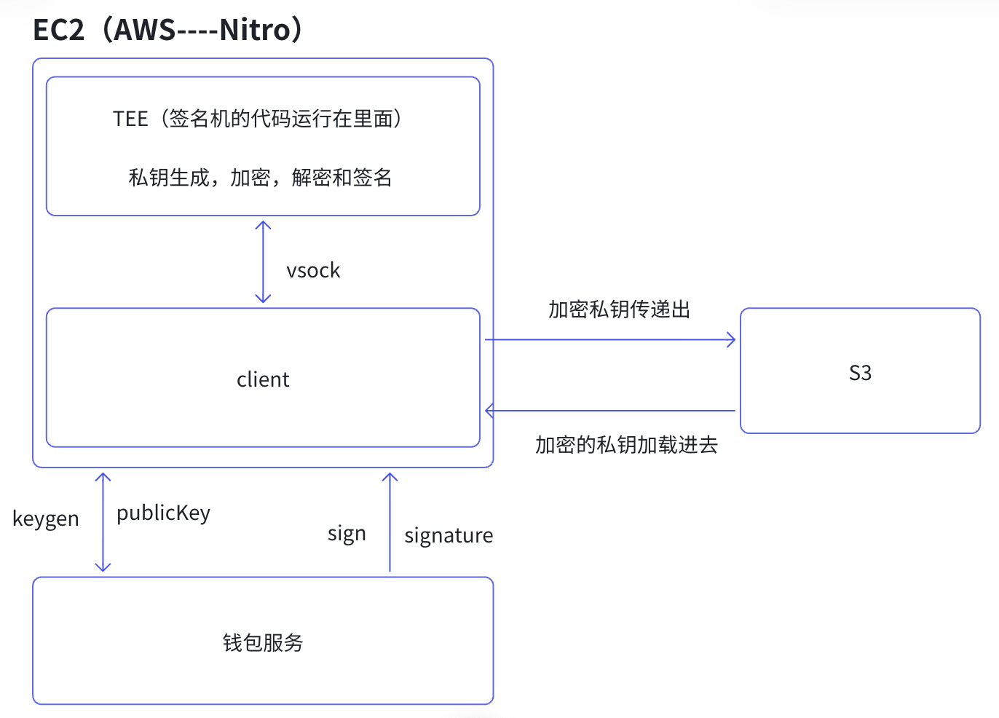

# 中心化交易所的核心业务

> 本文档详细介绍中心化交易所（CEX）的核心业务模块，包括交易所钱包管理系统、交易撮合、风险控制等关键业务。

---

## 🎯 前置知识：交易所如何保护你的资产？

作为前端开发者，你可能很好奇：**交易所是怎么保护用户资产的？**

简单来说，核心就是**保护私钥**（就像保护你的密码一样）。但交易所管理的不是一个人的密码，而是几百万用户的资产，所以安全技术要求极高。

---

## 一、交易所钱包核心业务模块

### 1.1 密钥管理（通俗版）

#### 🔒 TEE (Trusted Execution Environment) - 可信执行环境

TEE是一个安全可信任执行环境，私钥生成，加密，解密和签名都在这个环境完成，具备比较难以侵入的特点，用的比较多的AWS Nitro,TEE和宿主机之间的通行模式 vsock。



- keygen:钱包服务发起keygen之后，传递给签名机，签名机接到指令之后，私钥生成和加密过程在TEE里面完成在TEE生成密钥,将私钥进行加密;
  将私钥加密之后传递出来存储到S3数据库
  将公钥返回给钱包
  钱包使用公钥生成地址
- sign:钱包将构建好交易生成32字节的MessageHash,将MessageHash传递给签名机进行，签名过程在TEE完成
  将加密私钥加载到TEE
  在TEE环境中解密私钥
  使用私钥对交易进行签名
  返回signature

---

#### HSM (Hardware Security Module) - 硬件安全模块

**前端类比理解**：

```
// 想象一个专用的"加密U盘"
class HSMDevice {
  constructor() {
    this.privateKey = null; // 私钥存在硬件里，永远不输出
    this.isHardwareProtected = true;
  }

  // 你只能调用签名功能，拿不到私钥本身
  sign(data) {
    // 内部硬件完成签名
    return hardwareSign(data);
  }

  // 试图获取私钥？不可能！
  getPrivateKey() {
    throw new Error(" 私钥永远不会离开硬件！");
  }
}

// 使用方式
const hsm = new HSMDevice();
const signature = hsm.sign(transactionData); // ✅ 可以签名
const key = hsm.getPrivateKey(); //  报错！
```

**通俗解释**：

- **HSM 就像一个专用的"加密U盘"**
- 私钥存在硬件芯片里，**永远不会离开设备**
- 你只能用它来签名，但永远拿不到私钥本身
- 即使把 HSM 设备偷走，没有密码也读不出私钥

**生活中的类比**：

- 普通电脑 = 密码存在记事本里（容易被复制）
- HSM = 密码存在银行的指纹保险箱里（必须本人+指纹才能用，但拿不到密码本身）

**常见产品**：AWS CloudHSM、Azure Dedicated HSM、Thales HSM

---

#### MPC (Multi-Party Computation) - 多方计算

**前端类比理解**：

```
// 想象把密码切成3片，分给3个人
const privateKey = "my_secret_key_12345";

// 使用秘密共享算法（如 Shamir's Secret Sharing）
const [share1, share2, share3] = splitSecret(privateKey, {
  totalShares: 3,      // 总共3份
  requiredShares: 2    // 需要2份才能还原
});

// 3个不同的服务器各自保存一份
// Server A: share1 = "a7f3k..."
// Server B: share2 = "9d2m8..."
// Server C: share3 = "x5p1q..."

// 签名时需要至少2个服务器合作
async function signTransaction(txData) {
  const partialSig1 = await serverA.sign(txData, share1);
  const partialSig2 = await serverB.sign(txData, share2);

  // 合并部分签名得到完整签名
  const fullSignature = combineSignatures(partialSig1, partialSig2);
  return fullSignature;
}

// 黑客只黑掉1个服务器？没用！
// 必须同时黑掉2个才能拿到私钥
```

**通俗解释**：

- **MPC 就是把私钥"切碎"，分给多个服务器保管**
- 单个服务器拿到的只是"碎片"，完全没用
- 签名时需要多个服务器"合作计算"
- 即使黑客黑掉1-2个服务器，也拿不到完整私钥

**生活中的类比**：

- 普通方式 = 核弹发射密码存在一个将军手里（危险！）
- MPC = 密码切成3片，分给3个将军，需要至少2人同意才能发射（安全！）

**优势**：

- ✅ 没有单点故障（一个服务器坏了不影响）
- ✅ 防内部作恶（一个员工无法单独转账）
- ✅ 防外部攻击（黑客需要同时攻破多个服务器）

---

#### 🔢 门限签名 (Threshold Signature)

**通俗解释**：

- **门限签名是 MPC 的一种具体实现方式**
- 规则：5个人保管钥匙，需要至少3人同意才能开门（3-of-5）
- 比传统多签更高效（只需要一个签名，不需要多笔交易）

**前端类比**：

```
// 传统多签（链上）：需要3笔交易
tx1 = alice.sign();    // 第1笔交易
tx2 = bob.sign();      // 第2笔交易
tx3 = charlie.sign();  // 第3笔交易

// 门限签名：只需要1笔交易
partialSig1 = alice.partialSign();
partialSig2 = bob.partialSign();
partialSig3 = charlie.partialSign();
finalSig = combine(partialSig1, partialSig2, partialSig3);
// 一笔交易完成！
```

---

### 1.2 交易所钱包核心业务流程

#### 充值 (Deposit)

- 外部用户向交易所分配的用户地址转入资产
- 系统监听链上交易，确认充值到账
- 更新用户账户余额

#### 提现 (Withdrawal)

- 从交易所热钱包向用户指定的外部地址转账
- 需要风控审核、安全验证（如二次确认、KYC）
- 批量处理以提高效率并降低 Gas 费用

#### 归集 (Collection)

- 将散落在各用户充值地址的资金集中转移到归集地址
- 归集地址通常是交易所的主热钱包地址
- 自动化定时执行，优化资金管理

#### 热转冷 (Hot to Cold)

- 将热钱包中的超额资金转入冷钱包存储
- 降低热钱包风险暴露，提高资产安全性
- 通常设置阈值自动触发

#### 冷转热 (Cold to Hot)

- 当热钱包资金不足时，从冷钱包补充资金
- 需要多重签名授权，流程更严格
- 人工审批 + 自动化执行相结合

#### 兑换 (Swap)

- 一种代币兑换成另一种代币
- 可通过内部撮合或外部 DEX 完成
- 用于流动性管理和资产结构调整

#### 资金划转 (Transfer)

- 交易所在不同账户之间进行资金划拨
- 包括用户账户间转账、业务账户间调拨
- 需要完整的审计日志和权限控制

### 1.3 交易所储备金证明系统

采用 **Merkle Tree + Zero-Knowledge Proof (零知识证明)** 的证明体系：

- **Merkle Tree**: 构建用户余额的默克尔树，每个用户可验证自己的余额包含在树中
- **ZK Proof**: 在不泄露具体用户余额的情况下，证明总资产充足
- **透明度**: 用户可独立验证交易所的偿付能力
- **隐私保护**: 不暴露其他用户的资产信息

### 1.4 交易所冷钱包管理方案（私钥冷处理）

#### 密钥多签机制

- 采用多重签名方案（如 2-of-3, 3-of-5）
- 不同签名者分布在不同地理位置
- 防止单点故障和内部作恶

#### 合约多签私服

- 基于智能合约的多签钱包（如 Gnosis Safe）
- 可编程的审批流程和权限管理
- 支持时间锁、限额等安全策略
- 链上透明可审计

---

## 二、交易撮合引擎

### 2.1 订单簿管理

- **买卖盘维护**: 实时更新买入和卖出订单列表
- **价格优先**: 最优价格优先成交
- **时间优先**: 相同价格按挂单时间排序
- **订单类型**: 市价单、限价单、止损单、止盈单等

### 2.2 撮合算法

- **连续撮合**: 实时匹配买卖订单
- **批量撮合**: 定时批量处理订单（如集合竞价）
- **部分成交**: 支持订单部分执行
- **冰山订单**: 大额订单分批展示，避免市场冲击

### 2.3 流动性管理

- **做市商激励**: 提供手续费返佣吸引流动性
- **深度维护**: 确保主流交易对有充足的买卖深度
- **跨市场套利**: 平衡不同交易对的价格差异

---

## 三、用户账户系统

### 3.1 身份认证

- **KYC (Know Your Customer)**: 实名认证，上传身份证件
- **AML (Anti-Money Laundering)**: 反洗钱审查
- **分级认证**: 不同认证级别对应不同交易限额
- **合规要求**: 满足不同国家和地区的监管要求

### 3.2 账户安全

- **双重验证 (2FA)**: Google Authenticator、短信验证
- **登录保护**: IP 白名单、设备绑定、异常登录提醒
- **提现安全**: 提现地址白名单、冷却期设置
- **API 密钥管理**: 程序化交易的安全控制

### 3.3 资金管理

- **多币种账户**: 支持多种加密货币和法币
- **子账户系统**: 机构用户的资金分账管理
- **账单明细**: 完整的交易记录和资金流水
- **对账系统**: 确保账户余额与实际资产一致

---

## 四、风险管理系统

### 4.1 交易风控

- **异常交易检测**: 识别操纵市场、自成交等行为
- **大额交易监控**: 大额提现需要人工审核
- **价格异常保护**: 防止极端行情下的异常成交
- **反欺诈系统**: 识别洗钱、恐怖融资等非法活动

### 4.2 杠杆交易风控

- **保证金率计算**: 实时监控维持保证金率
- **强平机制**: 保证金不足时自动平仓
- **阶梯强平**: 分阶段减仓降低市场冲击
- **保险基金**: 应对穿仓风险，保护其他用户

### 4.3 系统风控

- **DDoS 防护**: 抵御网络攻击
- **灾备系统**: 多机房部署，快速故障切换
- **数据备份**: 定期备份，防止数据丢失
- **监控告警**: 实时监控系统状态，异常及时告警

---

## 五、法币出入金通道

### 5.1 法币充值

- **银行转账**: 支持电汇、SEPA 等银行渠道
- **信用卡/借记卡**: 快速法币充值
- **第三方支付**: 接入 PayPal、Apple Pay 等
- **本地支付方式**: 根据不同地区提供本地化支付

### 5.2 法币提现

- **法币兑换**: 将加密货币兑换成法币
- **提现到银行卡**: 支持主流银行
- **提现时效**: 通常 1-3 个工作日到账
- **手续费**: 根据提现金额和方式收取费用

### 5.3 OTC 交易

- **场外大宗交易**: 大额交易不冲击市场价格
- **点对点交易**: 用户间直接交易，平台担保
- **法币对**: 支持 CNY、USD、EUR 等多种法币
- **商户系统**: 认证商家提供流动性

---

## 六、衍生品交易

### 6.1 合约交易

- **永续合约**: 无到期日的期货合约
- **交割合约**: 有明确到期日的期货合约
- **资金费率**: 永续合约的多空平衡机制
- **杠杆倍数**: 支持 1x-125x 等不同杠杆

### 6.2 期权交易

- **看涨期权 (Call)**: 预期价格上涨
- **看跌期权 (Put)**: 预期价格下跌
- **期权策略**: 支持组合策略交易
- **希腊值管理**: Delta、Gamma、Vega 等风险指标

### 6.3 杠杆交易

- **借贷资金**: 平台提供杠杆资金
- **借贷利率**: 根据市场供需动态调整
- **抵押品管理**: 支持多种资产作为抵押
- **爆仓预警**: 提前通知用户追加保证金

---

## 七、理财与 Staking 服务

### 7.1 理财产品

- **活期理财**: 随时存取，按日计息
- **定期理财**: 锁定一定期限，收益更高
- **智能定投**: 自动定期投资
- **结构化产品**: 保本或增强收益产品

### 7.2 Staking 质押

- **PoS 质押**: 参与以太坊等 PoS 网络
- **锁仓奖励**: 长期锁仓获得额外收益
- **流动性 Staking**: 质押同时保持流动性（如 stETH）
- **收益分配**: 定期分配质押奖励

### 7.3 Launchpad 发行

- **IEO (Initial Exchange Offering)**: 交易所首发
- **项目筛选**: 严格的项目审核机制
- **额度分配**: 根据持仓量分配认购额度
- **上币支持**: 提供上市后的流动性支持

### 7.4 借贷服务

- **抵押借贷**: 抵押加密货币借出稳定币
- **信用借贷**: 基于信用评分的无抵押借贷
- **借贷利率**: 根据供需关系动态调整
- **清算机制**: 抵押品价值不足时自动清算

---

## 八、做市商与专业交易

### 8.1 做市商服务

- **流动性激励**: 手续费返还、做市竞赛
- **API 支持**: 提供高性能交易 API
- **市场数据**: 实时深度数据和成交信息
- **专属客户经理**: 一对一服务支持

### 8.2 程序化交易

- **REST API**: 标准的 HTTP 接口
- **WebSocket**: 实时推送行情和订单更新
- **FIX 协议**: 机构级交易协议
- **SDK 支持**: 提供多种语言的开发工具包

### 8.3 高频交易支持

- **低延迟撮合**: 微秒级订单处理
- ** colocated 服务器**: 交易所机房托管
- **批量下单**: 支持批量订单提交
- **订单类型**: 支持复杂的订单策略

---

## 九、合规与监管

### 9.1 牌照与合规

- **多国牌照**: 在不同司法管辖区获取运营许可
- **监管合作**: 与监管机构保持沟通
- **合规审查**: 定期接受合规审计
- **信息披露**: 透明化运营数据

### 9.2 税务支持

- **交易记录**: 提供完整的交易历史
- **税务报告**: 生成符合各国税法的报表
- **资本利得**: 自动计算盈亏
- **第三方工具**: 对接 CoinTracker、Koinly 等税务软件

### 9.3 地域限制

- **KYC 分级**: 根据地区限制功能使用
- **禁入地区**: 遵守制裁和限制名单
- **本地化合规**: 适应不同地区的法规要求
- **用户告知**: 明确告知用户所在地区限制

---

## 十、客户服务与运营

### 10.1 客户支持

- **7×24 小时客服**: 全天候在线支持
- **多渠道服务**: 在线聊天、邮件、电话
- **工单系统**: 复杂问题跟踪处理
- **多语言支持**: 覆盖全球主要语言

### 10.2 用户教育

- **帮助中心**: 详细的操作指南和 FAQ
- **视频教程**: 图文、视频教学
- **新手引导**: 新用户入门流程
- **安全提示**: 防诈骗、安全操作指南

### 10.3 社区运营

- **社交媒体**: Twitter、Telegram、Discord 等
- **内容营销**: 博客、研报、市场分析
- **用户活动**: 交易竞赛、空投活动
- **KOL 合作**: 与意见领袖合作推广

---

## 十一、技术基础设施

### 11.1 系统架构

- **微服务架构**: 模块化设计，便于扩展
- **高可用部署**: 多机房、多区域部署
- **负载均衡**: 分散流量压力
- **弹性扩容**: 根据负载自动扩容

### 11.2 安全防护

- **Web 应用防火墙 (WAF)**: 防护 SQL 注入、XSS 等攻击
- **DDoS 防护**: 大流量攻击缓解
- **数据加密**: 传输层和存储层加密
- **安全审计**: 定期渗透测试和代码审计

### 11.3 监控运维

- **实时监控**: 系统性能、业务指标监控
- **日志系统**: 完整的操作日志和审计追踪
- **告警系统**: 异常情况及时通知
- **自动化运维**: CI/CD、自动化部署

---

## 十二、营销与增长

### 12.1 用户获取

- **推荐奖励**: 邀请好友获得佣金分成
- **注册奖励**: 新用户注册赠送体验金
- **SEO/SEM**: 搜索引擎优化和投放
- **品牌合作**: 与其他项目联合营销

### 12.2 用户留存

- **手续费优惠**: 根据交易量提供费率折扣
- **VIP 体系**: 分级会员制度
- **积分系统**: 交易获得积分兑换奖励
- **定期活动**: 节假日促销、交易大赛

### 12.3 数据驱动

- **用户画像**: 分析用户行为特征
- **A/B 测试**: 优化产品和营销策略
- **转化漏斗**: 优化用户转化路径
- **流失预警**: 识别并挽留流失用户

---

## 总结

中心化交易所是一个复杂的金融技术系统，涉及**资产管理、风险控制、交易撮合、合规运营**等多个核心业务模块。与去中心化交易所（DEX）相比，CEX 的优势在于：

✅ **用户体验好**: 界面友好，操作简单  
✅ **交易速度快**: 链下撮合，即时成交  
✅ **流动性充足**: 专业做市商提供深度  
✅ **功能丰富**: 支持法币、衍生品、理财等  
✅ **客户服务**: 专业的客户支持团队

但也需要注意中心化风险：

️ **资产托管风险**: 需要信任平台保管资产  
⚠️ **单点故障**: 平台被攻击可能导致资产损失  
️ **监管风险**: 面临各国监管政策变化  
⚠️ **透明度不足**: 储备金证明机制正在完善

随着 **Merkle Tree + ZK Proof** 等储备金证明技术的普及，以及 **MPC、多签** 等安全方案的应用，中心化交易所正在向更加透明、安全的方向发展。

---

**📚 相关学习资源**:

- [密码学基础](./01%20密码学.md)
- [以太坊原理](./03%20以太坊.md)
- [Web3 钱包](./04%20web3%20钱包.md)
- [Uniswap V2 详解](./uniswap-v2.md)
