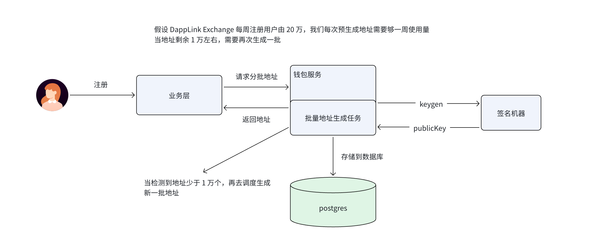

# 一、地址预生成

用户级多地址池设计，下图是完整的交易所/钱包系统架构图。通过BIP44标准，实现用户级多地址池，用户注册时，系统会提前生成用户级多地址池，用户可以按需分配地址，当用户地址池库存不足时，系统会自动补货。

地址派生逻辑：助记词 → 根钱包 → 批量派生地址

通过 “提前离线生成地址池 + 按需分配 + 低库存自动补货” 的模式，实现用户注册时秒级分配充币地址，同时保证私钥安全、性能高、不影响用户体验。
