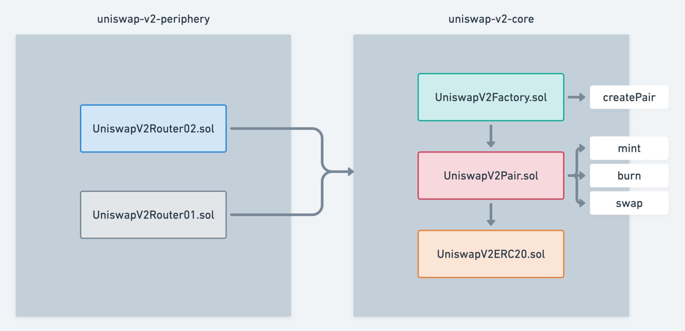

# uniswap V2

## 一、什么是uniswap

Uniswap V2（2020 年 5 月上线）是以太坊上最经典的 AMM（自动做市商）DEX，用 x・y=k 恒定乘积公式实现无需许可、去中心化代币交换，是所有 DEX/AMM 的地基，V3、Pancake、Sushi 全是基于它改的。Uniswap Protocol

**特点**

1. 任意 ERC20 ↔ ERC20 交易对（V1 只能 ERC20↔ETH）

- 可以创建 USDC/DAI、WBTC/ETH、任意长尾币 / 主流币 池子
- 真正开启 DeFi 长尾流动性时代

2. 恒定乘积公示 x \* y = k

- x = 池子中 token0 的数量
- y = 池子中 token1 的数量
- k 是常数（交易中不变，加流动性才变大）
- 交易时：x↑ → y↓，乘积永远不变

推论：当你买入代币 A，池中 A 减少，B 增加。为了保持 $k$ 不变，A 的价格会随着你的购买量而上升。这就是滑点 (Slippage) 的数学来源。

3. 0.3% 的滑点

- 每笔 swap 收 0.3%，全部分给 LP 持有者
- 后期可开启 0.05% 协议费（治理决定）

4. 价格预言机（TWAP）

又称作链上时间加权价格，防操纵

- 每个区块开始记录一次价格，累加
- 外部合约可查询 任意时间段的平均价格
- 是 DeFi 最安全、最常用的预言机之一

5. 闪电兑换（Flash Swap，无抵押借币）

允许你先借出资产，只要在交易结束前还回即可（类似闪电贷）。

- 可先从池子借出任意数量代币
- 在同一笔交易内必须归还（+ 手续费）
- 用于套利、清算、杠杆等高级玩法Uniswap Protocol

6. 不可升级合约

- 核心合约 无后门、无法修改、无法关停
- 安全审计极其严格，多年未出大漏洞

### 滑点计算

公式：滑点 = (预期价格 - 实际价格) / 预期价格

原因：大额交易导致池子储备变化 → 价格偏离

### 无常损失

提供流动性后，两种币价格波动不一致，导致「做 LP 收益 < 单纯持币收益」的差额，就是无常损失；波动越大，损失越大，横盘则几乎为 0。

### 手续费分配

- 0.3% 交易费 → 100% 给 LP（默认）
- 开启协议费后：0.25% 给 LP，0.05% 给协议

### v2 & V3 & v4 对比

- V2：全区间流动性、单一费率、LP 是 ERC20， 是 AMM 基础版
- V3：集中流动性、多费率、LP 是 NFT，性能升级但架构没变；
- V4：单例合约 + Hooks 可编程 + 闪电记账 + 原生 ETH，把 AMM 变成可定制流动性底层框架。

对比维度 Uniswap V2 Uniswap V3 Uniswap V4
发行时间 2020 年 2021 年 2025 年
流动性模型 全局恒定乘积 x⋅y=k全价格区间均匀流动性 集中流动性LP 自选价格区间提供流动性 保留 V3 集中流动性支持 自定义 AMM 曲线
费率机制 固定 0.3% 单一费率 三档固定费率：0.05% / 0.3% / 1% 动态自定义费率可通过 Hooks 随意设置
池子架构 Factory 工厂模式每交易对独立 Pair 合约 同 V2每交易对独立合约 Singleton 单例合约所有池子共用一个 PoolManager
LP 凭证 ERC20 代币份额同质化 NFT 代币非同质化仓位 兼容 NFT 仓位架构统一托管在单例合约
ETH 处理 必须用 WETH 包装 必须用 WETH 包装 原生支持 ETH无需包装 WETH
扩展性 几乎无扩展能力 扩展能力弱规则写死不可改 Hooks 可编程插件可插入自定义逻辑
Gas 成本 中等 偏高 大幅降低单例 + 闪电记账优化
记账方式 逐笔实时链上存储 逐笔实时链上存储 Flash Accounting 闪电记账交易内临时记账、净额结算
预言机 内置 TWAP 时间加权预言机 保留 TWAP，精度更高 可通过 Hooks 自定义预言机逻辑
无常损失 中等 偏高（区间越窄无常损失越大） 可通过 Hooks 策略主动降低无常损失
额外能力 基础兑换、LP、闪电兑换 精准做市、窄区间刷手续费 限价单、MEV 防护、动态费率、自定义做市策略、资产自动复投
适用场景 长尾币、小盘币、简单兑换 专业做市、主流币精准做市 机构做市、定制化流动性、链上金融乐高

## 二、v2 系统架构设计

Uniswap V2 采用了 Core（核心） 与 Periphery（外围） 分离的架构。这是为了确保最关键的资金存储逻辑尽可能简单、安全，而复杂的业务逻辑放在可替换的外围。



### Core 核心合约

- UniswapV2Factory：工厂合约，负责创建和管理所有的代币对（Pair）。
  - 创建 Pair 合约（createPair）
  - 记录所有交易对地址
  - 设置 feeTo（协议费接收地址）
  - 核心函数 -
    createPair 1. 使用 CREATE2 确定性部署创建交易对 2. 确保相同参数下总是创建相同地址的交易对 3. 使用 keccak256(abi.encodePacked(token0, token1)) 作为 salt
    getPair 1.快速查找两个代币之间的交易对地址 2.使用映射：token0 => token1 => pairAddress
- UniswapV2Pair：代币对合约，每个币对都有一个独立的合约实例，负责保管资金和执行 Swap。
  - 存储 x、y（储备量）
  - swap：执行兑换（核心公式）
  - mint：铸造 LP（加流动性）
  - burn：销毁 LP（撤流动性）
  - \_update: 更新储备量
  - ERC20：LP Token 本身
- UniswapV2ERC20
  - LP Token 的 ERC20 实现
  - UniswapV2Pair 继承了 UniswapV2ERC20

### Periphery（外围，易用，给用户 / DApp 用）

- UniswapV2Router02
  路由器合约，提供用户友好的接口。
  它负责计算价格、路径路由、以及安全检查，是我们日常交互最多的合约。
  1. 添加流动性

  addLiquidity: ERC20/ERC20 交易对
  addLiquidityETH: ERC20/ETH 交易对（通过 WETH）2. 移除流动性

  removeLiquidity: 移除 ERC20/ERC20 流动性
  removeLiquidityETH: 移除 ERC20/ETH 流动性
  支持 Permit 签名，无需预先授权 3. 交换

  swapExactTokensForTokens: 精确输入，交换代币
  swapTokensForExactTokens: 精确输出，交换代币
  支持 ETH 交换（通过 WETH）
  支持多跳交换（通过多个交易对）4. 税费代币支持

  特殊函数处理在转账时收取费用的代币
  通过比较交换前后的余额来验证输出数量

- UniswapV2Library
  工具库，包含计算函数和地址计算

```
用户 -> Router -> Factory -> Pair
                -> Library (计算)
```

## 价格预言机

Uniswap V2 内置了价格预言机功能，通过累积价格（Cumulative Price）实现。

### 工作原理

每个区块首次交换时，更新累积价格：

```
price0CumulativeLast += (reserve1 / reserve0) * timeElapsed
price1CumulativeLast += (reserve0 / reserve1) * timeElapsed
```

**变量说明：**

- price0CumulativeLast: token0 相对于 token1 的累积价格（单位：价格 \_ 秒数，无单位）
- price1CumulativeLast: token1 相对于 token0 的累积价格（单位：价格 \_ 秒数，无单位）
- reserve0: 第一种代币（token0）的储备量（单位：代币的最小单位）
- reserve1: 第二种代币（token1）的储备量（单位：代币的最小单位）
- timeElapsed: 自上次更新以来经过的时间（单位：秒）
- +=: 累加操作，将当前价格乘以时间间隔累加到累积价格中

**工作原理：**

- 每个区块首次交换时，计算当前价格（储备量比例）并乘以时间间隔
- 累积价格持续累加，形成价格历史记录
- 通过这种方式，可以计算任意时间段的平均价格

#### 计算时间加权平均价格（TWAP）

```
TWAP = (priceCumulativeEnd - priceCumulativeStart) / timeElapsed
```

**变量说明：**

- TWAP: 时间加权平均价格（Time-Weighted Average Price）（单位：价格，如 token1/token0 或 token0/token1）
- priceCumulativeEnd: 结束时间点的累积价格（单位：价格 \_ 秒数，无单位）
- priceCumulativeStart: 开始时间点的累积价格（单位：价格 \_ 秒数，无单位）
- timeElapsed: 计算时间段的总时长（单位：秒）

**工作原理：**

- 通过计算两个时间点之间累积价格的差值，除以时间间隔，得到该时间段的平均价格
- 时间段越长，价格越稳定，抗操纵能力越强
- 常用于需要稳定价格参考的场景，如借贷协议的清算价格

**优势：**

- 抗操纵：需要大量资金和时间才能显著影响价格
- 无需信任：完全在链上，无需外部数据源
- 低成本：作为交换的副产品，无需额外 gas

**使用场景：**

- 借贷协议的价格参考
- 衍生品协议的结算价格
- 其他需要价格数据的 DeFi 应用
