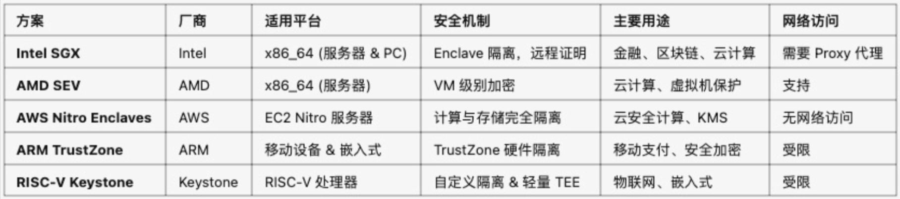
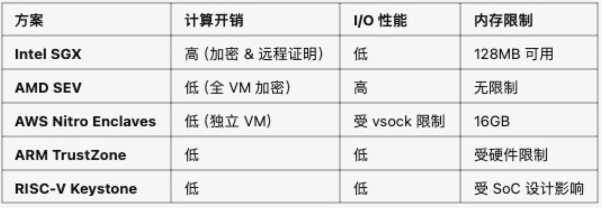
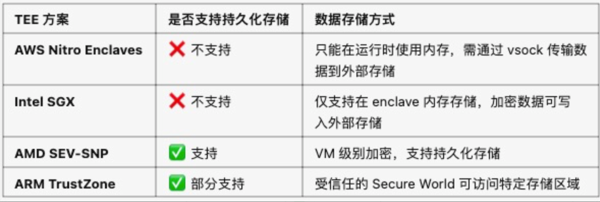

# 简介

可信执行环境(TrustedExecutionEnvironment,TEE)是一种安全隔离的执行环境，能够保护数据、代码和计算过程免受恶意软件或未授权访问的影响。TEE运行在CPU内部的一个受信任区(如IntelSGX或ARMTrustZone)，保证:

- 数据机密性:即使系统管理员、云供应商或恶意软件也无法访问TEE内部的数据。
- 代码完整性:代码在TEE内部执行时不可被篡改。
- 计算可验证性:可以提供远程证明(Attestation)，确保TEE执行的代码未被修改。

## TEE 在云计算中的重要性

传统的数据安全保护主要集中在两个阶段：数据传输（如在HTTPS中） 和数据存储（如硬盘加密）。然而，当数据被加载到系统内存中进行处理时，必须以明文（未加密）形态存在于CPU、内存等硬件中，这成了一个不受保护的关键缺口。无论是恶意的内部人员、有高级权限的攻击者，甚至是底层的主机操作系统，理论上都可趁此机会进行窃取。

TEE的核心创新在于，它通过硬件级别的隔离，直接在CPU内部创建了一个“黑盒”或“安全飞地”。数据仅在CPU的TEE内部才被解密运算，在内存中全程加密，甚至连云平台的运维人员也无法访问，这使得TEE成为了推动现代云计算发展的关键力量。

- 云管理员访问数据风险:云运营商可能滥用管理权限读取用户数据。
- 共享计算资源风险:云上多个租户共享物理服务器，可能导致数据泄露。
- 合规性要求:某些行业(如金融、医疗、政府)要求严格的数据隔离，TEE可以满足这些需求。

# TEE方案

目前，主流的TEE技术主要由芯片厂商提供：

- Intel SGX/TDX：提供应用层和虚拟机级隔离，生态成熟。
- AMD SEV-SNP：主要用于保护整个虚拟机，安全性强，被Azure等主流云厂商采用。
- AWS Nitro Enclaves
- ARM TrustZone (CCA)：在移动设备和物联网领域应用广泛，其新的CCA架构正拓展至服务器。
- RISC-V Keystone

## 支持的厂商

1. Intel SGX

- 由Intel开发。
- 主要应用于x86_64服务器和PC端。
- 适用于机密计算、金融安全、区块链隐私计算等场景

2. AMD SEV (Secure Encrypted Virtualization)

- 由AMD开发。
- 主要用于AMDEPYC服务器，适用于云端虚拟机加密。
- 通过全虚拟机加密提供保护，适合云计算、数据中心等应用。

3. AWS Nitro Enclaves

- 由AmazonWebServices(AWS)开发。
- 依赖AWSNitro系统，仅适用于AWSEC2Nitro服务器。
- 适用于云端高安全计算，如AWSKMS密钥管理、金融隐私计算等。

4. ARM TrustZone

- 由ARM设计，适用于ARM架构的CPU和SoC(系统级芯片)。主要用于移动设备、智能家居、嵌入式系统，如iPhone、安卓手机、智能电视等。
- 典型应用包括移动支付、指纹识别、硬件加密等。

5. RISC-V Keystone

- 由UCBerkeley&开源社区领导开发，适用于RISC-V处理器。
- 作为开源TEE解决方案，可高度定制化，适用于物联网、智能汽、嵌入式AI设备等。
- 由于RISC-V是开源架构，Keystone适学术研究、实验性安全计算。

## 可扩展性分析

- IntelSGX受限于Enclave的内存大小(最大128MB可用)。
- AMDSEV依赖于虚拟化，支持大规模扩展。
- AWSNitroEnclaves通过EC2负载均衡，具备出色的可扩展性。
- ARMTrustZone主要适用于移动端，不适合云端扩展。
- RISC-VKeystone由于开源架构，可根据需求扩展。

## 性能分析

- IntelSGX因为需要数据加密，计算开销较大，I/O性能受限。
- AMDSEV采用全VM加密，性能损失较小。
- AWSNitroEnclaves计算开销低，但vsock通信限制可能影响吞吐量。
- ARMTrustZone&RISC-VKeystone在嵌入式场景下，性能损耗较低。

# TEE 环境数据存储对比分析

- 不能持久化存储
  - TEE 环境不会保留数据：它主要用于计算时数据保护，一旦TEE进程终止或重启，内容数据会自动销毁，无法持久化存储
  - 没有磁盘或文件系统：大多数TEE方案不允许直接访问磁盘、文件系统、数据库或外部存储

- 可在TEE运行时存储数据
  - 内存春初：TEE允许在内存中存储数据，但数据仅在运行时可用，TEE关闭后数据会消失
  - 加密数据传输：TEE内的数据可以加密后存储到外部存储（如S3、EBS、数据库），并在需要时解密加载到TEE内部使用

TEE适用于数据保护和计算，但不适用于长期存储敏感数据，需要通过加密+外部存储结合使用。

# 应用场景

- IntelSGX适用于高安全需求场景，如机密计算、区块链隐私计算(如SecretNetwork)。
- AMDSEV适用于云端应用，如保护VM内的敏感数据。
- AWSNitroEnclaves适用于云端高安全需求，如AWSKMS、机密数据处理。
- ARMTrustZone适用于移动设备，如手机支付(SamsungKnox)。
- RISC-VKeystone适用于物联网设备，如智能家居、汽车安全系统。

不同TEE方案在安全性、可扩展性、性能和适用场景方面存在明显差异:

- AWS Nitro Enclaves适用于云端安全计算，提供无网络访问的隔离环境
  很多公司使用Nitro和KMS结合做为钱包的签名机服务
- Intel SGX适用于金融&区块链，但计算和I/O性能受限。
- AMD SEV提供全VM级别的加密，适合云端工作负载。
- ARM TrustZone主要用于移动设备安全，如Android&iOS设备。
- RISC-VKeystone是开源TEE方案，适用于物联网&嵌入式应用。

选择建议

- 云计算安全和区块链:
  - 云计算安全:AWS Nitro Enclaves,
  - 区块链签名机:AWS Nitro Enclaves+KMS
- 区块链&机密计算:IntelSGX
- 虚拟机&云端保护:AMDSEV
- 移动端&低功耗设备:ARMTrustZone
- 嵌入式&物联网:RISC-VKeystone

# AWS Nitro Enclaves 与 AWS KMS 结合使用详解

## 什么是AWS Nitro Enclaves？

它是 AWS 提供的一种可信执行环境（TEE），用于保护高度敏感的数据和计算。它通过硬件隔离的方式，确保数据即使在宿主实力上，也不会被恶意访问或篡改。

**特点**

- 安全隔离： Enclave 没有外部网络访问权限（无外网、无本地存储）
- 安全计算： Enclave 智能通过 vsock(虚拟 socket)进行数据通信，确保数据不被暴露
- 防篡改：运行环境和代码完整性由 Nitro Hypervisor 保证，防止被恶意改

## 为什么需要 AWS KMS

AWS Nitro Enclaves 无法持久化存储数据，也不能直接访问AWS 资源（如S3、数据库等）。因此

- 敏感数据需要加密后存储到外部
- 解密是需要KMS进行密钥管理，确保只有授权的Enclave可以访问解密密钥。

AWS KMS（Key Management Service）是AWS提供的云端密钥管理服务，允许 Nitro Enclaves 通过Enclave KMS Proxy 安全访问 KMS 解密数据。

## AWS Nitro Enclaves 与 KMS 结合使用的架构

- AWS Nitro Enclaves：执行安全计算的隔离环境
- vsock: Nitro Enclaves 和宿主实例的唯一通信方式
- AWS KMS：密钥管理服务，用于存储和管理密钥
- Enclave KMS Proxy：让 Nitro Enclaves 安全访问KMS
- AWS EC2宿主实例：运行 Enclaves 并管理 Enclaves-KMS 代理
- AWS IAM（Identity and Access Management）：用于管理用户权限和访问控制

## 安全性保证

- Nitro Enclaves 只能访问KMS，无法访问其他AWS服务
- Enclave KMS Proxy 确保只有 Nitro Enclaves 能解密数据
- 密钥不会暴露，即使EC2宿主实例被入侵，也无法获取密钥
- Nitro Enclaves 使用远程证明，确保只有特定的Enclave 代码能解密数据

# 如何使用AMD SEV-SNP 云端隐私保护

AMD SEV- SNP 是 AMD 机密计算的最新增强版本， 提供内存加密、数据完整性保护和远程证明功能，本文详细介绍如何在 SEV- SNP 环境中加密VM和数据。

## AMD SEV- SNP加密机制

SEV-SNP主要通过CPU级别的内存加密，保护虚拟机的敏感数据，避免宿主机（hypervisor）访问:

- 内存加密：使用VM独立的加密密钥（AES-128）
- 数据完整性保护：防止Hypervisor操作页表，导致数据回滚或劫持
- 远程证明：让云用户验证VM是否运行在安全环境中

## AWSEC2如何支持AMDSEV-SNP

在AWSNitro系统中，AWS通过KVM (Kernel-based Virtual Machine) 和SEV-SNP结合来实现EC2实例的机密计算，主要涉及:

- NitroHypervisor(AWS自研的KvM)
- AMD SEV-SNP的VM内存加密
- SEV-SNP远程认证(Attestation)
- CPU、内存、I/O访问控制

## SEV-SNP的底层原理

（1）虚拟机内存加密(EncryptedVirtualMemory)
SEV(Secure Encrypted Virtualization) 早期版本(如SEV-ES)已经支持为VM分配独立的加密密钥。

- 在SEV-SNP中，所有VM的内存都是加密的，且无法被宿主机(Hypervisor)访问。
- 底层实现:
  。每个VM拥有独立的密钥(由CPU内部的SecureProcessor生成)。
  。物理内存访问时，数据会自动加密/解密，保护VM数据。
  。Hypervisor只能管理页表，但无法解密VM数据。

  结果:AWS甚至无法访问EC2上运行的加密VM内存!

  （2）防止内存攻击
  SEV-SNP解决了传统SEV面临的恶意篡改问题，主要通过RMP(ReverseMapTable)机制:
  - 问题:早期SEV存在:
    - 页面重映射攻击(Page Remapping) 恶意Hypervisor可能会更改页表，映射到攻击者控制的内存地址。
    - 数据回滚攻击(Rollback) 旧版SEV允许攻击者恢复VM旧的内存快照，可能导致回滚攻击。
  - SNP解决方案(RMP机制):
    - RMP记录每个内存页的所有者，确保Hypervisor无法修改VM的内存映射。
    - VM只能访问属于自己的内存页，防止数据泄露。

  结果:即使AWS或恶意Hypervisor想修改VM的数据，SEV-SNP也会直接阻止!

## 远程证明(Attestation)

SEV-SNP允许EC2实例在启动时生成远程证明(AttestationReport)，证明当前环境是可信的。
具体实现:

- VM生成一个Attestation请求，并提交给AMDSecure Processor(AMDSP)。
- AMD SP计算哈希值(Measurement)，对CPU、固件、启动配置等进行签名
- VM可以使用AWS提供的SEV-SNPAPI将该证明发送给外部可信方(如区块链项目、银行、云端数据库)进行验证。

结果:AWS无法篡改VM运行环境，用户可以验证EC2实例的可信状态

# 总结

TEE技术在云计算、金融交易、Web3、医疗等领域至关重要:

- AWS Nitro Enclaves适用于云端安全计算，结合KMS可用于Web3签名机
- Intel SGX适用于金融区块链&隐私计算
- AMD SEV-SNP适用于虚拟机级别的数据加密，确保云端计算可信
- ARMTrustZone适用于移动支付和低功耗设备
- RISC-VKeystone适用于物联网&嵌入式AI
