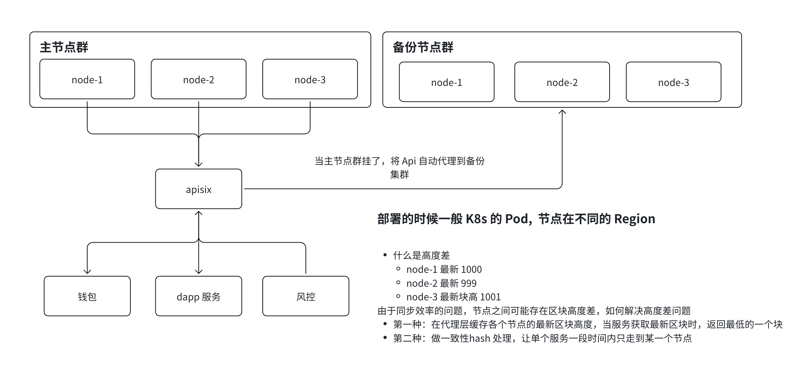

由于区块链数据同步存在物理延迟，不同地区的节点（如 node-1, node-2, node-3）在同一时刻看到的“最新区块”可能是不一致的。如果不处理，用户刷新一下页面可能发现区块高度反而变小了（回滚幻觉）。

这里有两种深度解决方案：

# 代理层缓存与过滤策略（返回最新高度）

1. 代理层缓存与过滤策略（返回最新高度）
   这种方案通过在 APISIX（中间代理层）增加逻辑来屏蔽落后的节点：
   - 实时同步状态： 代理层会不断轮询后端所有节点（node-1/2/3）的 eth_blockNumber。
   - 缓存最高水位线： 代理层会记录当前所有节点中出现的 最大高度值。
   - 落后节点剔除/等待： \* 当用户请求最新区块时，代理层只从那些已经达到“最大高度”的节点中提取数据。
     ○ 如果某个 Region 的节点落后太多（例如高度差 > 10），代理层会自动将该节点从负载均衡列表中临时剔除，直到它追上进度。
   - 优点： 用户始终能看到全网最快的数据。

# 一致性 Hash 处理（保持会话粘性）

- 原理： 代理层根据用户的 IP 地址 或 API Key 进行“一致性 Hash”计算，将该用户固定路由到某一个特定的 Region 或节点上。

- 解决逻辑： \* 只要用户一直访问的是 node-2，即便 node-2 比 node-1 慢 1 个块，用户看到的区块高度也是递增的（从 998 -> 999）。
  - 避免跳变： 只有当 node-2 彻底挂掉时，用户才会被切换到 node-1。这种“粘性”确保了单用户视角下的数据线性增长，避免了在不同高度的节点间来回“横跳”。

- 优点： 减少了因节点同步差带来的业务逻辑错误（如 Nonce 冲突）。
